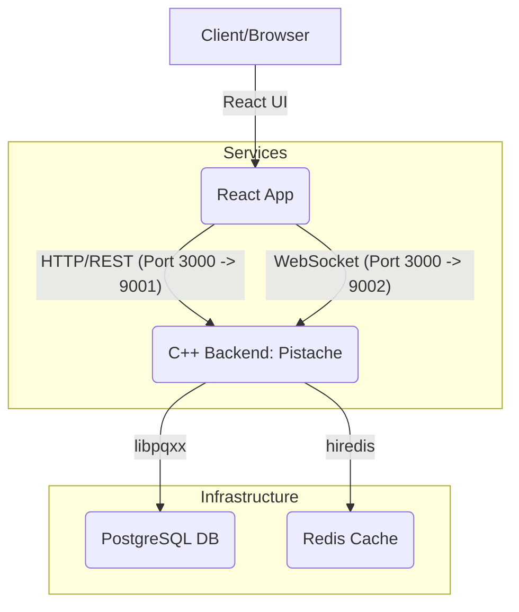

```markdown
# Real-time Chat Application

This is a comprehensive, enterprise-grade real-time chat application system built with a C++ backend (Pistache, Boost.Beast), React frontend, PostgreSQL database, and Redis for caching. It is designed for scalability, performance, and maintainability.

## Table of Contents

1.  [Features](#features)
2.  [Architecture](#architecture)
3.  [Prerequisites](#prerequisites)
4.  [Setup and Installation](#setup-and-installation)
    *   [Local Development (without Docker)](#local-development-without-docker)
    *   [Using Docker (Recommended)](#using-docker-recommended)
5.  [Running the Application](#running-the-application)
6.  [API Documentation](#api-documentation)
7.  [Frontend Usage](#frontend-usage)
8.  [Testing](#testing)
9.  [CI/CD](#cicd)
10. [Logging & Monitoring](#logging--monitoring)
11. [Error Handling](#error-handling)
12. [Caching & Rate Limiting](#caching--rate-limiting)
13. [Deployment Guide](#deployment-guide)
14. [Contributing](#contributing)
15. [License](#license)

## 1. Features

*   **User Management**: Registration, Login, Logout, Profile management (basic).
*   **Authentication & Authorization**: JWT-based authentication for REST APIs, token-based authentication for WebSockets.
*   **Room Management**: Create, join, leave, list rooms.
*   **Real-time Messaging**: Send and receive messages instantly via WebSockets.
*   **Message History**: Fetch past messages for a room.
*   **Data Persistence**: PostgreSQL database for users, rooms, and messages.
*   **Caching**: Redis for session tokens and potentially frequently accessed data.
*   **Scalability**: Microservice-oriented design with decoupled backend and frontend.
*   **Security**: Password hashing, JWTs, rate limiting.
*   **Observability**: Centralized logging, basic monitoring hooks.
*   **Developer Friendly**: Dockerized setup, comprehensive documentation.

## 2. Architecture

The system follows a typical microservice architecture with a clear separation of concerns:

*   **Frontend**: A modern web application built with **React (TypeScript)**, providing a rich user interface. It communicates with the backend via REST APIs and WebSockets.
*   **Backend**: A high-performance server built with **C++**.
    *   **REST API**: Uses `Pistache` for handling user authentication, room management (CRUD), and message history retrieval.
    *   **WebSocket Server**: Uses `Boost.Beast` for real-time, bi-directional communication for chat messages.
    *   **Services Layer**: Contains business logic (AuthService, ChatService).
    *   **Database Repository Layer**: Interfaces with the PostgreSQL database (`pqxx`).
    *   **Caching Layer**: Integrates `Redis` via `hiredis` for quick access to session tokens and other volatile data.
    *   **Middleware**: Implements JWT authentication, error handling, and rate limiting.
*   **Database**: **PostgreSQL** for persistent storage of users, rooms, and messages.
*   **Cache/Session Store**: **Redis** for fast key-value storage, primarily for JWT session blacklisting/validity checks.
*   **Containerization**: **Docker** and `docker-compose` for easy setup and deployment of all services.
*   **CI/CD**: Placeholder configuration for GitHub Actions to automate build, test, and deployment processes.



## 3. Prerequisites

Before you begin, ensure you have the following installed:

*   Git
*   Docker & Docker Compose (Recommended)
*   **If not using Docker for local dev:**
    *   C++ Compiler (GCC 10+ or Clang 10+)
    *   CMake 3.10+
    *   Boost libraries (system, thread, program_options, filesystem)
    *   Pistache library
    *   libpqxx (PostgreSQL C++ client)
    *   hiredis (Redis C client)
    *   OpenSSL development libraries
    *   Crypto++ library
    *   Node.js (LTS) & npm/yarn

## 4. Setup and Installation

### Local Development (without Docker)

This method requires manual installation of all dependencies.

**4.1. PostgreSQL & Redis Setup**

1.  Install PostgreSQL and Redis on your local machine or use Docker for just these services:
    ```bash
    # Start DB and Redis with Docker Compose if you prefer
    docker-compose up -d db redis
    ```
2.  Create the `chatdb` database and a user with `user`/`password` credentials (or update `.env` to match your setup).
3.  Apply schema and seed data manually:
    ```bash
    psql -h localhost -U user -d chatdb -f database/schema.sql
    psql -h localhost -U user -d chatdb -f database/seed.sql
    ```

**4.2. Backend Setup (C++)**

1.  Navigate to the `backend` directory:
    ```bash
    cd backend
    ```
2.  Install C++ dependencies (Pistache, Boost, libpqxx, hiredis, libssl, cryptopp). On Debian/Ubuntu:
    ```bash
    sudo apt update
    sudo apt install build-essential cmake libboost-all-dev libpistache-dev libpqxx-dev libhiredis-dev libssl-dev libcryptopp-dev
    # You might need to install nlohmann/json, spdlog, jwt-cpp manually or via git submodules
    # For instance, by cloning them to a `external` directory and adjusting CMakeLists.txt
    ```
3.  Build the backend:
    ```bash
    mkdir build && cd build
    cmake .. -DCMAKE_BUILD_TYPE=Release
    make -j$(nproc)
    ```
4.  Copy `.env.example` to `.env` and configure `DATABASE_URL`, `REDIS_HOST`, `JWT_SECRET`, etc.

**4.3. Frontend Setup (React)**

1.  Navigate to the `frontend` directory:
    ```bash
    cd ../frontend
    ```
2.  Install Node.js dependencies:
    ```bash
    npm install
    # or yarn install
    ```
3.  Copy `.env.example` to `.env` and configure `VITE_REACT_APP_API_BASE_URL` and `VITE_REACT_APP_WEBSOCKET_URL`.

### Using Docker (Recommended)

This is the easiest and most consistent way to get the application running.

1.  Clone the repository:
    ```bash
    git clone https://github.com/yourusername/realtime-chat-app.git
    cd realtime-chat-app
    ```
2.  Create your `.env` file by copying `.env.example`:
    ```bash
    cp .env.example .env
    # Edit .env if you need to change ports, secrets, etc.
    # Ensure ALLOWED_ORIGINS in backend/.env matches the frontend URL, e.g., http://localhost:3000
    ```
3.  Build and start all services using Docker Compose:
    ```bash
    docker-compose up --build -d
    ```
    This command will:
    *   Build the C++ backend Docker image.
    *   Build the React frontend Docker image.
    *   Pull PostgreSQL and Redis images.
    *   Start all services in detached mode.
    *   Initialize the PostgreSQL database with schema and seed data.

4.  Wait for all services to become healthy. You can check their status with:
    ```bash
    docker-compose ps
    docker-compose logs -f
    ```

## 5. Running the Application

Once the Docker containers are up and running:

*   **Frontend**: Accessible at `http://localhost:3000`
*   **Backend REST API**: Accessible at `http://localhost:9001`
*   **Backend WebSocket**: Accessible at `ws://localhost:9002`
*   **PostgreSQL**: Accessible at `localhost:5432`
*   **Redis**: Accessible at `localhost:6379`

## 6. API Documentation

The REST API and WebSocket protocols are documented in `API_DOCUMENTATION.md`.

## 7. Frontend Usage

1.  Open your browser to `http://localhost:3000`.
2.  **Register**: Create a new user account.
3.  **Login**: Use an existing account (e.g., `alice`/`password123` from seed data, adjust password logic based on actual hasher used for seeding).
4.  **Join/Create Rooms**: Explore existing rooms or create your own.
5.  **Chat**: Send and receive real-time messages within rooms.

## 8. Testing

### Backend Tests (C++)

1.  Ensure the backend is built (either locally or via Docker). If local:
    ```bash
    cd backend/build
    ctest --verbose
    ```
2.  Unit tests (e.g., `test_user_repository.cpp`) are run by CTest.
3.  Integration tests are part of the unit test suite where components interact with DB/Redis.

### Frontend Tests (React)

1.  Navigate to the `frontend` directory.
2.  Run Jest tests:
    ```bash
    npm test
    ```
3.  Coverage report can be generated:
    ```bash
    npm test -- --coverage
    ```
    *(Aim for 80%+ code coverage for production-grade quality).*

### API Tests

Use `curl` or Postman/Insomnia to test API endpoints:

**Register:**
```bash
curl -X POST -H "Content-Type: application/json" -d '{"username":"testuser", "email":"test@example.com", "password":"password123"}' http://localhost:9001/auth/register
```

**Login:**
```bash
curl -X POST -H "Content-Type: application/json" -d '{"username":"testuser", "password":"password123"}' http://localhost:9001/auth/login
# (Copy the token from the response)
```

**Get Rooms (requires Authorization header):**
```bash
curl -H "Authorization: Bearer <YOUR_JWT_TOKEN>" http://localhost:9001/rooms
```

**WebSocket Test (e.g., using a WebSocket client or browser console):**
*   Connect to `ws://localhost:9002`
*   Send an AUTH message: `{"type": "AUTH", "token": "<YOUR_JWT_TOKEN>"}`
*   Send a JOIN_ROOM message: `{"type": "JOIN_ROOM", "room_id": 1}`
*   Send a CHAT_MESSAGE: `{"type": "CHAT_MESSAGE", "room_id": 1, "content": "Hello from WebSocket!"}`

### Performance Tests

*   **Tools**: Utilize `JMeter`, `k6`, or `Locust` for performance testing.
*   **Scenarios**:
    *   Simulate 1000 concurrent users logging in.
    *   Simulate 500 concurrent users sending messages in a single room.
    *   Test API response times under load.
*   **Metrics**: Monitor response latency, throughput, error rates, and resource utilization (CPU, memory) on the backend and database servers.

## 9. CI/CD

A basic GitHub Actions workflow is provided in `.github/workflows/main.yml`. This workflow typically includes:

*   **Build**: Compiling the C++ backend and building the React frontend.
*   **Test**: Running unit and integration tests for both backend and frontend.
*   **Containerize**: Building Docker images for backend and frontend.
*   **Deploy**: Pushing Docker images to a registry (e.g., Docker Hub) and deploying to a cloud provider (e.g., Kubernetes, EC2, Azure, GCP).

```yaml
# .github/workflows/main.yml (Example)
name: CI/CD Pipeline

on:
  push:
    branches:
      - main
  pull_request:
    branches:
      - main

jobs:
  build-and-test:
    runs-on: ubuntu-latest

    steps:
    - name: Checkout code
      uses: actions/checkout@v3

    - name: Set up Docker Buildx
      uses: docker/setup-buildx-action@v2

    - name: Build and Test Backend (C++)
      run: |
        docker-compose -f docker-compose.yml build backend
        # To run C++ tests, you'd typically have a separate test stage in your Dockerfile
        # or mount the tests directory and run them inside the container.
        # For simplicity here, assume tests are run as part of the backend build process
        # or require a separate test container/runner.
        echo "C++ Backend built. Running tests (conceptual)..."
        # Example: docker run --rm your_backend_test_image ./chat_backend_tests

    - name: Build and Test Frontend (React)
      run: |
        docker-compose -f docker-compose.yml build frontend
        echo "React Frontend built. Running tests..."
        docker run --rm -v $(pwd)/frontend:/app/frontend -w /app/frontend node:18-alpine npm test

  # deploy: # Optional: Add a deployment stage for production
  #   needs: build-and-test
  #   if: github.ref == 'refs/heads/main'
  #   runs-on: ubuntu-latest
  #   steps:
  #     - name: Deploy to Production
  #       run: echo "Deploying to production environment..."
  #       # Add your deployment commands here (e.g., kubectl apply, ansible playbook, AWS CLI)
```

## 10. Logging & Monitoring

*   **Backend Logging**: `spdlog` is integrated for structured and multi-sink logging (console and file). Logs are collected in `backend/logs/chat_app.log` (mounted as a Docker volume).
*   **Monitoring**:
    *   **Container Logs**: Use `docker-compose logs -f` to view real-time logs from all services.
    *   **Resource Usage**: Monitor CPU, memory, and network usage of containers using `docker stats`.
    *   **Application Metrics**: In a production environment, integrate with Prometheus/Grafana or a cloud-native monitoring solution to collect metrics (e.g., request latency, error rates, active WebSocket connections). This would require instrumenting the C++ code with a metrics library.

## 11. Error Handling

*   **Backend**:
    *   **Centralized Exception Handling**: A `Middleware::handle_exception` utility is provided for REST API routes to catch exceptions and return standardized JSON error responses.
    *   **Database Errors**: `pqxx::sql_error` and `std::exception` are caught in repository and service layers for logging and graceful error propagation.
    *   **WebSocket Errors**: `Boost.Beast` provides error codes for WebSocket operations, which are logged and handled to ensure connection stability.
*   **Frontend**: Implements basic error boundaries and displays user-friendly error messages for API failures.

## 12. Caching & Rate Limiting

*   **Caching Layer (Redis)**:
    *   Implemented via `RedisClient.h` using `hiredis`.
    *   Currently used for caching JWT session tokens (validity/blacklisting).
    *   Can be extended to cache frequently accessed data like room lists or recent messages to reduce database load.
*   **Rate Limiting**:
    *   A simple IP-based, fixed-window rate limiter is implemented as a `Pistache` middleware in `Middleware::RateLimiter`.
    *   Limits requests per IP within a time window (`max_requests` per `window_duration`).
    *   For advanced production setups, offload rate limiting to a reverse proxy like Nginx or cloud-provider services.

## 13. Deployment Guide

1.  **Container Registry**: Push your Docker images to a private container registry (e.g., AWS ECR, Google Container Registry, Docker Hub Private Repo).
    ```bash
    docker login
    docker tag realtime-chat-app_backend your-registry/chat-backend:latest
    docker push your-registry/chat-backend:latest
    # Repeat for frontend
    ```
2.  **Environment Variables**: Securely manage environment variables (e.g., `JWT_SECRET`, `DATABASE_URL`) using Kubernetes Secrets, AWS Secrets Manager, Vault, or your chosen cloud provider's secret management service.
3.  **Orchestration**:
    *   **Kubernetes**: Convert `docker-compose.yml` into Kubernetes deployments, services, and ingress configurations. Use Helm charts for easier management.
    *   **Cloud Platforms**: Deploy on services like AWS ECS, Google Cloud Run, Azure Container Instances, or a VM with Docker.
4.  **Database**: Use a managed database service (e.g., AWS RDS, Azure Database for PostgreSQL) for high availability, backups, and scaling.
5.  **Monitoring & Alerting**: Set up comprehensive monitoring for all services (CPU, memory, network, latency, error rates) and configure alerts for anomalies.
6.  **Load Balancing**: Place a load balancer (e.g., Nginx, AWS ALB) in front of your backend instances for traffic distribution and potentially SSL termination.
7.  **SSL/TLS**: Ensure all external traffic uses HTTPS. Configure SSL certificates with your load balancer or reverse proxy.

## 14. Contributing

Contributions are welcome! Please follow these steps:

1.  Fork the repository.
2.  Create a new branch (`git checkout -b feature/your-feature-name`).
3.  Make your changes.
4.  Commit your changes (`git commit -m 'Add new feature'`).
5.  Push to the branch (`git push origin feature/your-feature-name`).
6.  Open a Pull Request.

## 15. License

This project is licensed under the MIT License - see the LICENSE file for details.
```