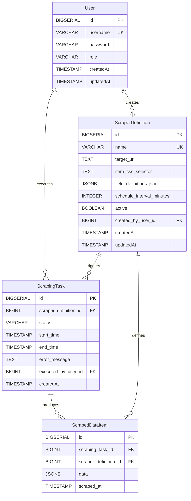

# Web Scraping Automation Platform - Architecture Document

This document outlines the architectural design of the Web Scraping Automation Platform. It covers the system's high-level structure, key components, data flow, and deployment considerations.

---

## Table of Contents
1.  [System Overview](#1-system-overview)
2.  [High-Level Architecture](#2-high-level-architecture)
3.  [Core Components](#3-core-components)
    *   [Backend (Spring Boot)](#31-backend-spring-boot)
    *   [Frontend (Thymeleaf/Static Assets)](#32-frontend-thymeleafstatic-assets)
    *   [Database (PostgreSQL)](#33-database-postgresql)
4.  [Data Model](#4-data-model)
5.  [Key Flows](#5-key-flows)
    *   [Scraper Creation](#51-scraper-creation)
    *   [Scheduled Scraping Task](#52-scheduled-scraping-task)
    *   [On-Demand Scraping Task](#53-on-demand-scraping-task)
    *   [Data Retrieval](#54-data-retrieval)
6.  [Cross-Cutting Concerns](#6-cross-cutting-concerns)
    *   [Authentication & Authorization](#authentication--authorization)
    *   [Error Handling](#error-handling)
    *   [Logging](#logging)
    *   [Caching](#caching)
    *   [Rate Limiting](#rate-limiting)
7.  [Deployment Strategy](#7-deployment-strategy)
8.  [Scalability & Resilience](#8-scalability--resilience)
9.  [Security Considerations](#9-security-considerations)

---

## 1. System Overview

The Web Scraping Automation Platform is designed to enable users to easily define, schedule, and execute web scraping jobs. It stores the extracted data in a structured format and provides both a RESTful API and a basic web UI for management and viewing. The system aims for robustness, scalability, and maintainability.

## 2. High-Level Architecture

The system follows a typical N-tier architecture, primarily comprising a client layer (web UI, API consumers), an application layer (Spring Boot backend), and a data layer (PostgreSQL).

```mermaid
graph TD
    A[User/Admin] ---|Web UI (Browser)| B(Frontend - Thymeleaf/JS)
    A ---|REST API Calls| C(API Consumers - e.g., Postman, other services)

    B ---|HTTP/REST| D[Spring Boot Backend]
    C ---|HTTP/REST| D

    subgraph Spring Boot Backend
        D --> D1(Authentication & Authz)
        D --> D2(API Controllers)
        D --> D3(Scraping Services)
        D --> D4(HTML Parser)
        D --> D5(Scheduler)
        D --> D6(Data Services)
        D --> D7(Interceptors/Filters)
        D --> D8(Global Exception Handler)
    end

    D1 -- JWT Validation --> D
    D2 -- Calls Services --> D3 & D6
    D3 -- Uses --> D4
    D5 -- Triggers --> D3
    D3 & D6 -- Interacts with --> E(Spring Data JPA Repositories)

    E -- SQL --> F[PostgreSQL Database]
    F -- Storage --> F1(Scraper Definitions)
    F -- Storage --> F2(Scraping Tasks)
    F -- Storage --> F3(Scraped Data)
    F -- Storage --> F4(Users)

    D7 -- Applies to --> D
```

**Key Interactions:**
*   Users interact with the platform via the Web UI or directly through the REST API.
*   The Spring Boot backend acts as the central hub, handling business logic, data processing, and security.
*   The PostgreSQL database serves as the persistent storage for all system data.

## 3. Core Components

### 3.1 Backend (Spring Boot)

The backend is a Spring Boot application structured into logical modules and layers:

*   **`WebScrapingToolsApplication.java`**: The main entry point for the Spring Boot application.
*   **`auth/`**:
    *   **Models**: `User`, `Role` (for JWT and Spring Security).
    *   **Repositories**: `UserRepository`.
    *   **Services**: `UserService` (registration, authentication), `JwtService` (JWT generation/validation), `CustomUserDetailsService` (Spring Security integration).
    *   **Config**: `SecurityConfig` (JWT filter chain, password encoder, authentication manager), `JwtAuthFilter`.
    *   **Controllers**: `AuthController` (exposed for `/api/auth/register`, `/api/auth/authenticate`).
*   **`common/`**:
    *   **Config**: `CacheConfig` (Ehcache setup), `WebConfig` (Interceptor registration).
    *   **Error Handling**: `ResourceNotFoundException`, `ApiError`, `GlobalExceptionHandler` (centralized exception handling).
    *   **Interceptor**: `RateLimitInterceptor` (for API request throttling).
    *   **Util**: `ScraperUtils` (URL validation, generic scraper helpers).
*   **`scraping/`**: The core business logic for web scraping.
    *   **Models**: `ScraperDefinition`, `ScrapingTask`, `ScrapedDataItem`, `ScrapingStatus`.
    *   **Repositories**: `ScraperDefinitionRepository`, `ScrapingTaskRepository`, `ScrapedDataItemRepository`.
    *   **Services**:
        *   `ScraperDefinitionService`: CRUD for scraper definitions, caching (`@Cacheable`).
        *   `HtmlParserService`: Handles fetching HTML (Jsoup) and parsing content based on CSS selectors.
        *   `ScrapingService`: Orchestrates the scraping process, triggers tasks (manual/scheduled), manages thread pool for parallel execution, and persists results. Contains the `@Scheduled` method for automated runs.
        *   `ScrapedDataService`: Retrieval of scraped data.
    *   **Config**: `ScrapingSchedulerConfig` (dedicated thread pool for scheduler).
    *   **Controllers**: `ScraperController`, `ScrapingTaskController`, `ScrapedDataController` (REST API endpoints).
*   **`web/`**:
    *   **Controllers**: `WebPagesController` (Thymeleaf template rendering, handles UI actions).
    *   **DTO**: `WebScraperFormDTO` (for form binding).

### 3.2 Frontend (Thymeleaf/Static Assets)

The frontend is a lightweight, server-rendered UI using Thymeleaf.
*   **Pages:** Login, Scrapers List, Scraper Detail/Edit.
*   **Interaction:** Basic form submissions and links. API calls for data retrieval are handled by the backend and rendered.
*   **Static Assets:** CSS, JS files in `src/main/resources/static/`.

### 3.3 Database (PostgreSQL)

*   **Technology:** PostgreSQL 15.
*   **Persistence:** Managed by Spring Data JPA and Hibernate.
*   **Schema Evolution:** Flyway for database migrations.
*   **Data Model (Entities):**
    *   `User`: Stores user credentials and roles.
    *   `ScraperDefinition`: Defines a scraper (name, URL, selectors, schedule).
    *   `ScrapingTask`: Records an instance of a scraper execution (status, timings, errors).
    *   `ScrapedDataItem`: Stores the actual data extracted by a `ScrapingTask` in a JSONB field.

## 4. Data Model



*   **`User`**: Standard user details for authentication.
*   **`ScraperDefinition`**: Stores the blueprint for a scraper. `field_definitions_json` uses PostgreSQL's JSONB type for flexible, schema-less field definitions.
*   **`ScrapingTask`**: Logs each execution of a `ScraperDefinition`, tracking its lifecycle.
*   **`ScrapedDataItem`**: Stores the output of a `ScrapingTask`. The actual extracted data is stored as JSONB.

## 5. Key Flows

### 5.1 Scraper Creation

1.  **User (UI/API):** Submits `ScraperCreateRequest` with name, URL, CSS selectors, and field definitions (JSON).
2.  **`ScraperController`:** Receives request, validates input.
3.  **`ScraperDefinitionService`:**
    *   Validates URL.
    *   Checks for duplicate scraper name.
    *   Converts field definitions map to JSON string.
    *   Creates and persists `ScraperDefinition` entity to DB.
    *   Evicts relevant cache entries (if name/URL is part of caching keys).
4.  **Response:** Returns `ScraperDefinitionDTO` (201 Created).

### 5.2 Scheduled Scraping Task

1.  **`ScrapingSchedulerConfig`:** Configures Spring's `@Scheduled` tasks to run on a dedicated thread pool.
2.  **`ScrapingService#runScheduledScrapers`:**
    *   Runs periodically (e.g., every minute).
    *   Queries `ScraperDefinitionService` for active scrapers with `scheduleIntervalMinutes > 0`.
    *   For each eligible scraper, checks its last run time to ensure the interval has passed.
    *   If due, calls `ScrapingService#triggerScraping`.
3.  **`ScrapingService#triggerScraping`:**
    *   Creates a `ScrapingTask` with status `PENDING`.
    *   Submits the actual scraping work to an `ExecutorService` (thread pool) for asynchronous execution.
    *   Returns the `ScrapingTask` (not directly used by scheduler, but good for consistency).
4.  **`ScrapingService#executeScrapingTask` (in a new thread):**
    *   Updates `ScrapingTask` status to `RUNNING`.
    *   Calls `HtmlParserService#fetchHtmlDocument` to get HTML.
    *   Calls `HtmlParserService#parseData` to extract data using Jsoup and CSS selectors.
    *   For each extracted item, creates and persists a `ScrapedDataItem` to DB.
    *   Updates `ScrapingTask` status to `COMPLETED` or `FAILED`, records `endTime` and `errorMessage` if any.

### 5.3 On-Demand Scraping Task

1.  **User (UI/API):** Triggers `POST /api/scrapers/{id}/run`.
2.  **`ScraperController`:** Receives request, gets current user.
3.  **`ScrapingService#triggerScraping`:** Same as step 3 in Scheduled Scraping, but `executedBy` is the current user.
4.  **Response:** Returns `ScrapingTaskDTO` (202 Accepted).
5.  **Asynchronous Execution:** Same as step 4 in Scheduled Scraping.

### 5.4 Data Retrieval

1.  **User (UI/API):** Requests data (e.g., `GET /api/data`, `GET /api/data?scraperDefinitionId=1`).
2.  **`ScrapedDataController`:** Receives request, applies pagination/filters.
3.  **`ScrapedDataService`:** Queries `ScrapedDataItemRepository` for data.
4.  **Response:** Returns paginated `ScrapedDataDTO` list (200 OK).

## 6. Cross-Cutting Concerns

### Authentication & Authorization
*   **Spring Security:** Handles all security aspects.
*   **JWT:** Used for stateless authentication. Tokens are generated upon successful login/registration and validated for subsequent requests.
*   **`JwtAuthFilter`:** Intercepts requests, extracts, and validates JWTs.
*   **`@PreAuthorize`:** Used on controller methods for role-based access control (`hasAnyRole('ADMIN', 'USER')`).

### Error Handling
*   **`GlobalExceptionHandler`:** A `@ControllerAdvice` that centralizes exception handling across all controllers.
*   Provides consistent JSON error responses (`ApiError`) with status, message, debug info, and validation errors.
*   Handles common exceptions like `ResourceNotFoundException`, `IllegalArgumentException`, `MethodArgumentNotValidException`.

### Logging
*   **SLF4J + Logback:** Standard logging facade and implementation.
*   **`logback-spring.xml`:** Configures logging to console, a rolling file, and a rolling JSON file. JSON logs facilitate integration with external log aggregators.
*   **`@Slf4j`:** Used for easy logger instantiation.

### Caching
*   **Spring Caching Abstraction:** Enabled via `@EnableCaching`.
*   **Ehcache:** Used as the caching provider. Configured in `ehcache.xml`.
*   **`@Cacheable`, `@CachePut`, `@CacheEvict`:** Annotations used on `ScraperDefinitionService` methods to cache scraper definitions, reducing database load for frequent lookups.

### Rate Limiting
*   **`RateLimitInterceptor`:** A custom Spring `HandlerInterceptor` that implements a simple in-memory, IP-based rate limiting mechanism.
*   **Mechanism:** Tracks request counts within a time window for each client IP. If limits are exceeded, returns `429 Too Many Requests`.
*   **Deployment Note:** For distributed deployments, a shared cache (e.g., Redis) would be needed for global rate limiting.

## 7. Deployment Strategy

*   **Docker:** The application is containerized using a `Dockerfile`.
*   **Docker Compose:** `docker-compose.yml` orchestrates the application and a PostgreSQL database for easy local development and single-server deployments.
*   **CI/CD (GitHub Actions):** Automates building, testing, Docker image creation, pushing to a registry (Docker Hub), and deployment to a target server via SSH.
*   **Production Environment:**
    *   **Orchestration:** Kubernetes (EKS, GKE, AKS) is recommended for production, managing multiple instances of the application, load balancing, and auto-scaling.
    *   **Database:** A managed PostgreSQL service (AWS RDS, Azure Database for PostgreSQL) for high availability, backups, and scaling.
    *   **Secrets Management:** Use Kubernetes Secrets, AWS Secrets Manager, HashiCorp Vault, or similar for sensitive information (JWT secret, DB credentials).

## 8. Scalability & Resilience

*   **Backend:**
    *   **Stateless:** The application is stateless (JWT authentication), allowing easy horizontal scaling by running multiple instances behind a load balancer.
    *   **Asynchronous Scraping:** Scraping tasks are executed asynchronously in a dedicated `ExecutorService`, preventing blocking of the main application thread.
    *   **Database Connection Pooling:** Managed by HikariCP (default in Spring Boot) for efficient database access.
    *   **Caching:** Reduces load on the database for read-heavy operations.
*   **Database:** PostgreSQL can be scaled vertically (more powerful server) or horizontally (read replicas, sharding - more complex).
*   **Resilience:**
    *   **Error Handling:** Robust global error handling for graceful degradation.
    *   **Logging & Monitoring:** Comprehensive logging and Actuator endpoints aid in identifying and diagnosing issues.
    *   **Health Checks:** Docker Compose and Kubernetes can use `/actuator/health` for automatic restarts of unhealthy containers.
    *   **Retry Mechanisms:** Not explicitly implemented for external scraping calls, but could be added for transient network failures.

## 9. Security Considerations

*   **Authentication:** Strong password hashing (BCrypt) via Spring Security. JWT for API authentication with a robust, regularly rotated secret key.
*   **Authorization:** Role-Based Access Control (RBAC) enforced using Spring Security's `@PreAuthorize`.
*   **Input Validation:** Extensive use of `@Valid` and JSR-303 annotations on DTOs to prevent injection attacks and ensure data integrity.
*   **Environment Variables:** Sensitive configurations (DB credentials, JWT secret) are externalized using environment variables (`${...:default_value}`) in `application.yml`, making them easy to manage in production without hardcoding.
*   **Dependencies:** Regularly update project dependencies to patch security vulnerabilities. Tools like Dependabot can automate this.
*   **Rate Limiting:** Protects API endpoints from brute-force attacks and abuse.
*   **HTTPS:** Crucial for production environments to encrypt all communication (JWT tokens, user credentials, scraped data) between clients and the server. This would typically be handled by a reverse proxy/load balancer (e.g., Nginx, ALB) in front of the Docker containers.

---
```