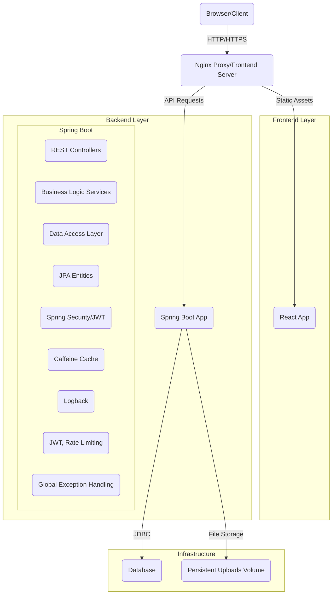

```markdown
# CMS Pro: Architecture Documentation

This document outlines the high-level architecture of the CMS Pro system, focusing on its components, their interactions, and the underlying design principles.

## 1. High-Level Overview

The CMS Pro is a monolithic application with a clear separation of concerns, designed as a full-stack web application. It follows a layered architecture pattern and is deployed as containerized services orchestrated by Docker Compose.



## 2. Component Breakdown

### 2.1. Frontend Layer (React)

*   **Technology:** React 18, Vite, Axios, React Router DOM.
*   **Purpose:** Provides an intuitive and responsive user interface for both public content consumption and administrative tasks (content creation, management).
*   **Key Components:**
    *   **Pages:** Home, Login, Content Management, Category Management (placeholders), User Management (placeholders), Media Management (placeholders), Not Found.
    *   **Components:** Reusable UI elements like Header, Content Cards, Forms, Tables.
    *   **Context:** `AuthContext` manages user authentication state (JWT token, user role, login/logout functions).
    *   **API Services:** Centralized modules for interacting with the backend API (e.g., `auth.js`, `content.js`).
    *   **Routing:** `react-router-dom` handles client-side navigation.
*   **Interaction:** Communicates with the Backend API exclusively via RESTful HTTP requests. Uses JWT for authenticated requests.

### 2.2. Backend Layer (Spring Boot)

*   **Technology:** Java 17, Spring Boot 3.x, Spring Data JPA, Spring Security.
*   **Purpose:** Serves as the core business logic and data persistence layer, exposing a RESTful API to the frontend.
*   **Architecture:** Follows a standard N-tier architecture:
    *   **Controllers (`@RestController`):** Handle incoming HTTP requests, perform input validation, delegate to service layer, and return API responses.
    *   **Services (`@Service`):** Contain the core business logic, orchestrate data operations, and interact with repositories. This layer also incorporates caching and authorization checks (`@PreAuthorize`).
    *   **Repositories (`@Repository` / Spring Data JPA):** Provide data access methods for interacting with the PostgreSQL database. Abstract away JDBC boilerplate.
    *   **Models (JPA Entities):** Represent the database schema using JPA annotations (`@Entity`, `@Table`, `@Column`, `@OneToMany`, etc.).
    *   **DTOs (Data Transfer Objects):** Used for transferring data between the client and the server, ensuring data consistency and hiding internal entity details.
    *   **Security (Spring Security):**
        *   **JWT Authentication Filter:** Intercepts requests, validates JWTs, and sets up the Spring Security context.
        *   **Authentication Provider:** Handles user authentication (validating credentials against the database).
        *   **Authorization:** Role-Based Access Control (RBAC) enforced using `@PreAuthorize` annotations at the service/controller level.
    *   **Global Error Handling (`@ControllerAdvice`):** Catches exceptions across the application and returns standardized error responses.
    *   **Caching (Caffeine):** Integrated via Spring Cache annotations (`@Cacheable`, `@CacheEvict`) for improving performance of frequently accessed data.
    *   **Rate Limiting:** A custom `RateLimitFilter` (using Guava's `RateLimiter`) protects against abuse and ensures API stability.
    *   **Logging:** SLF4J with Logback provides structured logging for monitoring and debugging.
*   **Database:** Connects to PostgreSQL using JDBC and Hibernate (via Spring Data JPA).

### 2.3. Database Layer (PostgreSQL)

*   **Technology:** PostgreSQL 15.
*   **Purpose:** Persistent storage for all application data (users, content, categories, media metadata).
*   **Management:**
    *   **Flyway:** Used for version control of database schema migrations, ensuring controlled and repeatable schema changes.
    *   **Indexing:** Applied to frequently queried columns to optimize read performance.
*   **Data Model:** Includes tables for `app_users`, `categories`, `contents`, and `media`, with appropriate relationships and constraints.

### 2.4. Infrastructure & Deployment (Docker, Docker Compose, Nginx)

*   **Docker:** Used to containerize each application component (Backend, Frontend, Database) for consistent environments from development to production.
*   **Docker Compose:** Orchestrates the multi-container application, defining services, networks, and volumes.
    *   **`db` service:** PostgreSQL database.
    *   **`backend` service:** Spring Boot application.
    *   **`frontend` service:** Nginx server serving the built React application and acting as a reverse proxy for API requests to the `backend` service.
*   **Nginx:** Serves the static React build, handles URL routing, and proxies API calls to the Spring Boot backend, providing a single entry point for the client.
*   **Persistent Volumes:** Docker volumes (`cms_data`, `cms_uploads`) are used to ensure data persistence for the database and uploaded media files, respectively, across container restarts.

## 3. Data Flow Example: Fetching Published Content

1.  **Client Request:** A user's browser (Frontend) requests `/` or `/api/v1/content/public`.
2.  **Nginx Interception:** Nginx receives the request.
    *   If `http://localhost/` or static assets, Nginx serves the React application from `/usr/share/nginx/html`.
    *   If `http://localhost/api/v1/content/public`, Nginx proxies the request to `http://backend:8080/api/v1/content/public`.
3.  **Backend Controller:** The `ContentController` in the Spring Boot `backend` service receives the request.
4.  **Service Layer:** The `ContentController` calls `contentService.getPublishedContent(...)`.
    *   The `ContentService` checks its cache (`@Cacheable`). If data is present and valid, it returns immediately.
    *   If not in cache, the `ContentService` calls `contentRepository.findByStatus(ContentStatus.PUBLISHED, pageable)`.
5.  **Repository Layer:** The `ContentRepository` (Spring Data JPA) translates this call into a SQL query.
6.  **Database:** PostgreSQL executes the query, retrieving the published content.
7.  **Data Mapping:** JPA maps the raw database results back to `Content` entities.
8.  **Service Transformation:** The `ContentService` maps `Content` entities to `ContentDTO`s.
9.  **Controller Response:** The `ContentController` returns the `Page<ContentDTO>` as a JSON response.
10. **Nginx Passthrough:** Nginx forwards the JSON response back to the client.
11. **Frontend Processing:** The React frontend receives the JSON, updates its state, and renders the content list on the UI.

## 4. Key Design Principles

*   **Separation of Concerns:** Clear boundaries between frontend, backend, and database layers, and within the backend (controllers, services, repositories).
*   **Modularity:** Features are organized into logical modules (auth, content, category, media) for easier management and scalability.
*   **RESTful API:** Standardized communication between frontend and backend using REST principles.
*   **Security by Design:** Integrated Spring Security, JWTs, RBAC, and rate limiting.
*   **Scalability:** Stateless backend services (JWT), caching, database indexing, and containerization facilitate horizontal scaling.
*   **Maintainability:** Clean code, extensive testing, and structured logging.
*   **Developer Experience:** Docker Compose provides an isolated and easy-to-set-up local development environment.
```