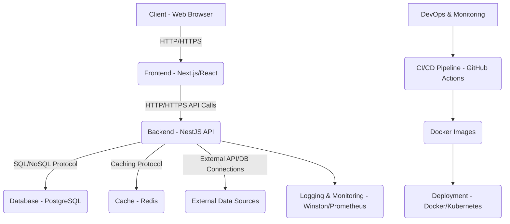

```markdown
# DataViz Pro - System Architecture

## 1. High-Level Overview

The DataViz Pro system is a modern, full-stack web application designed for creating and managing data visualizations and dashboards. It follows a micro-services oriented architecture (though implemented as a monolith for simplicity in this blueprint, modules are clearly separated for future extraction) and leverages cloud-native principles like containerization.



## 2. Frontend Architecture (Next.js / React)

The frontend is a Next.js application, providing benefits like Server-Side Rendering (SSR) or Static Site Generation (SSG) for performance and SEO, though largely acting as a Single Page Application (SPA) after initial load.

*   **Framework:** Next.js (React)
*   **State Management:** Zustand for global and component-level state.
*   **Data Fetching & Caching:** React Query for efficient data fetching, caching, and synchronization with the server.
*   **Routing:** Next.js file-system based routing.
*   **Styling:** Tailwind CSS for utility-first styling.
*   **Charting Library:** ECharts (or similar) for rendering interactive charts.
*   **UI/UX:** Focus on intuitive dashboard building with drag-and-drop (e.g., `react-grid-layout`) and responsive design.

**Key Components:**
*   `AppLayout`: Provides consistent navigation (Navbar, Sidebar) and ensures authentication.
*   `AuthContext` / `authStore`: Manages user authentication state, token storage, and logout.
*   `api.ts`: Centralized Axios instance for API calls, with request/response interceptors for auth and error handling.
*   `pages/`: Next.js pages for routing (Login, Register, Dashboards, Charts, Data Sources, Users).
*   `components/`: Reusable UI components (buttons, inputs, modals, ChartPanel, DashboardGrid).

## 3. Backend Architecture (NestJS / TypeScript)

The backend is built with NestJS, a progressive Node.js framework for building efficient, reliable, and scalable server-side applications. It enforces a modular structure, promoting separation of concerns.

*   **Framework:** NestJS
*   **Language:** TypeScript
*   **Database:** PostgreSQL, accessed via Prisma ORM.
*   **Authentication:** JWT (JSON Web Tokens) with Passport.js strategies.
*   **Authorization:** Role-Based Access Control (RBAC) using custom guards and decorators.
*   **API Design:** RESTful API endpoints.
*   **Caching:** Redis integration for response caching and potentially session management.
*   **Logging:** Winston for structured, transportable logging.
*   **Error Handling:** Global exception filters and validation pipes.
*   **Rate Limiting:** `express-rate-limit` middleware.

**Core Modules:**
*   `AuthModule`: Handles user login, registration, and JWT token generation/validation.
*   `UsersModule`: Manages user CRUD operations and role assignments.
*   `DataSourcesModule`: Manages connections to various external data sources (PostgreSQL, MySQL, REST API, etc.). This module contains logic to dynamically connect and query these sources.
*   `ChartsModule`: Manages chart definitions, including chart type, configuration (ECharts options), and the data query used to fetch its data. It also serves processed data for charts.
*   `DashboardsModule`: Manages dashboard layouts and their relationships with charts (DashboardPanel).
*   `PrismaModule`: Encapsulates PrismaClient for database interactions.
*   `Common Module`: Contains global middlewares, interceptors, pipes, and filters for cross-cutting concerns (logging, error handling, caching, validation).

## 4. Database Layer (PostgreSQL with Prisma)

*   **Database:** PostgreSQL is chosen for its robustness, reliability, and enterprise features.
*   **ORM:** Prisma provides a type-safe and efficient way to interact with the database.
    *   **Schema Definition:** `prisma/schema.prisma` defines all database models and their relationships.
    *   **Migrations:** Prisma Migrate is used to manage schema changes and keep the database in sync.
    *   **Seed Data:** `prisma/seed.ts` populates the database with initial users and sample data.
*   **Query Optimization:**
    *   Prisma's query engine generates optimized SQL.
    *   Indexes are defined on frequently queried columns (`userId`, `dataSourceId`, etc.).
    *   Caching with Redis is used to reduce database load for common queries.
    *   Potential for materialized views or background jobs for heavy aggregations in the `ChartsModule`.

## 5. Infrastructure & Deployment

*   **Containerization:** Both frontend and backend applications are containerized using Docker. This ensures environment consistency from development to production.
*   **Orchestration:** Docker Compose is used for local development to manage multiple services (app, db, redis). For production, Kubernetes is the recommended orchestration platform.
*   **Reverse Proxy:** Nginx is used to serve the frontend, proxy API requests to the backend, handle SSL termination, and provide basic load balancing.
*   **CI/CD:** GitHub Actions automates the build, test, and deployment process:
    *   **Build:** Compiles TypeScript, creates Docker images.
    *   **Test:** Runs unit, integration, and E2E tests.
    *   **Deployment:** Pushes Docker images to a registry and deploys to a target environment (e.g., Kubernetes cluster) upon successful tests on the `main` branch.

## 6. Security Considerations

*   **Authentication:** JWT tokens with secure storage (HTTP-only cookies recommended for client-side web apps).
*   **Authorization:** Strict RBAC implemented via Guards.
*   **Input Validation:** `class-validator` and NestJS `ValidationPipe` for all incoming API payloads.
*   **Data Protection:** Sensitive data (e.g., data source credentials) stored encrypted at rest (e.g., in HashiCorp Vault or cloud secret manager, not directly in DB config for production). For this blueprint, `Json` field is used, which is not encrypted.
*   **Secure Headers:** `helmet` middleware for various HTTP security headers.
*   **CORS:** Properly configured to allow requests only from trusted frontend origins.
*   **Rate Limiting:** Prevents brute-force attacks and DoS.
*   **Dependencies:** Regular security audits of third-party dependencies.
*   **Logging:** Comprehensive logging aids in detecting and investigating security incidents.

## 7. Monitoring & Observability

*   **Structured Logging:** Winston logs are structured (JSON) for easy parsing by log aggregators (e.g., ELK Stack, Grafana Loki).
*   **Health Checks:** Docker Compose and Kubernetes can leverage health checks to monitor service availability.
*   **Performance Monitoring:** `k6` for API performance testing. In production, integrate with APM tools (e.g., New Relic, Datadog, Prometheus/Grafana) for real-time monitoring of metrics (CPU, memory, request latency, error rates).
*   **Alerting:** Configure alerts based on predefined thresholds for critical metrics and error rates.
```