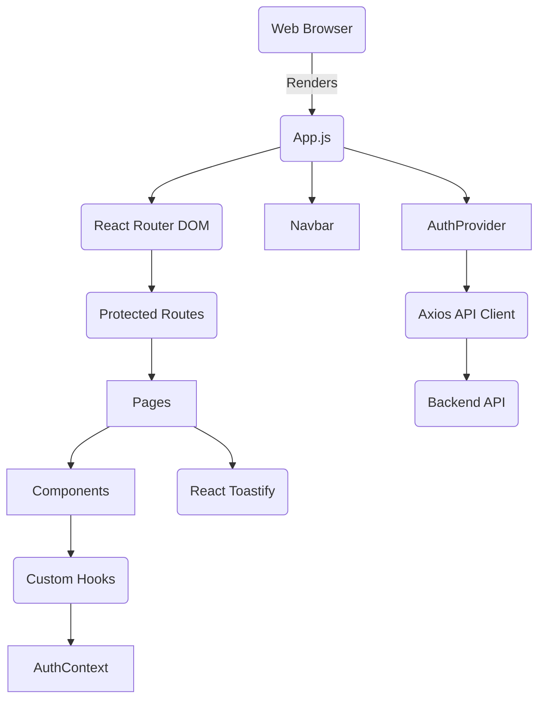

# 🏛️ Architecture Documentation: Database Optimization System

This document outlines the architectural design of the Database Optimization System, covering its major components, their interactions, and the rationale behind key design decisions.

## 1. High-Level Architecture

The system follows a classic **Client-Server** architecture with a **Monolithic (Backend) / SPA (Frontend)** approach, designed for scalability and maintainability.

```mermaid
graph TD
    User -->|Browser| Frontend
    Frontend -->|HTTP/HTTPS (REST API)| Backend
    Backend -->|Database Driver (Prisma)| PostgreSQL
    Backend -->|Internal (Node-cron)| CollectorService
    CollectorService -->|Database Driver (Prisma)| PostgreSQL
    Backend -->|Logging| LogStore
    Backend -->|Caching| Redis/NodeCache
    CI_CD -->|Build & Test| Backend
    CI_CD -->|Build & Test| Frontend
    CI_CD -->|Deploy| HostingPlatform
```

**Key Components**:

*   **Frontend**: A Single Page Application (SPA) built with React.js, providing the user interface for interaction.
*   **Backend**: A Node.js (Express.js) API server responsible for business logic, data processing, authentication, and communication with the database.
*   **Database**: PostgreSQL, serving as the persistent storage for system data (users, monitored queries, suggestions, metrics, etc.).
*   **Collector Service**: A background service (part of the Backend application, managed by `node-cron`) responsible for simulating data collection from the monitored database, performing analysis, and storing insights.
*   **Caching Layer**: Integrated within the Backend to reduce database load and improve API response times.
*   **Logging & Monitoring**: Comprehensive logging through Winston, and a conceptual external monitoring system.
*   **CI/CD Pipeline**: Automates the build, test, and deployment processes using GitHub Actions.

## 2. Backend Architecture (Node.js/Express)

The backend adheres to a layered architecture, promoting separation of concerns:

```mermaid
graph TD
    Client[Client (Frontend)] -- HTTP Requests --> LoadBalancer(Load Balancer / API Gateway)
    LoadBalancer --> ExpressApp
    ExpressApp(Express.js Application) -->|Middleware| Authentication[Authentication/Authorization]
    ExpressApp -->|Middleware| RateLimiting[Rate Limiting]
    ExpressApp -->|Middleware| Logging[Request Logging]
    ExpressApp -->|Routes| Controllers
    Controllers --> Services
    Services --> Prisma(Prisma ORM)
    Prisma --> PostgreSQL[PostgreSQL Database]
    ExpressApp -->|Middleware| ErrorHandling[Global Error Handler]
    ExpressApp -- Background Task --> Scheduler(Node-Cron Scheduler)
    Scheduler --> CollectorService[Collector Service]
    CollectorService --> Prisma
    Services -- Cache Access --> NodeCache(Node-Cache)
    Logging --> LogFiles(Log Files / External Log Aggregator)
```

**Layers**:

*   **`src/server.js`**: Application entry point, initializes Express app and starts server.
*   **`src/app.js`**: Configures the Express application, applies global middleware, and mounts API routes. Also initiates the `CollectorService` scheduling.
*   **`src/config/`**: Contains environment-specific configurations (database URL, JWT secrets, etc.) and Prisma client initialization.
*   **`src/middleware/`**:
    *   `authMiddleware.js`: Handles JWT verification and role-based authorization (`protect`, `authorize`).
    *   `errorHandler.js`: Centralized error handling for consistent API error responses.
    *   `loggingMiddleware.js`: Logs incoming requests and responses.
    *   `rateLimitMiddleware.js`: Implements rate limiting to protect API endpoints.
*   **`src/routes/`**: Defines API endpoint paths and maps them to controller functions. Uses Express Routers to modularize routes by feature.
*   **`src/controllers/`**:
    *   Receive incoming requests, validate input (basic), and delegate business logic to `services`.
    *   Format responses to be sent back to the client. Use `express-async-handler` to simplify error handling in async functions.
*   **`src/services/`**:
    *   Encapsulates the core business logic of the application.
    *   Interacts with the database (via Prisma) and the caching layer.
    *   Examples: `authService`, `queryService`, `indexService`, `schemaService`, `metricService`, `dbCollectorService`.
*   **`src/utils/`**: Helper utilities.
    *   `logger.js`: Winston-based logging utility.
    *   `cache.js`: Node-cache wrapper for in-memory caching.
    *   `scheduler.js`: Node-cron wrapper for scheduling background tasks.
*   **`prisma/`**:
    *   `schema.prisma`: Defines the database schema using Prisma's SDL.
    *   `migrations/`: Contains database migration scripts managed by Prisma Migrate.

### 2.1 Database Layer

*   **PostgreSQL**: Chosen for its robustness, reliability, advanced features (e.g., JSONB support for `EXPLAIN` plans), and wide industry adoption.
*   **Prisma ORM**:
    *   **Schema Definition**: Provides a type-safe way to define the database schema.
    *   **Migrations**: Simplifies database schema evolution.
    *   **Query Builder**: Offers a powerful and type-safe API for database interactions, preventing SQL injection and improving developer experience.
    *   **Connection Pooling**: Managed automatically by Prisma Client, ensuring efficient use of database connections.

### 2.2 Data Collection & Analysis (CollectorService)

The `dbCollectorService` is a critical background component:

1.  **Scheduled Execution**: Uses `node-cron` to periodically run tasks (e.g., every 5 minutes).
2.  **Simulation of Data Collection**: For this demo, it simulates fetching data (`pg_stat_statements`, `pg_stat_activity`, `information_schema`) from the *system's own database*. In a real production system, this service would:
    *   Connect to *external* monitored database instances using appropriate database clients (e.g., `pg` for PostgreSQL).
    *   Execute specific queries (e.g., `SELECT * FROM pg_stat_statements;`, `SELECT * FROM pg_stat_activity;`, `SELECT * FROM information_schema.tables;`) to gather raw performance data and schema metadata.
3.  **Analysis**:
    *   **Slow Query Identification**: Filters collected queries based on execution duration.
    *   **Index Suggestion**: Analyzes `EXPLAIN` plans (if captured) to identify opportunities for index creation (e.g., frequent table scans on large tables).
    *   **Schema Linting**: Checks for common anti-patterns or missing best practices (e.g., missing foreign keys, suboptimal data types).
4.  **Storage**: Stores the processed insights (MonitoredQueries, IndexSuggestions, SchemaIssues, MetricSnapshots) into the system's own PostgreSQL database via Prisma.
5.  **Cache Invalidation**: Invalidates relevant cache entries after new data is collected and analyzed to ensure the frontend receives fresh information.

## 3. Frontend Architecture (React.js)

The frontend is a standard React SPA:



**Key Elements**:

*   **`index.js`**: Entry point for the React application.
*   **`App.js`**: Main application component, sets up `BrowserRouter`, `AuthProvider`, `Navbar`, and defines main routes.
*   **`src/contexts/AuthContext.js`**: Provides global authentication state and functions (`login`, `logout`, `register`) to child components using React Context API.
*   **`src/hooks/useAuth.js`**: Custom hook for easy access to authentication context.
*   **`src/components/`**: Reusable UI components (Navbar, Card, Table, MetricChart, PrivateRoute).
*   **`src/pages/`**: Top-level components mapped to routes, representing distinct views of the application (Dashboard, SlowQueries, IndexSuggestions, etc.).
*   **`src/api/index.js`**: Centralized Axios instance with interceptors for:
    *   Attaching JWT tokens to outgoing requests.
    *   Global error handling (displaying toasts, redirecting on 401).
    *   Defines functions for interacting with specific backend API endpoints.
*   **`src/styles/`**: Tailwind CSS configuration and global CSS imports.

## 4. Security Considerations

*   **Authentication**: JWT for stateless authentication. Tokens are stored in HTTP-only cookies (if configured, in this demo, `js-cookie` stores in local storage which is less secure but simpler for demo).
*   **Authorization**: Role-based access control (`admin`, `user`) implemented via middleware on the backend.
*   **Data Validation**: Basic input validation on backend controllers. More robust schema validation (e.g., Joi, Zod) would be used in production.
*   **Hashing**: `bcryptjs` for secure password storage.
*   **Rate Limiting**: Protects against brute-force attacks and abuse.
*   **CORS**: Configured to allow requests from the frontend origin.
*   **Helmet**: Provides various HTTP headers to secure Express apps.
*   **Environment Variables**: Sensitive information (database credentials, JWT secrets) are stored in environment variables, not hardcoded.

## 5. Scalability and Performance

*   **Stateless Backend**: Express.js server is stateless, allowing for easy horizontal scaling.
*   **Database Connection Pooling**: Prisma manages efficient database connections.
*   **Caching**: `node-cache` (in-memory) provides quick access to frequently requested data, reducing database load. In a production environment, this would be replaced by a distributed cache like Redis.
*   **Optimized Database Queries**: Prisma allows for efficient querying. The system itself is designed to *identify* slow queries, contributing to overall database health.
*   **Background Processing**: The `CollectorService` offloads heavy analysis tasks from the main request/response cycle.
*   **Frontend Performance**: React's virtual DOM, code splitting (implicitly handled by Create React App build), and optimized component rendering contribute to a responsive UI.

## 6. Observability

*   **Structured Logging**: Winston provides categorized and structured logs (info, error, debug, http), which can be easily shipped to an external log management system (ELK stack, Splunk, DataDog).
*   **Error Handling**: Centralized error handling ensures all unhandled errors are logged and a consistent error response is sent to the client.
*   **Performance Metrics**: The system itself collects and displays database performance metrics, providing a view into its own (or a conceptual external) database's health.
*   **Health Check**: A simple `/api/health` endpoint allows load balancers and orchestrators (like Docker Swarm, Kubernetes) to monitor application health.

This architectural overview provides a foundation for understanding the system's design and operational characteristics.