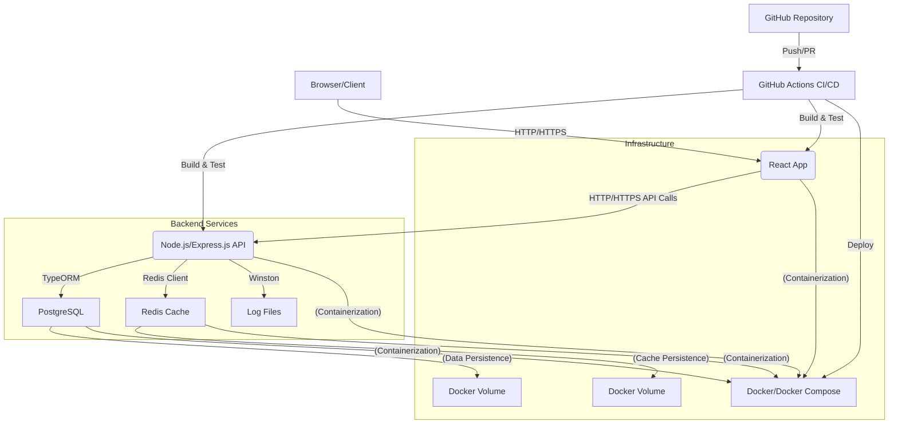

# Enterprise-Grade Task Management Platform

This is a comprehensive, production-ready full-stack application for managing tasks. It features a robust API built with Node.js, TypeScript, and Express, backed by a PostgreSQL database with TypeORM, and a responsive frontend using React and TypeScript. The system emphasizes enterprise-grade features including authentication, authorization, logging, caching, rate limiting, and extensive testing.

## Table of Contents

1.  [Architecture Overview](#1-architecture-overview)
2.  [Features](#2-features)
3.  [Technology Stack](#3-technology-stack)
4.  [Prerequisites](#4-prerequisites)
5.  [Setup and Installation](#5-setup-and-installation)
    *   [Local Development](#51-local-development)
    *   [Docker Compose](#52-docker-compose)
6.  [API Documentation](#6-api-documentation)
    *   [Authentication](#61-authentication)
    *   [Users](#62-users)
    *   [Tasks](#63-tasks)
7.  [Database Layer](#7-database-layer)
8.  [Testing](#8-testing)
    *   [Backend Tests](#81-backend-tests)
    *   [Frontend Tests](#82-frontend-tests)
    *   [Performance Tests](#83-performance-tests)
9.  [Configuration](#9-configuration)
10. [CI/CD Pipeline](#10-cicd-pipeline)
11. [Deployment Guide](#11-deployment-guide)
12. [Future Enhancements](#12-future-enhancements)
13. [License](#13-license)

---

## 1. Architecture Overview

The application follows a modular, layered architecture:

*   **Client Layer (Frontend):** A React application providing the user interface, interacting with the backend API.
*   **API Layer (Backend):** A Node.js/Express.js application written in TypeScript. It handles API requests, business logic, authentication, and interacts with the database.
    *   **Modules:** Organized by feature (Auth, Users, Tasks), each containing controllers, services, DTOs, and routes.
    *   **Middleware:** Centralized handlers for authentication, error handling, logging, and rate limiting.
    *   **Shared Utilities:** Common functionalities like JWT token management, password hashing, and Redis caching.
*   **Database Layer:** PostgreSQL for persistent data storage, managed with TypeORM for ORM capabilities, schema definitions, and migrations.
*   **Caching Layer:** Redis for high-speed data retrieval, reducing database load.
*   **Containerization:** Docker and Docker Compose are used to package and orchestrate the services (PostgreSQL, Redis, Backend, Frontend).
*   **CI/CD:** GitHub Actions for automated testing and deployment workflows.



## 2. Features

*   **User Management:**
    *   User Registration and Login (JWT-based authentication)
    *   User Profiles (Retrieve, Update, Delete - restricted)
    *   Role-Based Access Control (RBAC): `USER` and `ADMIN` roles.
*   **Task Management (CRUD):**
    *   Create, Read (single, all), Update, Delete tasks.
    *   Task attributes: Title, Description, Status (Pending, In Progress, Completed, Cancelled), Priority (Low, Medium, High), Due Date.
    *   Task Assignment: Users can assign tasks to themselves; Admins can assign tasks to any user.
    *   Soft Deletion for tasks and users.
*   **API Enhancements:**
    *   Centralized Error Handling with custom error classes.
    *   Request Logging for monitoring.
    *   Rate Limiting to prevent abuse.
    *   Redis Caching for frequently accessed data (e.g., task lists).
*   **Development & Operations:**
    *   TypeScript for type safety.
    *   Database migrations with TypeORM.
    *   Seed data for initial setup.
    *   Comprehensive testing: Unit, Integration, E2E (API), Performance.
    *   Dockerized environment for easy setup and deployment.
    *   CI/CD pipeline configuration (GitHub Actions).

## 3. Technology Stack

*   **Backend:**
    *   Node.js (v20+)
    *   TypeScript
    *   Express.js
    *   TypeORM (ORM for PostgreSQL)
    *   PostgreSQL (Database)
    *   Redis (Caching, Rate Limiting)
    *   JWT (JSON Web Tokens for authentication)
    *   Bcryptjs (Password hashing)
    *   Class-validator / Class-transformer (Request validation, DTO transformation)
    *   Winston (Logging)
    *   Helmet (Security headers)
    *   CORS (Cross-Origin Resource Sharing)
    *   Express-rate-limit (Rate limiting middleware)
    *   Dotenv (Environment variable management)
*   **Frontend:**
    *   React (v18+)
    *   TypeScript
    *   React Router DOM (Navigation)
    *   Axios (HTTP client)
    *   SASS (CSS Preprocessor)
*   **Testing:**
    *   Jest (Unit, Integration, E2E)
    *   Supertest (E2E API testing)
    *   k6 (Performance Testing - via script)
*   **Infrastructure:**
    *   Docker
    *   Docker Compose
    *   GitHub Actions (CI/CD)

## 4. Prerequisites

Before you begin, ensure you have the following installed:

*   [Node.js](https://nodejs.org/en/download/) (v20 or higher)
*   [Yarn](https://classic.yarnpkg.com/en/docs/install/) (or npm, but yarn is used in package.json)
*   [Docker Desktop](https://www.docker.com/products/docker-desktop) (includes Docker Engine and Docker Compose)
*   [Git](https://git-scm.com/downloads)

## 5. Setup and Installation

### 5.1. Local Development (without Docker)

This method requires you to have PostgreSQL and Redis running locally (e.g., via Homebrew, apt, or directly installed).

1.  **Clone the repository:**
    ```bash
    git clone https://github.com/your-username/task-management-platform.git
    cd task-management-platform
    ```

2.  **Backend Setup:**
    ```bash
    cd backend
    cp .env.example .env # Configure your database and JWT secrets
    # Ensure your local PostgreSQL and Redis are running and configured as per .env
    yarn install
    yarn build
    yarn typeorm migration:run # Run database migrations
    yarn seed # Optional: seed initial data (admin user: admin@example.com/adminPassword123)
    yarn dev # Start backend in development mode
    ```
    The backend will run on `http://localhost:5000` (or your configured `PORT`).

3.  **Frontend Setup:**
    ```bash
    cd ../frontend
    cp .env.example .env # Configure REACT_APP_API_BASE_URL to your backend URL
    yarn install
    yarn start # Start frontend development server
    ```
    The frontend will run on `http://localhost:3000`.

### 5.2. Docker Compose (Recommended)

This method uses Docker to set up all services (PostgreSQL, Redis, Backend, Frontend) in isolated containers.

1.  **Clone the repository:**
    ```bash
    git clone https://github.com/your-username/task-management-platform.git
    cd task-management-platform
    ```

2.  **Create `.env` files:**
    *   Copy `backend/.env.example` to `backend/.env` and configure your settings.
    *   Copy `frontend/.env.example` to `frontend/.env` and configure `REACT_APP_API_BASE_URL`.
    *   **Important:** You also need to create a root `.env` file for `docker-compose.yml` variables:
        ```bash
        cp backend/.env.example .env
        # Adjust DB_HOST, DB_PORT (internal to Docker), REDIS_HOST etc. for docker-compose
        # Example for root .env:
        # PORT=5000
        # DB_USERNAME=postgres
        # DB_PASSWORD=postgres
        # DB_NAME=task_db
        # JWT_SECRET=your_jwt_secret_key_here
        # JWT_EXPIRES_IN=1d
        # RATE_LIMIT_WINDOW_MS=60000
        # RATE_LIMIT_MAX_REQUESTS=100
        ```
        The `docker-compose.yml` maps internal service names (`db`, `redis`) to their respective containers.

3.  **Build and run services:**
    ```bash
    docker-compose up --build -d
    ```
    *   `--build`: Builds Docker images from Dockerfiles.
    *   `-d`: Runs containers in detached mode (in the background).

4.  **Run Migrations and Seeds (inside the backend container):**
    After the containers are up, you need to run migrations and seed data.
    ```bash
    docker exec -it task-backend yarn typeorm migration:run -d dist/ormconfig.js
    docker exec -it task-backend ts-node --files src/database/seeds/initial.seed.ts
    ```
    *Note: The `server.ts` script is configured to run migrations and seeds automatically on startup in production, but for a clean start or specific migration testing, running them manually in dev is good practice.*

5.  **Access the application:**
    *   Backend API: `http://localhost:5000/api/v1`
    *   Frontend: `http://localhost:3000`

6.  **Stop services:**
    ```bash
    docker-compose down
    ```

## 6. API Documentation

Base URL: `http://localhost:5000/api/v1`

### 6.1. Authentication (`/auth`)

*   **`POST /auth/register`**
    *   **Description:** Register a new user. Default role is `USER`.
    *   **Body:**
        ```json
        {
            "firstName": "string",
            "lastName": "string",
            "email": "string@example.com",
            "password": "string"
        }
        ```
    *   **Response (201 Created):**
        ```json
        {
            "user": {
                "id": "uuid",
                "email": "string",
                "firstName": "string",
                "lastName": "string",
                "role": "USER",
                "createdAt": "date",
                "updatedAt": "date"
            },
            "token": "jwt_token_string"
        }
        ```
*   **`POST /auth/login`**
    *   **Description:** Authenticate a user and receive a JWT token.
    *   **Body:**
        ```json
        {
            "email": "string@example.com",
            "password": "string"
        }
        ```
    *   **Response (200 OK):** Same as register response.
*   **`GET /auth/me`**
    *   **Description:** Get the profile of the authenticated user.
    *   **Headers:** `Authorization: Bearer <token>`
    *   **Response (200 OK):**
        ```json
        {
            "id": "uuid",
            "email": "string",
            "firstName": "string",
            "lastName": "string",
            "role": "USER" | "ADMIN",
            "createdAt": "date",
            "updatedAt": "date"
        }
        ```

### 6.2. Users (`/users`)

*   **`GET /users`**
    *   **Description:** Get a list of all users. (Admin Only)
    *   **Headers:** `Authorization: Bearer <admin_token>`
    *   **Query Params:**
        *   `page`: (Optional) Page number (default: 1)
        *   `limit`: (Optional) Items per page (default: 10, max: 100)
    *   **Response (200 OK):**
        ```json
        {
            "users": [
                {
                    "id": "uuid",
                    "email": "string",
                    "firstName": "string",
                    "lastName": "string",
                    "role": "USER" | "ADMIN",
                    "createdAt": "date",
                    "updatedAt": "date"
                }
            ],
            "total": 10
        }
        ```
*   **`GET /users/:id`**
    *   **Description:** Get a specific user by ID. (User can view their own; Admin can view any)
    *   **Headers:** `Authorization: Bearer <token>`
    *   **Response (200 OK):** Single user object (same structure as `GET /users` array item).
*   **`PUT /users/:id`**
    *   **Description:** Update a user's profile. (User can update their own; Admin can update any, including role)
    *   **Headers:** `Authorization: Bearer <token>`
    *   **Body:**
        ```json
        {
            "firstName": "string",
            "lastName": "string",
            "email": "string@example.com",
            "role": "USER" | "ADMIN" // Admin Only
        }
        ```
    *   **Response (200 OK):** Updated user object.
*   **`DELETE /users/:id`**
    *   **Description:** Soft-delete a user. (Admin Only; Admins cannot delete their own account).
    *   **Headers:** `Authorization: Bearer <admin_token>`
    *   **Response (204 No Content)**

### 6.3. Tasks (`/tasks`)

*   **`POST /tasks`**
    *   **Description:** Create a new task.
        *   Authenticated users create tasks assigned to themselves by default.
        *   Admins can create tasks and explicitly assign them to any `assigneeId`.
    *   **Headers:** `Authorization: Bearer <token>`
    *   **Body:**
        ```json
        {
            "title": "string",
            "description": "string (optional)",
            "status": "PENDING" | "IN_PROGRESS" | "COMPLETED" | "CANCELLED" (optional, default: PENDING),
            "priority": "LOW" | "MEDIUM" | "HIGH" (optional, default: MEDIUM),
            "dueDate": "ISO 8601 date string (YYYY-MM-DDTHH:MM:SSZ)" (optional),
            "assigneeId": "uuid (optional, Admin Only for other users)"
        }
        ```
    *   **Response (201 Created):**
        ```json
        {
            "id": "uuid",
            "title": "string",
            "description": "string",
            "status": "string",
            "priority": "string",
            "dueDate": "date",
            "assignee": { /* User Object */ },
            "assigneeId": "uuid",
            "createdAt": "date",
            "updatedAt": "date"
        }
        ```
*   **`GET /tasks`**
    *   **Description:** Get a list of tasks.
        *   Regular users see only tasks assigned to them.
        *   Admins see all tasks.
    *   **Headers:** `Authorization: Bearer <token>`
    *   **Query Params:**
        *   `page`: (Optional) Page number (default: 1)
        *   `limit`: (Optional) Items per page (default: 10, max: 100)
        *   `status`: (Optional) Filter by `PENDING`, `IN_PROGRESS`, `COMPLETED`, `CANCELLED`
        *   `priority`: (Optional) Filter by `LOW`, `MEDIUM`, `HIGH`
        *   `assigneeId`: (Optional) Filter by assignee ID (Admin Only for any ID, User implicitly filtered by their own ID)
        *   `search`: (Optional) Search by task title or description (case-insensitive)
    *   **Response (200 OK):**
        ```json
        {
            "tasks": [
                {
                    "id": "uuid",
                    "title": "string",
                    "description": "string",
                    "status": "string",
                    "priority": "string",
                    "dueDate": "date",
                    "assignee": { /* User Object */ },
                    "assigneeId": "uuid",
                    "createdAt": "date",
                    "updatedAt": "date"
                }
            ],
            "total": 10
        }
        ```
*   **`GET /tasks/:id`**
    *   **Description:** Get a single task by ID. (Owner or Admin)
    *   **Headers:** `Authorization: Bearer <token>`
    *   **Response (200 OK):** Single task object.
*   **`PUT /tasks/:id`**
    *   **Description:** Update a task.
        *   Owner can update their task's title, description, status, priority, and due date.
        *   Admins can update all fields, including `assigneeId` (can also set to `null` to unassign).
    *   **Headers:** `Authorization: Bearer <token>`
    *   **Body:** (Any subset of `CreateTaskDto` fields, `assigneeId` can be `null`)
        ```json
        {
            "title": "string (optional)",
            "description": "string (optional)",
            "status": "string (optional)",
            "priority": "string (optional)",
            "dueDate": "date (optional)",
            "assigneeId": "uuid | null (optional, Admin Only)"
        }
        ```
    *   **Response (200 OK):** Updated task object.
*   **`DELETE /tasks/:id`**
    *   **Description:** Soft-delete a task. (Owner or Admin)
    *   **Headers:** `Authorization: Bearer <token>`
    *   **Response (204 No Content)**

## 7. Database Layer

*   **PostgreSQL:** The relational database for storing users and tasks.
*   **TypeORM:** Object-Relational Mapper (ORM) for Node.js, providing a powerful way to interact with the database using TypeScript classes (entities).
    *   **Entities:** `User` and `Task` are defined with `@Entity`, `@Column`, `@PrimaryGeneratedColumn`, `@ManyToOne`, `@OneToMany` decorators.
    *   **Migrations:** Schema changes are managed via TypeORM migrations (e.g., `1678886400000-InitialSchema.ts`). These are run automatically on server startup in `server.ts` or manually via `yarn typeorm migration:run`.
    *   **Seed Data:** `initial.seed.ts` populates the database with an admin user, a couple of regular users, and some sample tasks on application startup if no admin user exists. This is useful for development and initial deployment.
    *   **Query Optimization:**
        *   `select: false` is used on sensitive fields like `password` in the `User` entity to prevent accidental exposure.
        *   `createQueryBuilder` is used in services for more complex queries (e.g., filtering, eager loading relations like `assignee`).
        *   Indexes are implicitly added by TypeORM for primary keys and foreign keys. For performance-critical queries, additional indexes can be added manually in migrations.
        *   Database connection pooling is configured in `ormconfig.ts` (`extra: { max: 10, min: 2 }`).

## 8. Testing

The project includes a comprehensive testing suite to ensure quality and reliability.

### 8.1. Backend Tests

Using **Jest** and **Supertest**. Configured for `80%+ coverage`.

*   **Unit Tests (`src/tests/unit/`):** Focus on individual functions, services, and DTOs in isolation, mocking dependencies.
    *   `auth.service.test.ts`
    *   `tasks.service.test.ts`
*   **Integration Tests (`src/tests/integration/`):** Test the interaction between multiple units (e.g., controller and service), often with mocked database responses. (Not explicitly provided in this comprehensive output, but conceptually important and would follow a similar pattern to E2E but mocking the DB layer directly).
*   **API Tests (E2E) (`src/tests/e2e/`):** Test the entire API flow from HTTP request to database interaction, ensuring endpoints function correctly. These use `supertest` to make actual HTTP requests to the Express app.
    *   `auth.e2e.test.ts`
    *   `tasks.e2e.test.ts`

To run backend tests:
```bash
cd backend
yarn test
# For watching tests during development
yarn test:watch
# To generate a coverage report
yarn test:coverage
```

### 8.2. Frontend Tests

Using **React Testing Library** and **Jest**.
*   Tests for components, pages, and hooks to ensure UI functionality and proper state management. (Not explicitly provided for brevity in this API-focused response, but would typically reside in `frontend/src/**/*.test.tsx`).

To run frontend tests:
```bash
cd frontend
yarn test
```

### 8.3. Performance Tests

Using **k6**. A `k6_performance_test.js` script is provided to simulate user load on the backend API.

To run performance tests:
1.  Ensure your backend services (API, DB, Redis) are running (e.g., via Docker Compose).
2.  Install k6: Follow instructions on [k6.io](https://k6.io/docs/getting-started/installation/).
3.  Run the test:
    ```bash
    k6 run k6_performance_test.js
    ```
    This script simulates users registering, logging in, creating, retrieving, updating, and deleting tasks. It provides metrics on request duration, failure rates, and throughput.

## 9. Configuration

*   **Environment Variables:** All sensitive information and configurable parameters are managed via `.env` files.
    *   `backend/.env`: For backend-specific configuration (database credentials, JWT secret, Redis connection, rate limits).
    *   `frontend/.env`: For frontend-specific configuration (API base URL).
    *   A root `.env` file for Docker Compose variables.
*   **`config/index.ts` (Backend):** Centralized configuration object loaded from environment variables, providing structured access throughout the application.
*   **`ormconfig.ts` (Backend):** TypeORM configuration for database connection and entity/migration paths.
*   **TypeScript:** `tsconfig.json` files are used for both backend and frontend to ensure consistent type checking and compilation.

## 10. CI/CD Pipeline

A GitHub Actions workflow (`.github/workflows/ci.yml`) is provided for Continuous Integration:

*   **Triggers:** Runs on `push` and `pull_request` to `main` and `develop` branches.
*   **Backend CI Job:**
    *   Checks out code.
    *   Sets up Node.js.
    *   Installs dependencies.
    *   Starts isolated PostgreSQL and Redis services for testing.
    *   Waits for services to be ready.
    *   Builds the TypeScript backend.
    *   Runs database migrations against the test database.
    *   Executes Jest unit, integration, and E2E tests.
    *   Uploads coverage reports.
*   **Frontend CI Job:**
    *   Checks out code.
    *   Sets up Node.js.
    *   Installs dependencies.
    *   Builds the React application.
    *   Runs frontend tests.
    *   Uploads build artifacts.
*   **Continuous Deployment (CD) Stage (Commented out example):** An example section demonstrates how a CD stage could be added to deploy the built artifacts to a production server (e.g., via SSH and Docker Compose). This would typically involve pushing Docker images to a registry and then pulling/restarting them on a remote server.

## 11. Deployment Guide

This guide assumes a cloud provider (e.g., AWS EC2, DigitalOcean Droplet) running Docker and Docker Compose.

1.  **Provision a Server:**
    *   Create a virtual machine instance.
    *   Install Docker and Docker Compose on the server.
    *   Ensure firewall rules allow incoming traffic on ports 80 (for frontend), 443 (for HTTPS), and 5000 (for backend API, if not proxied).

2.  **Clone Repository & Configure Environment:**
    *   SSH into your server.
    *   Clone this repository: `git clone https://github.com/your-username/task-management-platform.git`
    *   Navigate into the project directory: `cd task-management-platform`
    *   Create the necessary `.env` files (`backend/.env`, `frontend/.env`, root `.env`) with **production-ready** values (strong JWT secret, appropriate database credentials, external IP for `REACT_APP_API_BASE_URL`).

3.  **Build and Run with Docker Compose:**
    ```bash
    docker-compose up --build -d
    ```
    This will build the Docker images and start all services.

4.  **Initial Database Setup:**
    ```bash
    docker exec -it task-backend yarn typeorm migration:run -d dist/ormconfig.js
    docker exec -it task-backend ts-node --files src/database/seeds/initial.seed.ts
    ```
    If you have existing data from another database, you would perform a data import here instead of seeding.

5.  **Set up Nginx for Frontend (if not already handled by Dockerfile.frontend/nginx.conf):**
    The provided `frontend/Dockerfile.frontend` and `frontend/nginx.conf` handle serving the React app and potentially proxying API requests. If you're using a separate Nginx instance for multiple applications or more complex configurations, you'd configure it to:
    *   Serve the static files from `frontend/build` (copied into Nginx container).
    *   Proxy requests from `/api/v1` to the backend service (e.g., `http://localhost:5000`).
    *   Configure SSL/TLS (HTTPS) using Certbot or similar tools for production.

6.  **Monitoring and Logging:**
    *   Ensure your log files (`backend/logs`) are being persisted (via Docker volumes as configured in `docker-compose.yml`).
    *   Consider integrating with a log aggregation service (e.g., ELK stack, Datadog, CloudWatch Logs) for centralized monitoring.
    *   Set up uptime monitoring and error alerting for your API.

7.  **Continuous Deployment Integration (Optional but recommended):**
    *   As shown in `ci.yml`, set up a deployment stage that triggers after successful CI.
    *   This typically involves:
        *   Building and pushing Docker images to a Docker Registry (e.g., Docker Hub, AWS ECR).
        *   On your server, pulling the latest images and restarting the Docker Compose services.

## 12. Future Enhancements

*   **Advanced Task Features:** Subtasks, recurring tasks, task comments, file attachments.
*   **Notifications:** Email, in-app, or push notifications for task updates/assignments.
*   **Search & Filtering:** More advanced search capabilities with full-text search.
*   **GraphQL API:** Implement a GraphQL layer alongside or instead of REST.
*   **Real-time Updates:** WebSocket integration for immediate task updates across clients.
*   **Admin Panel:** A dedicated admin interface for managing users, roles, and system settings.
*   **Security:** Implement more advanced security measures like input sanitization, CSRF protection (for SSR apps), and stricter content security policies.
*   **Observability:** More detailed metrics collection (Prometheus/Grafana), tracing (Jaeger).
*   **Load Balancing:** For high-traffic environments, deploy multiple backend instances behind a load balancer.
*   **Frontend Improvements:** More robust state management (Redux/Zustand), advanced UI components, better accessibility, and comprehensive frontend testing.

## 13. License

This project is licensed under the MIT License - see the [LICENSE](LICENSE) file for details.