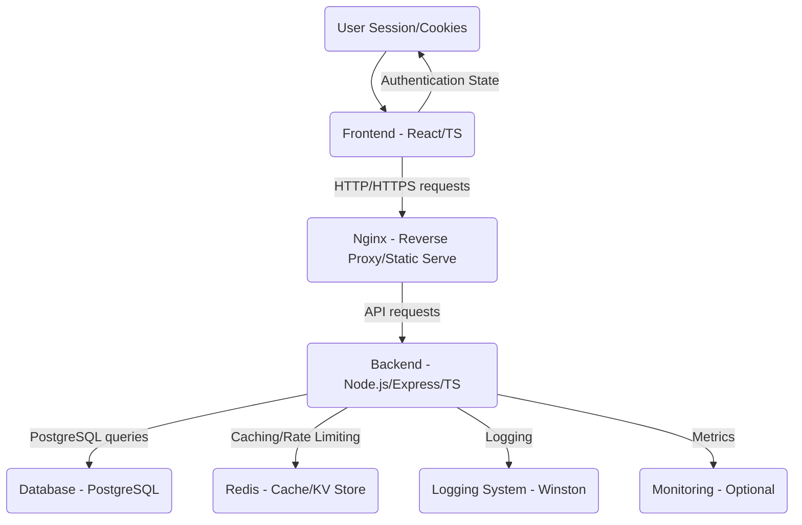

# Architecture Documentation

This document describes the overall architecture of the Secure Enterprise Web Application.

## 1. High-Level Overview

The application follows a standard **client-server architecture** with a **monorepo structure** (for development convenience) for its backend and frontend components. It leverages **Docker** for containerization and **Docker Compose** for local orchestration, facilitating consistent development and deployment environments.

## 2. Component Breakdown

### 2.1 Frontend (Client-side)

*   **Technology:** React, TypeScript, Axios (for API calls), React Router.
*   **Purpose:** Provides a responsive and interactive user interface for interacting with the backend API.
*   **Key Features:**
    *   User authentication (Login, Register, Logout).
    *   Protected routes based on authentication status and user roles.
    *   Display and management of products.
    *   Basic user profile/management interface for admins.
*   **Deployment:** Served as static files by Nginx in a Docker container.

### 2.2 Backend (API Server)

*   **Technology:** Node.js, Express.js, TypeScript.
*   **Purpose:** Exposes a RESTful API for client applications, handles business logic, data persistence, and security concerns.
*   **Layers:**
    *   **`app.ts` / `server.ts`:** Entry points, application setup (middleware, routes).
    *   **`routes/`:** Defines API endpoints and maps them to controllers.
    *   **`controllers/`:** Handles incoming requests, orchestrates data flow, and sends responses. Delegates business logic to services.
    *   **`services/`:** Contains core business logic, interacts with the database (via ORM), and other external services (e.g., email, cache). This layer is responsible for data manipulation and validation beyond basic input parsing.
    *   **`middleware/`:** Intercepts requests/responses for common tasks like authentication, authorization, validation, logging, error handling, rate limiting.
    *   **`validation/`:** Zod schemas for validating incoming request data (body, query, params).
    *   **`utils/`:** Helper functions (JWT, password hashing, response formatting, logger).
    *   **`config/`:** Centralized configuration for environment variables, database, JWT settings, etc.

### 2.3 Database

*   **Technology:** PostgreSQL.
*   **ORM:** Prisma.
*   **Purpose:** Stores all persistent application data (users, products, tokens).
*   **Key Features:**
    *   Relational database ensuring data integrity.
    *   Prisma provides type-safe queries and manages database schema via migrations.
    *   Separate databases for development, testing, and production environments.

### 2.4 Caching & Rate Limiting Store

*   **Technology:** Redis (in-memory data structure store).
*   **Purpose:**
    *   **Caching:** Stores frequently accessed data (e.g., product details, lists) to reduce database load and improve response times.
    *   **Rate Limiting:** Acts as a store for rate limit counters to enforce API request limits per user/IP.
    *   Can also be used for session management (though not directly for JWT tokens in this setup), temporary data, or pub/sub.

## 3. Data Flow

1.  **Client Request:** A user interacts with the React frontend, which sends an HTTP request to the Nginx server.
2.  **Nginx Proxy:** Nginx routes static asset requests (HTML, CSS, JS) directly from its static files and proxies API requests to the Node.js backend.
3.  **Backend Processing:**
    *   **Middleware Chain:** The request passes through various Express middleware:
        *   `helmet`: Sets security headers.
        *   `cors`: Handles Cross-Origin Resource Sharing.
        *   `cookie-parser`: Parses cookies (including `accessToken` and `refreshToken`).
        *   `compression`: Gzip compresses responses.
        *   `morganMiddleware`: Logs HTTP requests.
        *   `apiRateLimiter`: Checks and enforces rate limits (using Redis).
        *   `auth`: Authenticates the user using the `accessToken` from cookies, verifies it with JWT utilities, and retrieves user info from PostgreSQL.
        *   `validate`: Validates request body/params/query using Zod schemas.
        *   `authorize`: Checks if the authenticated user has the necessary role for the requested resource.
    *   **Controller:** If all middleware passes, the request reaches the appropriate controller. The controller delegates specific tasks to services.
    *   **Service:** Business logic is executed. This might involve:
        *   Interacting with `Prisma` to query or modify data in PostgreSQL.
        *   Interacting with `Redis` for caching or to store/retrieve rate limit data.
        *   Calling other services (e.g., `emailService` for password reset).
    *   **Response:** The service returns data to the controller, which formats it into a standard success/error response using `utils/response.ts` and sends it back to the client.
4.  **Error Handling:** Any errors encountered during the middleware or controller/service execution are caught by a global `errorHandler` middleware, which logs the error and sends a standardized error response.

## 4. Scalability Considerations

*   **Stateless Backend:** The use of JWTs makes the backend largely stateless, allowing easy horizontal scaling of Node.js instances.
*   **Database Scaling:** PostgreSQL can be scaled vertically (more powerful server) or horizontally (read replicas, sharding, though more complex).
*   **Redis Scaling:** Redis can be scaled with clustering or read replicas for improved read performance and high availability.
*   **Load Balancer:** A load balancer (e.g., Nginx, AWS ELB) would sit in front of multiple backend instances to distribute traffic.
*   **Containerization:** Docker facilitates easy scaling by deploying more instances of each service.

## 5. Security Measures (Architectural)

*   **Layered Security:** Security is implemented at multiple layers (network, application, database).
*   **Least Privilege:** User roles and permissions are enforced to grant only necessary access.
*   **Secure Communication:** Assumes HTTPS for all communication in production.
*   **Separation of Concerns:** Distinct responsibilities for backend, frontend, and database enhance maintainability and security auditing.
*   **Isolated Environments:** Docker containers provide isolation between services.
*   **Secrets Management:** Environment variables are used, and in production, should be managed by a dedicated secrets management service (e.g., AWS Secrets Manager, HashiCorp Vault).