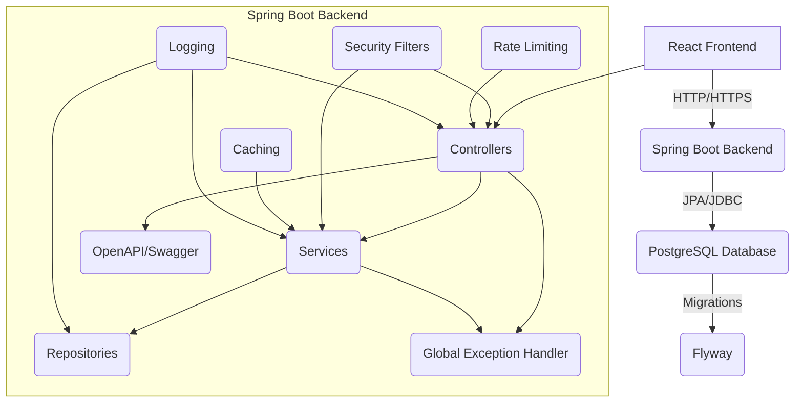

```markdown
# Comprehensive Authentication System

This project is a full-scale, production-ready authentication and resource management system built with Spring Boot (Java) for the backend and React for the frontend, utilizing modern enterprise-grade practices.

## Table of Contents

1.  [Features](#features)
2.  [Architecture](#architecture)
3.  [Technologies Used](#technologies-used)
4.  [Setup Instructions](#setup-instructions)
    *   [Prerequisites](#prerequisites)
    *   [Local Development with Docker Compose](#local-development-with-docker-compose)
    *   [Manual Setup (Backend)](#manual-setup-backend)
    *   [Manual Setup (Frontend)](#manual-setup-frontend)
5.  [API Documentation](#api-documentation)
6.  [Testing](#testing)
7.  [CI/CD](#ci-cd)
8.  [Deployment](#deployment)
9.  [Future Enhancements](#future-enhancements)
10. [Contribution](#contribution)
11. [License](#license)

## 1. Features

This system provides a robust set of features for authentication, authorization, and resource management:

*   **User Management**:
    *   User Registration (sign-up).
    *   User Login (sign-in) with JWT (JSON Web Tokens).
    *   Token Refresh mechanism (using refresh tokens to obtain new access tokens).
    *   Role-Based Access Control (RBAC): `USER` and `ADMIN` roles.
    *   Self-service user profile viewing and updating (for `USER` and `ADMIN`).
    *   Admin-level user management (view, update, delete any user for `ADMIN`).
*   **Product Management**:
    *   CRUD operations for products.
    *   Access controlled by roles: `USER` can view products, `ADMIN` can perform full CRUD.
*   **Security**:
    *   JWT-based stateless authentication.
    *   Password hashing (BCrypt).
    *   CORS configuration.
    *   Rate limiting on critical authentication endpoints (`/register`, `/login`).
    *   Robust error handling.
*   **Observability**:
    *   Structured logging with Logback.
    *   Request logging middleware for auditing.
    *   Actuator endpoints for monitoring (`/actuator/health`, `/actuator/prometheus`).
*   **Performance**:
    *   Caching layer (Caffeine) for frequently accessed data (e.g., user details).
*   **Scalability & Maintainability**:
    *   Containerization with Docker.
    *   Database migrations with Flyway.
    *   Clear separation of concerns (layered architecture).
    *   Comprehensive testing suite (Unit, Integration, API).
    *   Automated CI/CD pipeline (GitHub Actions).
    *   Extensive documentation.

## 2. Architecture

The system follows a microservice-like layered architecture, though presented as a monolith for simplicity in this example.

*   **Client (Frontend)**: A React application that consumes the REST API.
*   **Backend (Spring Boot)**:
    *   **Controller Layer**: Handles HTTP requests, input validation, and delegates to services.
    *   **Service Layer**: Contains business logic, orchestrates data access, and enforces authorization.
    *   **Repository Layer**: Interacts with the database using Spring Data JPA.
    *   **Security Layer**: Spring Security with custom JWT filters for authentication and `@PreAuthorize` for authorization.
    *   **Cross-Cutting Concerns**: Global exception handling, logging, rate limiting, caching.
*   **Database (PostgreSQL)**: Relational database for persistent storage of users, roles, and product data.



## 3. Technologies Used

*   **Backend**:
    *   Java 17
    *   Spring Boot 3.x
    *   Spring Security (for authentication and authorization)
    *   Spring Data JPA (for database interaction)
    *   PostgreSQL (relational database)
    *   Flyway (database migration)
    *   JJWT (Java JWT library)
    *   Lombok (boilerplate code reduction)
    *   Caffeine (local caching)
    *   Logback (logging)
    *   Springdoc-OpenAPI (API documentation)
    *   Maven (build tool)
*   **Frontend**:
    *   React 18
    *   React Router DOM (for navigation)
    *   Axios (HTTP client)
    *   JWT-Decode (for client-side token parsing)
    *   npm (package manager)
    *   Bootstrap (for basic styling)
*   **Infrastructure**:
    *   Docker & Docker Compose (containerization)
    *   GitHub Actions (CI/CD)

## 4. Setup Instructions

### Prerequisites

*   **Git**: For cloning the repository.
*   **Docker & Docker Compose**: For containerized development (recommended).
*   **Java 17 JDK**: If running backend manually.
*   **Maven**: If building backend manually.
*   **Node.js (LTS) & npm**: If running frontend manually.

### Local Development with Docker Compose (Recommended)

1.  **Clone the repository**:
    ```bash
    git clone https://github.com/your-username/authentication-system.git
    cd authentication-system
    ```

2.  **Configure Environment Variables**:
    Create a `.env` file in the root directory of the project (next to `docker-compose.yml`) and add the following:
    ```
    # Database Configuration
    DB_NAME=authdb
    DB_USER=user
    DB_PASSWORD=password

    # JWT Secret Key (MUST be a strong, base64-encoded 256-bit key in production)
    # You can generate one with: openssl rand -base64 32
    JWT_SECRET_KEY=404E635266556A586E3272357538782F413F4428472B4B6250645367566B5970
    ```
    *Note*: Replace the `JWT_SECRET_KEY` with a truly random, secure key for any non-development environment.

3.  **Build and Run with Docker Compose**:
    ```bash
    docker-compose up --build
    ```
    This command will:
    *   Build Docker images for the backend and frontend.
    *   Start a PostgreSQL database container.
    *   Start the Spring Boot backend application (connected to PostgreSQL).
    *   Start the React frontend application (served by Nginx, connected to the Spring Boot backend).
    *   Run Flyway migrations on the database automatically.

4.  **Access the Applications**:
    *   **Frontend**: `http://localhost:3000`
    *   **Backend API**: `http://localhost:8080/api`
    *   **Swagger UI (API Docs)**: `http://localhost:8080/swagger-ui/index.html`
    *   **PostgreSQL**: `localhost:5432` (you can use a database client like DBeaver or pgAdmin with `user`/`password`)

    **Default Seeded Users:**
    *   **Admin**: `admin@example.com` / `admin123`
    *   **User**: `user@example.com` / `user123`

### Manual Setup (Backend)

1.  **Navigate to backend directory**: `cd backend`
2.  **Configure `application.yml`**:
    *   Ensure `spring.datasource.url`, `username`, `password` point to a running PostgreSQL instance.
    *   Set `JWT_SECRET_KEY` in your environment variables or `application.yml`.
3.  **Run Flyway migrations**:
    *   Ensure your PostgreSQL instance is running and accessible. Flyway will run automatically when Spring Boot starts if `spring.flyway.enabled=true`.
4.  **Build and Run**:
    ```bash
    mvn clean install
    mvn spring-boot:run
    ```
    The backend will start on `http://localhost:8080`.

### Manual Setup (Frontend)

1.  **Navigate to frontend directory**: `cd frontend`
2.  **Install dependencies**:
    ```bash
    npm install
    ```
3.  **Configure `.env`**:
    Ensure `REACT_APP_API_BASE_URL` points to your running backend (e.g., `http://localhost:8080/api`).
4.  **Start the development server**:
    ```bash
    npm start
    ```
    The frontend will start on `http://localhost:3000`.

## 5. API Documentation

The backend API is documented using **Springdoc-OpenAPI (Swagger UI)**.
Once the backend is running, you can access the interactive documentation at:
**`http://localhost:8080/swagger-ui/index.html`**

All protected endpoints require a JWT Bearer token in the `Authorization` header. You can obtain tokens by logging in via `/api/auth/login` and then using the "Authorize" button in Swagger UI to set your token.

## 6. Testing

The project includes various types of tests to ensure quality:

*   **Unit Tests**: Located in `backend/src/test/java/...` and `frontend/src/...test.js`. These focus on individual components/services.
    *   Backend: JUnit 5, Mockito.
    *   Frontend: Jest, React Testing Library.
*   **Integration Tests**: Located in `backend/src/test/java/...`. These test interactions between multiple components (e.g., controller to service to repository).
    *   Backend: Spring Boot Test, Testcontainers (for PostgreSQL).
*   **API Tests**: (Conceptual, not generated as runnable scripts in this response). A Postman collection or equivalent REST Assured tests would cover endpoint functionality, status codes, and data contracts.
*   **Performance Tests**: (Conceptual). Apache JMeter scripts would simulate load and measure system performance under stress.

To run backend tests:
```bash
cd backend
mvn test
```

To run frontend tests:
```bash
cd frontend
npm test
```

## 7. CI/CD

A GitHub Actions workflow (`.github/workflows/ci-cd.yml`) is configured for automated CI/CD:

*   **Triggers**: On `push` and `pull_request` to the `main` branch.
*   **Stages**:
    1.  **Build and Test Backend**: Builds the Java application, runs JUnit tests, generates JaCoCo coverage report, and optionally runs SonarCloud analysis.
    2.  **Build and Test Frontend**: Installs Node.js dependencies, runs Jest tests, and generates coverage report.
    3.  **Docker Build and Push**: (Only on `main` branch pushes) Builds Docker images for backend and frontend, then pushes them to Docker Hub. Requires `DOCKER_USERNAME` and `DOCKER_PASSWORD` as GitHub Secrets.
    4.  **Deploy**: (Only on `main` branch pushes) Connects to a remote server via SSH, pulls new Docker images, and restarts services using `docker-compose`. Requires `SSH_HOST`, `SSH_USERNAME`, `SSH_PRIVATE_KEY` as GitHub Secrets.

## 8. Deployment

The recommended deployment strategy involves Docker and Docker Compose on a Linux server:

1.  **Prepare your server**:
    *   Install Docker and Docker Compose.
    *   Ensure necessary ports (80 for frontend, 8080 for backend if directly exposed) are open in your firewall.
    *   Set up a deployment directory (e.g., `/opt/authentication-system`).
    *   Create a `.env` file in the deployment directory with production-ready `DB_NAME`, `DB_USER`, `DB_PASSWORD`, and a **strong, unique `JWT_SECRET_KEY`**.
2.  **CI/CD Deployment (Automated)**:
    *   If you've configured the GitHub Actions `deploy` job, it will automatically connect to your server and update the containers.
3.  **Manual Deployment (If not using CI/CD for deploy)**:
    *   Copy the `docker-compose.yml` file and the `frontend/nginx/nginx.conf` to your server's deployment directory.
    *   Login to Docker Hub: `docker login -u your_docker_username`
    *   Pull the latest images: `docker-compose pull`
    *   Start the services: `docker-compose up -d`
    *   Monitor logs: `docker-compose logs -f`

## 9. Future Enhancements

*   **Password Reset/Forgot Password**: Implement email-based password reset flow.
*   **Email Verification**: Verify user email addresses after registration.
*   **More Granular Authorization**: Implement permission-based access control (e.g., `@PostFilter`).
*   **Audit Logging**: Detailed logging of sensitive actions and changes.
*   **Multi-Factor Authentication (MFA)**: Integrate 2FA options.
*   **Frontend UI/UX**: Enhance the React frontend with a more polished design and additional features.
*   **Container Orchestration**: Deploy on Kubernetes for advanced scaling and management.
*   **Centralized Logging/Monitoring**: Integrate with ELK stack (Elasticsearch, Logstash, Kibana) or Prometheus/Grafana.
*   **Distributed Caching**: Use Redis for caching across multiple backend instances.
*   **Token Blacklisting**: Implement a server-side mechanism to invalidate JWTs upon logout for increased security.

## 10. Contribution

Contributions are welcome! Please follow these steps:
1.  Fork the repository.
2.  Create a new branch (`git checkout -b feature/your-feature-name`).
3.  Make your changes.
4.  Commit your changes (`git commit -m 'feat: Add new feature'`).
5.  Push to the branch (`git push origin feature/your-feature-name`).
6.  Open a Pull Request.

## 11. License

This project is licensed under the MIT License - see the `LICENSE` file for details (not included in this response, but implied).
```