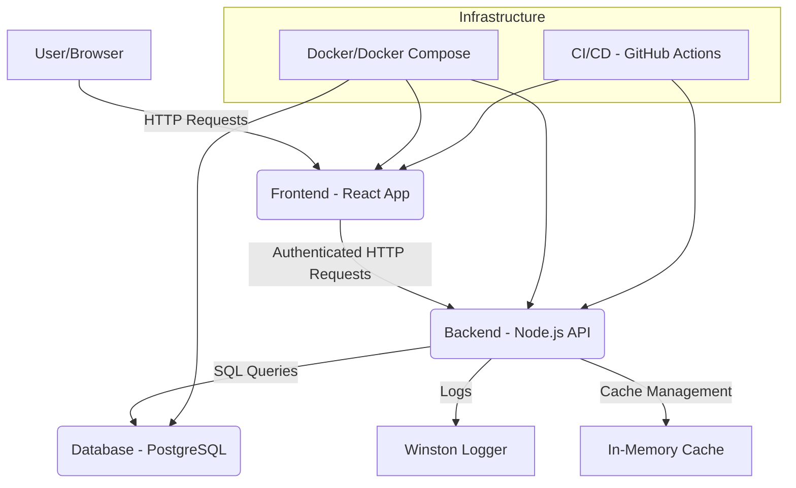

```markdown
# NimbusCMS Architecture Documentation

This document provides a high-level overview of the NimbusCMS architecture, its key components, and how they interact.

## 1. System Overview

NimbusCMS is a full-stack web application designed using a **monorepo** structure for both backend and frontend. It follows a **client-server architecture** with a RESTful API.



## 2. Component Breakdown

### 2.1. Frontend (Client-side)

*   **Technology:** React.js, React Router DOM, Tailwind CSS.
*   **Purpose:** Provides the administrative user interface (dashboard, content editors, user management, media library).
*   **Key Responsibilities:**
    *   **User Interface (UI):** Renders dynamic content and forms.
    *   **Routing:** Manages client-side navigation and protected routes based on user roles.
    *   **Authentication:** Handles user login/registration, stores JWT tokens (access & refresh) in `localStorage`, and sends them with API requests. Manages token refresh.
    *   **API Interaction:** Communicates with the backend API using Axios for all data operations (CRUD).
    *   **State Management:** Uses React Context API for global authentication state, local component state for forms and UI elements.
    *   **Form Handling:** Utilizes `react-hook-form` for efficient form management and validation.
    *   **Notifications:** Uses `react-toastify` for user feedback.

### 2.2. Backend (Server-side)

*   **Technology:** Node.js, Express.js.
*   **Purpose:** Exposes a secure RESTful API for frontend and other clients to interact with, handles business logic, and manages data persistence.
*   **Key Layers/Modules:**

    *   **`src/config`**: Global application configurations, database settings, environment variables.
    *   **`src/middleware`**:
        *   **Authentication (`auth.js`):** Validates JWT tokens, extracts user information, and enforces role-based access control (RBAC).
        *   **Error Handling (`error.js`):** Centralized error conversion and handling, ensuring consistent error responses.
        *   **Security (`helmet`, `xss-clean`, `hpp`):** Express middleware for various security enhancements.
        *   **Rate Limiting (`rateLimiter.js`):** Protects API endpoints from abuse.
        *   **Caching (`cache.js`):** In-memory caching for GET requests to improve performance.
    *   **`src/models`**: Sequelize models (`User`, `ContentType`, `Entry`, `Media`) defining database schemas, relationships, and model-level hooks (e.g., password hashing).
    *   **`src/validations`**: Joi schemas for robust input validation of all incoming API requests.
    *   **`src/services`**: Contains the core business logic. Services interact directly with the database models and perform complex operations, ensuring separation of concerns from controllers.
    *   **`src/controllers`**: Handles incoming HTTP requests, calls appropriate services, and constructs HTTP responses. Focuses on request/response handling.
    *   **`src/routes`**: Defines API endpoints and maps them to controllers and middleware.
    *   **`src/utils`**: Helper functions (logger, `ApiError` class, `catchAsync` wrapper, Joi validation utility, pagination utilities).
    *   **`src/app.js`**: Main Express application setup, middleware registration, and routing.
    *   **`src/server.js`**: Entry point for starting the Node.js server, connecting to the database, and handling graceful shutdown.

### 2.3. Database

*   **Technology:** PostgreSQL.
*   **ORM:** Sequelize.
*   **Purpose:** Persistent storage for all application data.
*   **Schema (Key Tables):**
    *   **`users`**: Stores user authentication and authorization details (`username`, `email`, `password`, `role`).
    *   **`content_types`**: Stores the definitions of dynamic content structures (`name`, `slug`, `description`, `fields` - JSONB array of field definitions).
    *   **`entries`**: Stores instances of content based on `content_types` (`contentTypeId`, `userId`, `status`, `data` - JSONB object holding actual content).
    *   **`media`**: Stores metadata about uploaded media files (`name`, `filename`, `path` (URL), `mimeType`, `size`, `userId`).
*   **Migrations:** Managed by Sequelize CLI to evolve the database schema over time.
*   **Seeders:** For populating initial data (e.g., admin user, default content types).

## 3. Data Flow and Interactions

1.  **User Request:** A user interacts with the Frontend (React App).
2.  **Frontend Logic:** React components handle UI interactions, manage local state, and, if needed, dispatch actions that lead to API calls.
3.  **API Call:** Axios sends an authenticated HTTP request to the Backend API. The JWT `access_token` is attached to the `Authorization` header.
4.  **Backend Request Handling:**
    *   Express routes receive the request.
    *   Global middleware (security, rate limiting) processes the request.
    *   `auth` middleware verifies the JWT and enforces RBAC based on the user's role.
    *   `joiValidation` middleware validates request body/query/params against predefined schemas.
    *   `cacheMiddleware` checks if a cached response exists for GET requests.
    *   The request is passed to the appropriate controller.
5.  **Business Logic:** The controller delegates to a service layer function, which encapsulates the core business logic.
6.  **Database Interaction:** The service layer uses Sequelize models to query or modify data in the PostgreSQL database.
7.  **Response Generation:**
    *   The service returns data to the controller.
    *   The controller formats the response and sends it back to the client.
    *   `cacheMiddleware` might store the response before it's sent back.
8.  **Frontend UI Update:** The Frontend receives the API response, updates its state, and re-renders the UI accordingly.
9.  **Error Handling:** Any errors throughout this flow are caught by global error middleware in the backend, which logs the error and sends a standardized error response. Frontend handles these errors by displaying toasts or error messages.

## 4. Scalability Considerations

*   **Stateless Backend:** The use of JWTs makes the backend largely stateless, simplifying horizontal scaling.
*   **Database:** PostgreSQL is highly scalable and supports various replication and clustering strategies.
*   **Caching:** The in-memory cache can be replaced or augmented with external caching services like Redis for distributed caching.
*   **Media Storage:** For production, `media.path` would point to a cloud object storage solution (AWS S3, Google Cloud Storage) instead of local storage, which can scale independently.
*   **Load Balancing:** Deploying multiple instances of the backend and frontend behind a load balancer (e.g., Nginx, AWS ELB) to distribute traffic.
*   **Queueing:** For long-running tasks (e.g., image processing, bulk data imports), a message queue (RabbitMQ, Kafka) could be introduced.

This architectural overview provides a foundation for understanding NimbusCMS. Each component is designed with modularity and extensibility in mind to facilitate future development and maintenance.
```