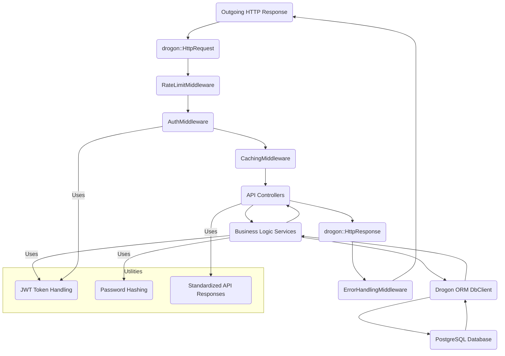

# CMS-CPP Architecture Documentation

This document describes the high-level architecture and key components of the C++ Content Management System.

## 1. High-Level Overview

The CMS-CPP is designed as a monolithic web application leveraging the Drogon C++ web framework. It follows a layered architecture pattern, separating concerns such as presentation, business logic, and data access. The application exposes a RESTful API for client interaction and serves a lightweight static frontend.

```mermaid
graph TD
    UserClient[Web Browser (HTML/JS)] -->|HTTP/HTTPS| LoadBalancer(Load Balancer / Reverse Proxy)
    LoadBalancer --> Nginx(Nginx - Static / Proxy)
    Nginx -->|Proxy API Requests| DrogonApp(C++ Drogon Application)

    subgraph Drogon Application
        DrogonApp --> Middlewares(Middlewares: Auth, Rate Limit, Cache, Error)
        Middlewares --> Controllers(Controllers: Auth, Content, User)
        Controllers --> Services(Services: User, Content)
        Services --> DbClient(Drogon ORM DbClient)
        DbClient --> PostgreSQL(PostgreSQL Database)
    end

    DrogonApp --|Serve Static Files| Nginx
    Nginx --|Serve Static Files| UserClient
```

**Key Components:**

*   **Client:** A basic HTML/CSS/JavaScript single-page application (SPA) that interacts with the Drogon backend via RESTful API calls.
*   **Reverse Proxy/Load Balancer (e.g., Nginx):** Handles incoming requests, serves static files efficiently, and proxies API requests to the Drogon application server. In a simple Docker Compose setup, Drogon might serve static files directly.
*   **Drogon Application (C++):** The core backend, built with the Drogon web framework.
*   **PostgreSQL Database:** The primary data store for all CMS content and user information.

## 2. Layered Architecture (Drogon Application)

The Drogon application is structured into several layers to promote maintainability, scalability, and testability.



### 2.1. Middleware Layer

Drogon's filter mechanism is used to implement cross-cutting concerns before or after the main request handler.

*   **`RateLimitMiddleware`**: Controls the number of requests a client (identified by IP address) can make within a specified time window. Prevents abuse and improves service stability.
*   **`AuthMiddleware`**: Intercepts requests to protected endpoints, extracts and validates JWT tokens from the `Authorization` header. If valid, user information (ID, username, role) is injected into the request context for subsequent layers.
*   **`CachingMiddleware`**: Implements a simple in-memory cache for `GET` requests to frequently accessed resources, reducing database load and improving response times.
*   **`ErrorHandlingMiddleware`**: (Implemented as Drogon's global exception handler `app().setExceptionHandler`). Provides a consistent format for error responses (JSON) for all uncaught exceptions or HTTP status errors.

### 2.2. Controllers Layer (`controllers/`)

*   HTTP request handlers responsible for receiving requests, parsing input (e.g., JSON payload, URL parameters), and delegating business logic to the `Service` layer.
*   They formulate HTTP responses using `ApiResponse` utilities.
*   Examples: `AuthController` (register, login), `ContentController` (CRUD for content), `UserController` (CRUD for users - admin-only operations).

### 2.3. Services Layer (`services/`)

*   Encapsulates the core business logic of the application.
*   Interacts with the `Database Layer` through the `DbClient`.
*   Performs validation, authorization checks (based on user info from `AuthMiddleware`), and complex data manipulation.
*   Decouples controllers from direct database access.
*   Examples: `UserService` (user registration, authentication, CRUD), `ContentService` (content creation, update, deletion).

### 2.4. Models Layer (`models/`)

*   Defines the data structures (structs) that represent the entities in the application (e.g., `User`, `Content`).
*   Includes methods for converting these structs to and from JSON for API communication.

### 2.5. Database Layer (Drogon ORM DbClient and PostgreSQL)

*   **`Drogon ORM DbClient`**: Drogon provides an asynchronous ORM client for database interactions. It handles connection pooling and query execution.
*   **PostgreSQL**: The chosen relational database. `schema.sql` defines tables, relationships, and indices. `seed.sql` provides initial data.

### 2.6. Utilities Layer (`utils/`)

*   **`JwtManager`**: Handles the creation, signing, and verification of JSON Web Tokens.
*   **`PasswordHasher`**: Provides secure password hashing and verification using `bcrypt`.
*   **`ApiResponse`**: Static helper class to generate standardized JSON responses for various HTTP status codes and messages.

## 3. Data Flow Example: User Login

1.  **Client Request:** User sends a `POST /api/v1/auth/login` request with username/email and password.
2.  **RateLimitMiddleware:** Checks if the client IP has exceeded the allowed request rate. If so, returns `429 Too Many Requests`.
3.  **AuthController:** Receives the request, parses the JSON payload.
4.  **UserService:** `authenticateUser()` is called with the identifier and password.
    *   Queries the `PostgreSQL` database for the user by username or email.
    *   Uses `PasswordHasher` to verify the provided password against the stored hash.
    *   If credentials are valid, `JwtManager` generates a new JWT token containing user ID, username, and role.
5.  **AuthController:** Returns a `200 OK` response with the generated JWT token and user details in the `data` field using `ApiResponse::ok()`.
6.  **ErrorHandlingMiddleware:** Catches any unhandled exceptions during the process, formatting them into a standard JSON error response.

## 4. Scalability and Performance Considerations

*   **Asynchronous I/O:** Drogon is built on an asynchronous, event-driven model (based on `libevent` / `Boost.Asio`), making it efficient for handling many concurrent connections without blocking.
*   **Connection Pooling:** Drogon's `DbClient` implements database connection pooling, reducing overhead for database interactions.
*   **Stateless Services:** The application's reliance on JWTs makes it stateless, facilitating horizontal scaling by running multiple instances behind a load balancer.
*   **Caching:** The `CachingMiddleware` reduces database load for read-heavy operations. External caching systems (Redis, Memcached) could be integrated for more advanced caching.
*   **Containerization:** Docker provides isolated environments for the application and database, simplifying deployment and scaling.
*   **Load Balancer:** A production setup would use a load balancer (e.g., Nginx, HAProxy, AWS ALB) to distribute traffic across multiple Drogon application instances.

## 5. Security Aspects

*   **Password Hashing:** Passwords are never stored in plain text, always hashed using `bcrypt` (or similar strong algorithm).
*   **JWT Authentication:** Securely transmits user identity; tokens are signed to prevent tampering. Short expiry times for access tokens and robust refresh token mechanisms (not fully implemented in this example but essential for production) are crucial.
*   **Role-Based Access Control (RBAC):** Basic roles (`user`, `admin`) are implemented, and controllers enforce access based on the user's role extracted from the JWT.
*   **Rate Limiting:** Protects against brute-force attacks and denial-of-service attempts.
*   **Input Validation:** While not extensively shown in every controller, proper input validation is critical to prevent SQL injection, XSS, and other vulnerabilities. Drogon provides mechanisms for this.
*   **HTTPS:** A production deployment *must* use HTTPS to encrypt all communication between clients and the server. This is typically handled by the reverse proxy.

## 6. Future Enhancements

*   **Advanced Caching:** Integration with Redis for distributed and persistent caching.
*   **Image/File Uploads:** Dedicated media management module with secure storage (e.g., S3, minio).
*   **Content Versioning:** Tracking changes to content and allowing rollbacks.
*   **Rich Text Editor Integration:** For a better UI/UX experience in content creation.
*   **WebSockets:** For real-time updates (e.g., live notifications, collaborative editing).
*   **Distributed Logging & Monitoring:** Integration with Prometheus/Grafana, ELK stack.
*   **Container Orchestration:** Deploying with Kubernetes for advanced scaling, self-healing, and management.
*   **Full OpenAPI/Swagger Generation:** For comprehensive API documentation directly from code.