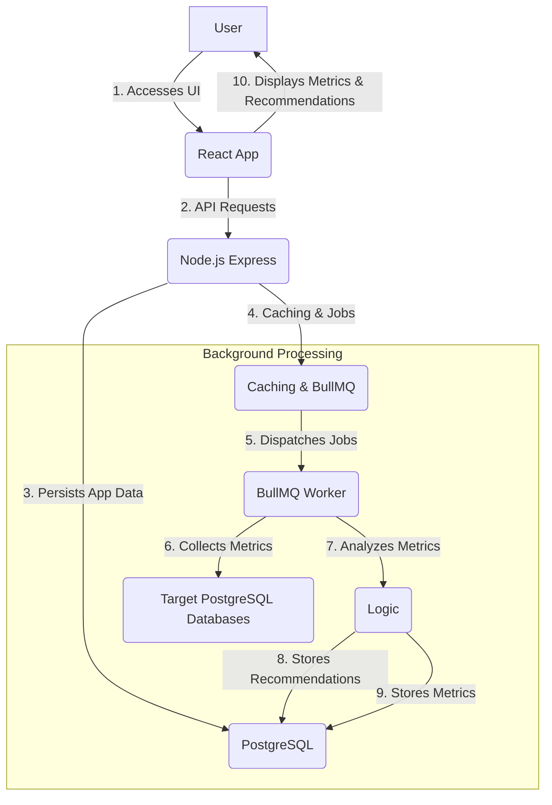

# Architecture Documentation: DB Health Monitor & Optimizer

This document provides a high-level overview of the architectural design of the DB Health Monitor & Optimizer system.

## 1. High-Level Overview

The DB Health Monitor & Optimizer is a full-stack web application designed to help users monitor and optimize their PostgreSQL databases. It consists of a React frontend, a Node.js (Express) backend, a PostgreSQL database for its own persistent data, and a Redis instance for caching and job queue management. It interacts with external PostgreSQL databases to collect metrics and provide recommendations.

## 2. Component Breakdown

### 2.1. Frontend (React Application)

*   **Purpose:** Provides an interactive user interface for connecting to databases, viewing dashboards, and managing recommendations.
*   **Technology:** React.js, React Router, Axios (for API calls), Chart.js (for data visualization).
*   **Key Modules/Components:**
    *   **Authentication:** Login, Registration forms, `AuthContext` for managing user session.
    *   **Dashboard:** Overview of all monitored databases, high-level alerts, summary statistics.
    *   **Database Management:** Forms for adding/editing database connections, list of configured databases.
    *   **Database Details:** Detailed metrics (charts for connections, slow queries, index usage), raw data views, specific recommendations for a selected database.
    *   **Recommendations List:** Displays all generated recommendations, allows status updates.
*   **Communication:** Communicates with the Backend API via RESTful endpoints.

### 2.2. Backend (Node.js Express API)

*   **Purpose:** Serves the frontend, handles user authentication, manages database connection details, orchestrates monitoring tasks, and stores/retrieves metrics and recommendations.
*   **Technology:** Node.js, Express.js, Knex.js (ORM), Bcrypt, JSON Web Tokens.
*   **Key Layers/Modules:**
    *   **Routes:** Defines API endpoints (`/api/auth`, `/api/databases`, `/api/dashboard`, `/api/recommendations`).
    *   **Controllers:** Handle incoming HTTP requests, validate input (using Joi), and delegate to services.
    *   **Services:** Contain core business logic.
        *   `AuthService`: User registration, login.
        *   `DbConnectionService`: CRUD operations for target database connection details, toggle monitoring.
        *   `MonitoringService`: Connects to target databases, fetches raw metrics.
        *   `AnalyzerService`: Processes raw metrics, applies rules, generates recommendations.
        *   `RecommendationService`: Manages recommendations (retrieval, status updates).
        *   `UserService`: User profile management.
        *   `CacheService`: Wrapper for Redis caching.
    *   **Models:** Interact directly with the `Internal_DB` using Knex.js. (e.g., `User`, `DbConnection`, `Metric`, `Recommendation`).
    *   **Middleware:** Authentication (`auth.middleware`), Error Handling (`errorHandler.middleware`), Rate Limiting (`rateLimit.middleware`).
    *   **Utilities:** JWT token generation/verification, password hashing (`bcrypt`), input validation (`joi`), custom error classes, encryption (`encryption.js` for DB passwords).

### 2.3. Internal Database (PostgreSQL)

*   **Purpose:** Stores all persistent data for the DB Health Monitor application itself.
*   **Technology:** PostgreSQL.
*   **Key Tables:**
    *   `users`: User authentication details.
    *   `db_connections`: Encrypted connection details for target databases.
    *   `metrics`: Time-series data collected from target databases (JSONB column for flexible schema).
    *   `recommendations`: Generated optimization recommendations and their status.
*   **Access:** Accessed via `Knex.js` ORM in the backend services/models.

### 2.4. Redis

*   **Purpose:** Serves two main functions:
    *   **Caching:** Stores frequently accessed API responses (e.g., dashboard summaries, recent metrics) to reduce database load and improve response times.
    *   **Job Queue Backend:** Used by BullMQ to manage and persist asynchronous jobs (e.g., scheduled database monitoring tasks).
*   **Technology:** Redis.
*   **Access:** Accessed by `CacheService` and `jobs` module in the backend.

### 2.5. BullMQ Job Queue & Worker

*   **Purpose:** Handles long-running or scheduled tasks asynchronously, ensuring reliability and scalability.
*   **Technology:** BullMQ.
*   **Components:**
    *   `monitoringQueue`: A BullMQ queue instance in the backend, used by `DbConnectionService` to add/remove monitoring jobs.
    *   `dbMonitoringWorker`: A BullMQ worker instance that processes jobs from `monitoringQueue`. It runs `MonitoringService.monitorDatabase` for each job.
*   **Flow:** When a user enables monitoring for a database, `DbConnectionService` adds a repeatable job to `monitoringQueue`. The `dbMonitoringWorker` picks up this job at the configured interval, fetches metrics, and triggers the `AnalyzerService`.

### 2.6. External Databases (Target PostgreSQL)

*   **Purpose:** The actual databases that the system monitors and optimizes.
*   **Technology:** PostgreSQL (extensible to other database types in the future).
*   **Interaction:** The `MonitoringService` in the backend directly connects to these databases (using `pg` driver) to execute specific queries for collecting performance metrics.

## 3. Data Flow Example: Monitoring a Database

1.  **User Action:** User logs into the `Frontend` and adds/enables monitoring for a `DbConnection` via the UI.
2.  **API Call:** The `Frontend` sends a `POST /api/databases/:id/monitor/start` request to the `Backend`.
3.  **Authentication & Authorization:** `auth.middleware` verifies the user's JWT.
4.  **Controller:** `DbConnectionController.startMonitoring` receives the request.
5.  **Service Layer:** `DbConnectionService.toggleMonitoring` is called.
    *   It fetches the `DbConnection` from `Internal_DB`.
    *   Updates its `is_monitoring_active` status in `Internal_DB`.
    *   Adds a repeatable job (`monitorDb-<id>`) to the `monitoringQueue` (backed by `Redis`).
6.  **Job Processing (Asynchronous):**
    *   The `dbMonitoringWorker` (running as a separate process or alongside the backend) picks up the job from `Redis` at the scheduled interval.
    *   It calls `MonitoringService.monitorDatabase(dbConnectionId)`.
7.  **External Database Interaction:**
    *   `MonitoringService` retrieves the (decrypted) connection details for `dbConnectionId` from `Internal_DB`.
    *   It establishes a direct connection (`pg` client) to the `External_DB`.
    *   It executes various SQL queries to collect metrics (e.g., `pg_stat_activity`, `pg_stat_user_indexes`).
8.  **Metric Storage:** The collected metrics are stored as a JSONB object in the `metrics` table of `Internal_DB`.
9.  **Analysis:** `MonitoringService` then calls `AnalyzerService.analyzeMetricsAndGenerateRecommendations`.
    *   `AnalyzerService` applies business rules (e.g., threshold for slow queries, low index scan counts).
    *   It compares potential new recommendations against existing pending ones in `Internal_DB`.
    *   New, unique recommendations are created and stored in the `recommendations` table of `Internal_DB`.
10. **Frontend Display:** When the user accesses the Dashboard or Database Details page, the `Frontend` fetches data from the `Backend` (e.g., `GET /api/dashboard/:id/metrics`, `GET /api/databases/:id/recommendations`). The `Backend` retrieves this data from `Internal_DB` (potentially serving from `Redis` cache for dashboards) and sends it to the `Frontend` for visualization.

## 4. Scalability Considerations

*   **Stateless Backend:** The Express backend is largely stateless, allowing for horizontal scaling by running multiple instances behind a load balancer.
*   **Database:** PostgreSQL can be scaled vertically (more powerful server) or horizontally (read replicas, sharding - more complex).
*   **Redis:** Highly scalable for caching and job queues. Can be clustered for high availability.
*   **BullMQ Workers:** Multiple workers can be run to process jobs from the queue concurrently.
*   **External Database Connections:** The `pg` client is designed to manage connections efficiently, but monitoring many databases with very frequent intervals could still put a strain. The interval is configurable.

## 5. Security Considerations

*   **Authentication:** JWT-based authentication ensures secure user access.
*   **Authorization:** Role-based access control (admin/user) restricts functionality.
*   **Password Encryption:** Database connection passwords for target databases are encrypted at rest using a symmetric encryption scheme (AES-256-CBC in this example). **A robust Key Management System (KMS) would be recommended for production.**
*   **Input Validation:** Joi schema validation on all API inputs prevents common vulnerabilities like SQL injection (when building queries with Knex) and cross-site scripting (XSS).
*   **HTTPS/SSL:** Expected to be enforced at the deployment level (e.g., Nginx, load balancer).
*   **Rate Limiting:** Protects against brute-force attacks and DoS.
*   **Helmet.js:** Adds various HTTP headers for security.

This architecture provides a solid foundation for a robust database optimization system, balancing functionality, scalability, and security.