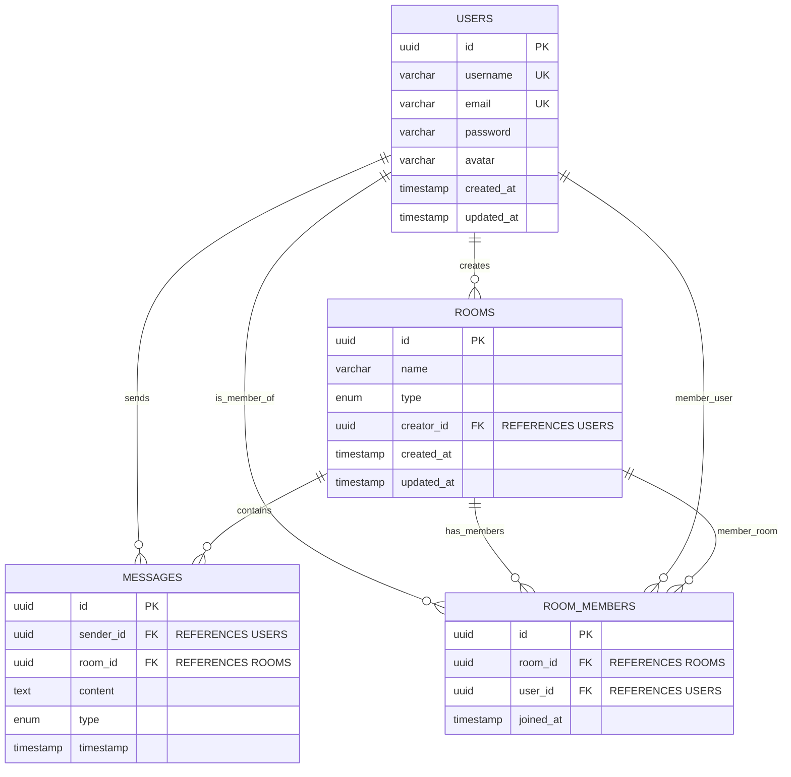

# Real-time Chat Application - Architecture Document

## 1. High-Level Architecture

The system follows a classic microservices-inspired architecture, separating the concerns of the backend API, real-time communication, and the frontend user interface. It is designed to be scalable, fault-tolerant, and maintainable.

```mermaid
graph TD
    User --> Frontend(Frontend - Next.js/React)
    Frontend -- HTTP/REST --> BackendAPI(Backend API - NestJS)
    Frontend -- WebSocket/Socket.IO --> BackendWS(Backend WebSocket - NestJS/Socket.IO)

    BackendAPI -- DB Queries --> PostgreSQL
    BackendWS -- DB Queries --> PostgreSQL
    BackendAPI -- Cache Ops --> Redis
    BackendWS -- Cache Ops --> Redis

    SubGraph Infra
        PostgreSQL
        Redis
    End

    SubGraph DevOps
        GitHub(GitHub Actions - CI/CD)
        Docker(Docker/Docker Compose)
    End

    BackendAPI --> Monitoring(Monitoring & Logging)
    BackendWS --> Monitoring
```

## 2. Component Breakdown

### 2.1. Frontend (Next.js/React)

*   **Framework**: Next.js 14 (React.js) with TypeScript.
*   **Styling**: Tailwind CSS for utility-first styling.
*   **Routing**: Next.js App Router for client-side and server-side routing.
*   **Authentication**:
    *   `AuthContext`: Manages user authentication state, provides `login`, `register`, `logout` functions.
    *   `js-cookie`: Manages JWT access tokens in browser cookies (and `localStorage` for Socket.IO).
*   **API Interaction**:
    *   `services/api.ts`: Axios instance with interceptors for JWT injection and global error handling (e.g., 401 Unauthorized redirects). Handles REST API calls (login, register, user profile, initial room list).
    *   `services/socket.ts`: Socket.IO client instance for real-time communication. Manages connection, disconnection, and event handling for chat messages, typing indicators, room events.
*   **UI Components**: Modularized components for login/register forms, chat sidebar, room header, message input, and message list.

### 2.2. Backend (NestJS)

*   **Framework**: NestJS (v10) with TypeScript. Follows a modular structure.
*   **Database**: PostgreSQL for persistent data storage.
    *   **ORM**: TypeORM with `uuid` primary keys, `timestamp with time zone` for dates, and robust entity relations.
    *   **Migrations**: Managed through TypeORM CLI for schema evolution.
    *   **Seed Data**: Script for populating initial development data.
*   **Authentication & Authorization (`AuthModule`)**:
    *   **Passport.js**: Integration for JWT strategy.
    *   **JWT Service**: Handles token generation and verification.
    *   **Guards**: `JwtAuthGuard` for protecting HTTP routes, `WsJwtAuthGuard` for protecting WebSocket messages.
    *   **bcrypt**: For password hashing.
*   **User Management (`UsersModule`)**:
    *   CRUD operations for user entities.
    *   Service layer for business logic, controller for REST API endpoints.
*   **Chat Core (`ChatModule`)**:
    *   **`ChatGateway`**: `@WebSocketGateway` that handles all Socket.IO events (sendMessage, createRoom, joinRoom, leaveRoom, typing, getRoomMessages). Authenticates WebSocket connections using `WsJwtAuthGuard`.
    *   **`ChatService`**: Business logic for room management (create, find, add/remove members), message management (send, retrieve). Interacts with TypeORM repositories.
    *   **Entities**: `Room`, `Message`, `RoomMember` (junction table for many-to-many user-room relationship).
*   **Common Modules/Features**:
    *   **`ConfigModule`**: Manages environment variables using `@nestjs/config` and Joi for validation.
    *   **`WinstonLoggerModule`**: Custom logger using Winston for structured logging to console and daily rotating files.
    *   **`AllExceptionsFilter`**: Global HTTP and WebSocket exception handling, providing consistent error responses and logging.
    *   **`LoggingInterceptor`**: Global interceptor for logging request and response lifecycle.
    *   **`ThrottlerModule`**: Implements rate limiting (per IP) to protect against abuse. `ThrottlerBehindProxyGuard` handles `X-Forwarded-For`.
    *   **Redis**: Used as a store for `express-session` and can be extended for general data caching.

## 3. Data Model



## 4. Authentication Flow

1.  **User Registration/Login (HTTP/REST)**:
    *   Frontend sends `POST /auth/register` or `POST /auth/login` to backend.
    *   Backend validates credentials, hashes password (for register), generates JWT.
    *   Backend sends JWT in response. Frontend stores it in `localStorage` (for WS) and `js-cookie` (for HTTP `Authorization` header).
2.  **Authenticated REST Requests**:
    *   Frontend attaches JWT to `Authorization: Bearer <token>` header using an Axios interceptor.
    *   Backend's `JwtAuthGuard` verifies token on protected routes.
3.  **Authenticated WebSocket Connection**:
    *   Frontend `socket.io-client` connects to `/chat` namespace, passing JWT in `auth` payload, `query` params, and `extraHeaders`.
    *   Backend's `WsJwtAuthGuard` intercepts connection handshake, verifies token, and attaches the authenticated `User` object to the `socket` instance.
    *   All subsequent `@SubscribeMessage` handlers can access `req.user` or `@WsAuthUser()` decorator.

## 5. Real-time Communication Flow

1.  **Connection**: Authenticated user connects to `/chat` namespace. Gateway marks user as 'online'.
2.  **Joining Rooms**: Upon connection, user joins Socket.IO rooms corresponding to their database-persisted chat rooms.
3.  **Sending Message**:
    *   Frontend emits `sendMessage` event with `roomId` and `content`.
    *   `ChatGateway` receives, authenticates user, calls `ChatService` to persist message in DB.
    *   `ChatGateway` emits `newMessage` event to all clients in `room_<roomId>`.
4.  **Typing Indicator**:
    *   Frontend emits `typing` event.
    *   `ChatGateway` broadcasts `typing` event to other clients in the room.

## 6. Logging, Monitoring & Error Handling

*   **Logging**: Winston-based `WinstonLogger` captures application events, errors, and debugging information. Logs are output to console and daily rotating files.
*   **Error Handling**: `AllExceptionsFilter` catches all HTTP and WebSocket exceptions, logs them consistently, and returns standardized error responses.
*   **Monitoring**: While full Prometheus/Grafana setup is not included, the logging infrastructure provides a foundation. For production, integrate with APM tools and metrics collectors.

## 7. Caching

*   **Redis**: Primarily used as an external store for `express-session` data, enabling stateless backend servers.
*   **Future Enhancements**: Redis could be used for caching frequently accessed data (e.g., user online status, room metadata, last N messages of a room) to reduce database load.

## 8. Deployment Strategy

*   **Docker Compose**: Used for local development and can serve as a base for single-server deployments.
*   **Container Orchestration (Kubernetes)**: In a production enterprise setting, Docker images would be deployed to a Kubernetes cluster for scalability, high availability, and easier management.
    *   Horizontal Pod Autoscaling (HPA) for backend/frontend based on CPU/memory.
    *   Load balancers to distribute traffic to multiple backend instances.
    *   Persistent volumes for PostgreSQL data.
    *   Managed Redis service.
*   **CI/CD**: GitHub Actions (or similar) automates building, testing, and deployment to staging/production environments.

This architecture provides a robust foundation for a production-ready real-time chat application, with clear separation of concerns and adherence to modern development practices.