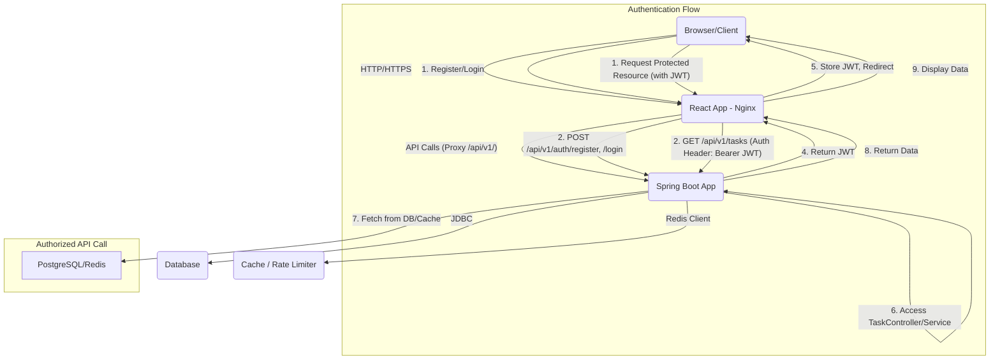

```markdown
# AuthSystem: Comprehensive Full-Stack Authentication & Task Management System

This project is a full-scale, production-ready web application providing secure user authentication (JWT-based) and a personal task management system. It follows enterprise-grade practices with a Java Spring Boot backend, a React frontend, PostgreSQL for persistence, and Redis for caching and rate limiting, all orchestrated with Docker.

## Table of Contents

1.  [Features](#features)
2.  [Architecture](#architecture)
3.  [Technologies Used](#technologies-used)
4.  [Prerequisites](#prerequisites)
5.  [Setup and Installation](#setup-and-installation)
    *   [1. Clone the Repository](#1-clone-the-repository)
    *   [2. Environment Variables](#2-environment-variables)
    *   [3. Run with Docker Compose (Recommended)](#3-run-with-docker-compose-recommended)
    *   [4. Manual Setup (Backend)](#4-manual-setup-backend)
    *   [5. Manual Setup (Frontend)](#5-manual-setup-frontend)
6.  [Running Tests](#running-tests)
7.  [API Documentation](#api-documentation)
8.  [Deployment Guide](#deployment-guide)
9.  [CI/CD](#cicd)
10. [Further Enhancements](#further-enhancements)
11. [License](#license)

## Features

*   **User Authentication:**
    *   User Registration (Signup)
    *   User Login (JWT-based authentication)
    *   Role-Based Authorization (USER, ADMIN)
    *   Secure password hashing (BCrypt)
*   **User Management:**
    *   View own profile
    *   Update own profile (including password change)
    *   Delete own account
*   **Task Management:**
    *   Create, Read, Update, Delete (CRUD) tasks
    *   Tasks are private to the authenticated user
    *   Mark tasks as completed/pending
*   **API Features:**
    *   RESTful API endpoints
    *   Comprehensive error handling with structured error responses
    *   Request validation using `jakarta.validation`
    *   Global exception handling
*   **Performance & Scalability:**
    *   Redis caching for frequently accessed data (e.g., user details, task lists)
    *   Redis-based Rate Limiting to protect against abuse and DDOS attacks
*   **Observability:**
    *   Structured logging with Logback (console, file, GELF-compatible)
*   **Database:**
    *   PostgreSQL relational database
    *   Flyway for database schema migrations
    *   Seed data for initial setup (admin and regular user)
*   **Containerization:**
    *   Docker and Docker Compose for easy setup and deployment
*   **Testing:**
    *   Unit tests (Backend)
    *   Integration tests (Backend API with Testcontainers for DB/Redis)
    *   API tests (using MockMvc)
*   **Frontend (React):**
    *   Responsive UI with Tailwind CSS
    *   User-friendly forms for Login, Register, Task management
    *   Protected Routes based on authentication status

## Architecture

The system follows a typical microservice-like architecture with a clear separation of concerns between the frontend and backend.



**Backend (Spring Boot):**
*   **Layered Architecture:** Controllers -> Services -> Repositories.
*   **Spring Security:** Handles authentication and authorization using JWTs.
*   **Spring Data JPA:** For ORM and database interactions.
*   **Flyway:** Manages database schema evolution.
*   **Redis:** Integrated via Spring Data Redis for caching and `bucket4j` for rate limiting.
*   **Global Exception Handling:** Provides consistent error responses.
*   **Logging:** Configured with Logback for various output options.

**Frontend (React):**
*   **Component-Based:** Reusable UI components.
*   **React Router:** Manages client-side routing.
*   **Axios:** HTTP client for API requests, with an interceptor to attach JWTs.
*   **Context API:** For global state management (authentication status).
*   **Tailwind CSS:** For styling and responsive design.
*   **Nginx (in Docker):** Serves static files and proxies API requests to the backend.

## Technologies Used

*   **Backend:** Java 17, Spring Boot 3.2.x, Spring Security, Spring Data JPA, Hibernate, JWT (jjwt), Lombok, Flyway, Logback, Redis (Spring Data Redis, bucket4j).
*   **Frontend:** React 18, React Router DOM 6, Axios, Tailwind CSS.
*   **Database:** PostgreSQL 16.
*   **Containerization:** Docker, Docker Compose.
*   **CI/CD:** GitHub Actions.
*   **Testing:** JUnit 5, Mockito, Spring Boot Test, MockMvc, AssertJ, Testcontainers.

## Prerequisites

Before you begin, ensure you have the following installed on your machine:

*   [Git](https://git-scm.com/)
*   [Docker Desktop](https://www.docker.com/products/docker-desktop/) (includes Docker Engine and Docker Compose)
*   (Optional, for manual setup) [Java 17 JDK](https://www.oracle.com/java/technologies/downloads/)
*   (Optional, for manual setup) [Maven 3.8+](https://maven.apache.org/download.cgi)
*   (Optional, for manual setup) [Node.js 20.x](https://nodejs.org/en/download/) and [Yarn](https://classic.yarnpkg.com/en/docs/install)

## Setup and Installation

The recommended way to run the entire application is using Docker Compose.

### 1. Clone the Repository

```bash
git clone https://github.com/your-username/AuthSystem.git
cd AuthSystem
```

### 2. Environment Variables

Create a `.env` file in the root directory of the project (where `docker-compose.yml` is located) for sensitive information.

```dotenv
# .env
JWT_SECRET=YOUR_SUPER_SECRET_JWT_KEY_HERE_MIN_32_CHARS # IMPORTANT: Change this in production
# Example: JWT_SECRET=a_very_long_and_secure_secret_that_is_at_least_256_bits_long_and_should_be_changed_for_prod
```
**Note:** The `JWT_SECRET` in `backend/src/main/resources/application.yml` is a fallback. The environment variable set in `docker-compose.yml` will override it. **Always use a strong, randomly generated secret in production.**

### 3. Run with Docker Compose (Recommended)

This will build the Docker images for backend and frontend, and start all services (PostgreSQL, Redis, Backend, Frontend).

```bash
docker compose up --build -d
```

*   `--build`: Rebuilds images if changes are detected in Dockerfiles or source code.
*   `-d`: Runs the containers in detached mode.

Wait a few moments for all services to start up. You can check their status with:

```bash
docker compose ps
docker compose logs -f
```

Once all services are healthy:
*   **Backend API:** `http://localhost:8080/api/v1`
*   **Frontend Application:** `http://localhost:3000`

### 4. Manual Setup (Backend)

If you prefer to run the backend without Docker Compose:

1.  **Start PostgreSQL & Redis:** Ensure you have PostgreSQL (port 5432) and Redis (port 6379) running, either locally or via Docker (e.g., `docker compose up db redis -d`).
2.  **Configure `application.yml`:**
    *   Adjust `spring.datasource.url` if your PostgreSQL is not on `localhost:5432`.
    *   Adjust `spring.redis.host` if Redis is not on `localhost`.
    *   Set `jwt.secret` to a strong, random value.
3.  **Build and Run:**
    ```bash
    cd backend
    mvn clean install
    mvn spring-boot:run
    ```
    The backend will start on `http://localhost:8080/api/v1`.

### 5. Manual Setup (Frontend)

If you prefer to run the frontend without Docker Compose:

1.  **Ensure Backend is Running:** The backend must be accessible at `http://localhost:8080/api/v1`.
2.  **Configure `frontend/.env`:** Create a `.env` file in the `frontend` directory:
    ```dotenv
    # frontend/.env
    REACT_APP_API_BASE_URL=http://localhost:8080/api/v1
    ```
3.  **Install Dependencies and Run:**
    ```bash
    cd frontend
    yarn install
    yarn start
    ```
    The frontend will start on `http://localhost:3000`.

## Running Tests

### Backend Tests

Backend tests include unit tests, integration tests, and API tests using JUnit 5, Mockito, and Testcontainers.

```bash
cd backend
mvn clean verify
```
This command will execute all tests and generate a JaCoCo code coverage report in `backend/target/site/jacoco/index.html`. Aim for 80%+ coverage, though this example may not reach it due to brevity of certain components.

### Frontend Tests

Basic frontend tests using React Testing Library are structured, but not extensively implemented in this example to save space.

```bash
cd frontend
yarn test
```

## API Documentation

The backend exposes RESTful APIs. Here are the main endpoints:

**Base URL:** `http://localhost:8080/api/v1`

### Authentication Endpoints (`/auth`)

*   **POST `/auth/register`**
    *   **Description:** Registers a new user with `USER` role.
    *   **Request Body:**
        ```json
        {
          "firstName": "John",
          "lastName": "Doe",
          "email": "john.doe@example.com",
          "password": "password123"
        }
        ```
    *   **Response:**
        ```json
        {
          "token": "eyJ...",
          "message": "User registered successfully",
          "userEmail": "john.doe@example.com",
          "role": "USER"
        }
        ```
    *   **Status Codes:** `201 Created`, `409 Conflict` (Email already exists), `400 Bad Request` (Validation errors)

*   **POST `/auth/login`**
    *   **Description:** Authenticates a user and returns a JWT token.
    *   **Request Body:**
        ```json
        {
          "email": "john.doe@example.com",
          "password": "password123"
        }
        ```
    *   **Response:**
        ```json
        {
          "token": "eyJ...",
          "message": "Login successful",
          "userEmail": "john.doe@example.com",
          "role": "USER"
        }
        ```
    *   **Status Codes:** `200 OK`, `401 Unauthorized` (Invalid credentials), `400 Bad Request` (Validation errors)

### User Endpoints (`/users`) - Requires Authentication (Bearer Token)

*   **GET `/users/me`**
    *   **Description:** Retrieves the profile of the currently authenticated user.
    *   **Headers:** `Authorization: Bearer <JWT_TOKEN>`
    *   **Response:** `UserDTO`
    *   **Status Codes:** `200 OK`, `401 Unauthorized`

*   **PUT `/users/me`**
    *   **Description:** Updates the profile of the currently authenticated user.
    *   **Headers:** `Authorization: Bearer <JWT_TOKEN>`
    *   **Request Body:**
        ```json
        {
          "firstName": "Updated",
          "lastName": "User",
          "email": "updated.email@example.com",
          "password": "newpassword" // Optional
        }
        ```
    *   **Response:** `UserDTO`
    *   **Status Codes:** `200 OK`, `401 Unauthorized`, `409 Conflict` (Email already in use)

*   **DELETE `/users/me`**
    *   **Description:** Deletes the account of the currently authenticated user.
    *   **Headers:** `Authorization: Bearer <JWT_TOKEN>`
    *   **Response:** `204 No Content`
    *   **Status Codes:** `204 No Content`, `401 Unauthorized`

*   **GET `/users/{userId}`**
    *   **Description:** Retrieves a user profile by ID. Accessible by ADMIN or the user themselves.
    *   **Headers:** `Authorization: Bearer <JWT_TOKEN>`
    *   **Response:** `UserDTO`
    *   **Status Codes:** `200 OK`, `401 Unauthorized`, `403 Forbidden`, `404 Not Found`

*   **GET `/users`**
    *   **Description:** Retrieves all user profiles. Accessible only by ADMIN.
    *   **Headers:** `Authorization: Bearer <JWT_TOKEN>`
    *   **Response:** `List<UserDTO>`
    *   **Status Codes:** `200 OK`, `401 Unauthorized`, `403 Forbidden`

### Task Endpoints (`/tasks`) - Requires Authentication (Bearer Token)

*   **POST `/tasks`**
    *   **Description:** Creates a new task for the authenticated user.
    *   **Headers:** `Authorization: Bearer <JWT_TOKEN>`
    *   **Request Body:**
        ```json
        {
          "title": "Buy groceries",
          "description": "Milk, eggs, bread",
          "completed": false
        }
        ```
    *   **Response:** `TaskDTO`
    *   **Status Codes:** `201 Created`, `400 Bad Request`, `401 Unauthorized`

*   **GET `/tasks`**
    *   **Description:** Retrieves all tasks for the authenticated user.
    *   **Headers:** `Authorization: Bearer <JWT_TOKEN>`
    *   **Response:** `List<TaskDTO>`
    *   **Status Codes:** `200 OK`, `401 Unauthorized`

*   **GET `/tasks/{taskId}`**
    *   **Description:** Retrieves a specific task by ID for the authenticated user.
    *   **Headers:** `Authorization: Bearer <JWT_TOKEN>`
    *   **Response:** `TaskDTO`
    *   **Status Codes:** `200 OK`, `401 Unauthorized`, `404 Not Found` (if not found or not owned by user)

*   **PUT `/tasks/{taskId}`**
    *   **Description:** Updates an existing task for the authenticated user.
    *   **Headers:** `Authorization: Bearer <JWT_TOKEN>`
    *   **Request Body:**
        ```json
        {
          "title": "Buy groceries (updated)",
          "description": "Milk, eggs, bread, cheese",
          "completed": true
        }
        ```
    *   **Response:** `TaskDTO`
    *   **Status Codes:** `200 OK`, `400 Bad Request`, `401 Unauthorized`, `404 Not Found`

*   **DELETE `/tasks/{taskId}`**
    *   **Description:** Deletes a task for the authenticated user.
    *   **Headers:** `Authorization: Bearer <JWT_TOKEN>`
    *   **Response:** `204 No Content`
    *   **Status Codes:** `204 No Content`, `401 Unauthorized`, `404 Not Found`

## Deployment Guide

The `docker-compose.yml` file provides a self-contained environment for deploying the application.

1.  **Build Docker Images:**
    Ensure your `JWT_SECRET` is set in a `.env` file.
    ```bash
    docker compose build
    ```
2.  **Run Containers:**
    ```bash
    docker compose up -d
    ```
    This will start `db`, `redis`, `backend`, and `frontend` services. The frontend will be accessible on port `3000` and the backend API on port `8080`. The Nginx within the `frontend` container proxies API calls to the `backend` container.

3.  **Access:**
    Open your browser to `http://localhost:3000`.

**Production Deployment Considerations:**
*   Use a proper domain name and configure Nginx/Traefik as a reverse proxy for HTTPS.
*   Manage `JWT_SECRET` and database credentials securely (e.g., Kubernetes Secrets, Vault, environment variables via orchestration tools).
*   Implement proper logging aggregation (e.g., ELK stack, Graylog) using the GELF appender.
*   Implement monitoring (e.g., Prometheus/Grafana) for application health and performance.
*   Use a robust CI/CD pipeline for automated testing, building, and deployment to a cloud provider (AWS, GCP, Azure) or your own servers.
*   Scale services based on load.

## CI/CD

A basic GitHub Actions workflow (`.github/workflows/ci.yml`) is provided for the backend:
*   Triggers on `push` and `pull_request` to `main` and `develop` branches.
*   Sets up Java 17.
*   Spins up PostgreSQL and Redis using Testcontainers for isolated testing.
*   Builds the backend application and runs all tests.
*   Generates and uploads a JaCoCo test coverage report.

This pipeline can be extended to:
*   Include frontend build and tests.
*   Perform Docker image builds and push to a container registry (e.g., Docker Hub, AWS ECR).
*   Automate deployment to staging/production environments (e.g., using SSH, AWS ECS/EKS actions).

## Further Enhancements

*   **Admin Panel:** Dedicated UI for managing users, roles, and system-wide configurations.
*   **Password Reset:** Implement "forgot password" functionality with email verification.
*   **Email Verification:** Require email confirmation upon registration.
*   **More Robust Authorization:** Implement more granular permissions beyond simple roles.
*   **Audit Logging:** Track significant user actions (e.g., task creation, user updates).
*   **Frontend Testing:** Add comprehensive unit and integration tests for React components.
*   **OpenAPI/Swagger:** Integrate Swagger UI for interactive API documentation.
*   **Monitoring & Alerting:** Set up Prometheus/Grafana for metric collection and alerting.
*   **Container Orchestration:** Deploy to Kubernetes for advanced scaling and management.
*   **Security Scans:** Incorporate static code analysis (SAST) and dependency vulnerability scans.

## License

This project is open-source and available under the [MIT License](LICENSE).
```