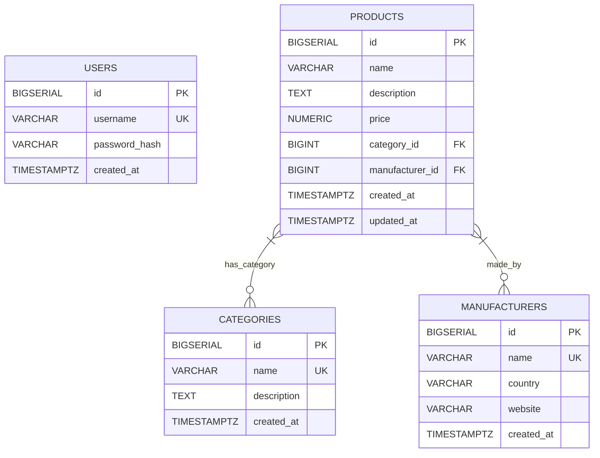

```markdown
# CppDBOptimizer - Product Catalog Management System Architecture

This document outlines the high-level and detailed architecture of the CppDBOptimizer application.

## 1. High-Level Overview

The system follows a typical N-tier (or 3-tier) architecture, separating concerns into presentation, application, and data layers. It's designed as a microservice-like structure with a distinct C++ backend API, a static frontend, and a dedicated database server, all orchestrated by Docker.

```mermaid
graph TD
    User --(1) Requests--> Frontend (Nginx)
    Frontend --(2) API Calls--> Backend (C++ Pistache)
    Backend --(3) Queries/Updates--> Database (PostgreSQL)
    Database --(4) Results--> Backend
    Backend --(5) API Responses--> Frontend
    Frontend --(6) Renders UI--> User
```

**Key Components:**
- **Frontend (Presentation Layer)**: Static HTML, CSS, JavaScript served by Nginx. Handles user interaction and displays data.
- **Backend (Application Layer)**: C++ application using Pistache. Exposes RESTful APIs, implements business logic, authentication, and interacts with the database.
- **Database (Data Layer)**: PostgreSQL server. Stores all application data.

## 2. Backend Architecture (C++)

The C++ backend is structured into several modules, adhering to principles like Separation of Concerns and Dependency Inversion.

```mermaid
graph TD
    subgraph C++ Backend
        HTTP_Requests[HTTP Requests] --> Middleware
        Middleware --(Apply Policies)--> Controllers[API Controllers]
        Controllers --(Call Services)--> Services[Business Services]
        Services --(DB Operations)--> Database[Database Layer (pqxx)]
        Database --(Cache Interaction)--> Cache[In-memory Cache]
        Services --(Auth Logic)--> AuthService[Auth Service]
        AuthService --(JWT Handling)--> TokenService[Token Service]
        AuthService --(User Data)--> Database
        Services --(Logging)--> Logger[spdlog Logger]
        Middleware --(Error Handling)--> ErrorHandler[Error Handler]
    end

    subgraph Utilities
        JsonUtils[JSON Utilities]
        AppConfig[App Config]
        Constants[Constants]
        Errors[Custom Errors]
    end

    Controllers --- JsonUtils
    Services --- JsonUtils
    Services --- Errors
    Middleware --- Errors
    Middleware --- Logger
    Services --- Logger
    Database --- Logger
    AppConfig --- All_Components[All Components]
```

**Modules and Their Responsibilities:**

1.  **`server/`**:
    *   `Server.h/cpp`: Initializes the Pistache HTTP endpoint, registers middleware, and sets up routing for all API endpoints. This is the entry point for HTTP requests.

2.  **`middleware/`**:
    *   `LoggingMiddleware`: Logs incoming request details and outgoing response status.
    *   `ErrorMiddleware`: Catches exceptions thrown by controllers or services and returns standardized JSON error responses.
    *   `AuthMiddleware`: Intercepts requests to protected routes, validates JWT tokens, and ensures user authentication.
    *   `RateLimitMiddleware`: Prevents abuse by limiting the number of requests from a single IP address within a time window.

3.  **`controllers/`**:
    *   `AuthController`, `ProductController`, `CategoryController`, `ManufacturerController`: Handle incoming HTTP requests for their respective resources.
    *   Parse request bodies (JSON), extract query parameters, validate basic input, and delegate business logic to the `services` layer.
    *   Format responses into JSON and send them back to the client.

4.  **`services/`**:
    *   `AuthService`, `ProductService`, `CategoryService`, `ManufacturerService`: Implement the core business logic for the application.
    *   Perform data validation, interact with the `database` layer, and utilize the `cache` where appropriate.
    *   This layer is decoupled from HTTP specifics, making it reusable and testable.

5.  **`database/`**:
    *   `Database.h/cpp`: Manages PostgreSQL database connections using `pqxx`, including a connection pool for efficient resource management. Provides `executeTransaction` for ACID compliance.
    *   `Models.h`: Defines C++ structs (`User`, `Product`, `Category`, `Manufacturer`) that represent the database entities. Uses `nlohmann/json` macros for easy serialization/deserialization.

6.  **`utils/`**:
    *   `AppConfig`: Loads configuration from environment variables (e.g., `.env` file).
    *   `Logger`: Wrapper around `spdlog` for structured, leveled logging.
    *   `JsonUtils`: Helper functions for common JSON operations and standardized error responses.
    *   `Cache`: A generic `InMemoryCache` implementation using `std::map` and `std::mutex` for thread-safe in-memory caching (e.g., for categories, manufacturers).

7.  **`common/`**:
    *   `Constants`: Stores global constants (e.g., API paths, JWT issuer).
    *   `Error.h`: Custom exception classes for different error scenarios (e.g., `NotFoundError`, `InputValidationError`, `DatabaseError`).

## 3. Database Schema & Optimization

The database is PostgreSQL, designed with performance and scalability in mind.



**Key Optimization Strategies:**

*   **Indexing**:
    *   `idx_products_name`: On `products.name` for efficient filtering by product name.
    *   `idx_products_price`: On `products.price` for range queries.
    *   `idx_products_category_id`, `idx_products_manufacturer_id`: On foreign keys for fast `JOIN` operations and filtering.
    *   `idx_products_category_price`: A composite index on `(category_id, price)` to optimize queries filtering by category and then by price.
    *   `idx_users_username`, `idx_categories_name`, `idx_manufacturers_name`: Unique indexes for fast lookups and ensuring data integrity.
    *   *Consideration*: For `ILIKE` searches on `products.name`, a `pg_trgm` GIN index could be added if fuzzy searching is critical (requires `CREATE EXTENSION IF NOT EXISTS pg_trgm;`).
*   **Query Optimization**:
    *   All database interactions use parameterized queries via `pqxx` to prevent SQL injection and allow PostgreSQL to cache query plans effectively.
    *   `EXPLAIN ANALYZE` is used during development to inspect and optimize complex queries.
*   **Connection Pooling**: Managed by `Database.h/cpp` to reuse database connections, reducing overhead of establishing new connections.
*   **Transactions**: `Database::executeTransaction` ensures data consistency for multi-statement operations.
*   **Caching**: The `InMemoryCache` reduces database load for frequently accessed, relatively static data like categories and manufacturers.

## 4. Frontend Architecture (Vanilla JS)

The frontend is a simple Single-Page Application (SPA) primarily using vanilla JavaScript, HTML, and CSS.

```mermaid
graph TD
    Browser[Web Browser] --> index.html
    index.html --(Loads)--> style.css
    index.html --(Loads)--> main.js
    main.js --(User Actions)--> DOM_Manipulation[DOM Manipulation]
    main.js --(fetch API)--> Nginx[Nginx Proxy (http://localhost:80/api/v1/)]
    Nginx --> CppBackend[C++ Backend]
    CppBackend --> Nginx
    Nginx --> main.js[JSON Responses]
    DOM_Manipulation --> Browser
```

**Key Responsibilities:**
-   **`index.html`**: The main application layout.
-   **`css/style.css`**: Styling for the application.
-   **`js/main.js`**:
    *   Handles user events (button clicks, form submissions).
    *   Makes `fetch` API calls to the `/api/v1/` endpoints.
    *   Parses JSON responses.
    *   Dynamically updates the DOM to display data and feedback to the user.
    *   Manages client-side authentication (storing JWT in `localStorage`).

## 5. DevOps and Infrastructure

The project utilizes Docker and Docker Compose for local development and a GitHub Actions pipeline for CI/CD.

```mermaid
graph TD
    subgraph Local Development
        Developer[Developer Machine] --> DockerCompose[docker-compose up]
        DockerCompose --> Nginx_D[Frontend (Nginx) Docker]
        DockerCompose --> CppBackend_D[Backend (C++) Docker]
        DockerCompose --> PostgreSQL_D[Database (PostgreSQL) Docker]
        Nginx_D --(Proxy)--> CppBackend_D
        CppBackend_D --(Connect)--> PostgreSQL_D
    end

    subgraph CI/CD (GitHub Actions)
        GitPush[git push] --> GitHubActions[GitHub Actions Workflow]
        GitHubActions --(Build C++ Backend)--> BuildStep[Build Stage]
        BuildStep --(Run Catch2 Tests)--> TestStep[Test Stage]
        TestStep --(Build Docker Images)--> DockerBuild[Docker Build & Tag]
        DockerBuild --(Push to Registry)--> Registry[Docker Registry]
        Registry --(Deploy to Server)--> DeploymentStep[Deployment Stage (e.g., SSH/Kubernetes)]
    end
```

**Components:**
-   **`Dockerfile`**: Defines how to build the C++ backend image. Uses a multi-stage build for a smaller final image.
-   **`docker-compose.yml`**: Orchestrates `db`, `backend`, and `frontend` services for local development/testing.
-   **`.github/workflows/ci-cd.yml`**: Automates:
    1.  Building the C++ application.
    2.  Running Catch2 unit/integration tests.
    3.  Building the Docker image for the backend.
    4.  (Optional) Pushing the image to a Docker registry.
    5.  (Optional) Triggering deployment to a target environment.

This architecture ensures modularity, scalability, and maintainability, providing a solid foundation for an enterprise-grade application.
```