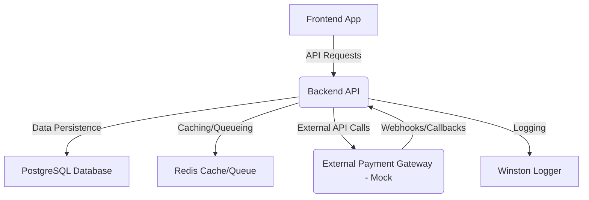

```markdown
# Payment Processing System

This project is a comprehensive, production-ready payment processing system built with TypeScript, Node.js (Express), React, PostgreSQL, and Docker. It provides a robust backend API for managing payments, refunds, merchants, and users, along with a conceptual React frontend.

## Table of Contents

1.  [Features](#features)
2.  [Architecture](#architecture)
3.  [Technologies Used](#technologies-used)
4.  [Setup and Installation](#setup-and-installation)
    *   [Prerequisites](#prerequisites)
    *   [Backend Setup (Docker Compose)](#backend-setup-docker-compose)
    *   [Backend Setup (Local)](#backend-setup-local)
    *   [Frontend Setup (Conceptual)](#frontend-setup-conceptual)
5.  [Running the Application](#running-the-application)
6.  [API Documentation](#api-documentation)
7.  [Testing](#testing)
8.  [CI/CD](#ci/cd)
9.  [Deployment Guide](#deployment-guide)
10. [Future Enhancements](#future-enhancements)
11. [License](#license)

---

## 1. Features

**Core Functionality:**

*   **Payment Initiation:** Merchants can initiate payment requests.
*   **Payment Processing:** Simulate interaction with external payment gateways to process payments and update transaction statuses.
*   **Refund Management:** Allow merchants to initiate full or partial refunds.
*   **Transaction Tracking:** Comprehensive logging and status updates for all transactions.
*   **Webhook System:** Notify merchants in real-time about payment and refund events.

**Security & Scalability:**

*   **Authentication & Authorization:** JWT-based user and merchant authentication with role-based access control (Admin, Merchant).
*   **Secure Password Hashing:** Using `bcryptjs`.
*   **Error Handling:** Centralized and consistent API error responses.
*   **Logging & Monitoring:** Structured logging with Winston.
*   **Caching Layer:** Redis integration for improved performance.
*   **Rate Limiting:** Protects API endpoints from abuse.
*   **Containerization:** Docker for consistent development and deployment environments.

**Development & Operations:**

*   **Database:** PostgreSQL with TypeORM for robust data management, schema migrations, and seeding.
*   **Testing:** Unit, Integration, and API tests with Jest and Supertest, aiming for high coverage.
*   **CI/CD:** Basic GitHub Actions workflow for automated testing and deployment.
*   **Comprehensive Documentation:** README, Architecture, API, and Deployment guides.

---

## 2. Architecture

The system follows a microservices-inspired modular architecture, emphasizing clear separation of concerns.

*   **Client (Frontend):** A React application (conceptual in this project) that provides a user interface for merchants to manage payments and an interface for customers to complete payments.
*   **Backend (Node.js/Express/TypeScript):** The core API server.
    *   **Modules:** Organized by domain (Auth, Users, Merchants, Payments, Webhooks), each with its own controllers, services, and validations.
    *   **Middlewares:** For authentication, authorization, error handling, validation, and rate limiting.
    *   **Services:** Abstractions for external interactions (payment gateways, caching, queuing) and business logic.
    *   **Database:** PostgreSQL, accessed via TypeORM.
    *   **Caching:** Redis for session management and frequently accessed data.
    *   **Queue:** A message queue (mocked with Redis for simplicity) for asynchronous tasks like webhook delivery.
*   **Database (PostgreSQL):** Stores all application data.
*   **Cache/Queue (Redis):** Used for caching and message queuing.
*   **External Payment Gateway (Mock):** Represents an external service (e.g., Stripe, PayPal) that actually processes card payments. This project includes a mock service for demonstration.

**Diagram:**



---

## 3. Technologies Used

*   **Backend:**
    *   Node.js
    *   TypeScript
    *   Express.js
    *   TypeORM (ORM for database interaction)
    *   PostgreSQL (Database)
    *   Redis (Caching, Queue)
    *   bcryptjs (Password hashing)
    *   jsonwebtoken (JWT authentication)
    *   Joi (Request validation)
    *   Winston (Logging)
    *   express-rate-limit (Rate limiting)
    *   Helmet (Security headers)
    *   Cors (CORS management)
*   **Frontend (Conceptual):**
    *   React
    *   TypeScript
    *   Tailwind CSS (Styling)
    *   React Router (Navigation)
    *   Axios (HTTP client)
*   **Tools:**
    *   Docker, Docker Compose
    *   Git, GitHub Actions (CI/CD)
    *   Jest, Supertest (Testing)
    *   ESLint, Prettier (Code quality)
    *   Nodemon (Development server)

---

## 4. Setup and Installation

### Prerequisites

*   Node.js (v18 or higher) & npm
*   Docker & Docker Compose
*   Git

### Backend Setup (Docker Compose - Recommended)

1.  **Clone the repository:**
    ```bash
    git clone https://github.com/your-username/payment-processing-system.git
    cd payment-processing-system
    ```

2.  **Create `.env` file:**
    Copy `.env.example` to `.env` and fill in your desired values. Ensure `DB_HOST` is `db` and `REDIS_HOST` is `redis` for Docker Compose to resolve correctly.
    ```bash
    cp .env.example .env
    # Edit .env to set your secrets and adjust configurations if needed
    ```

3.  **Create `init-db.sh`:**
    This script initializes the PostgreSQL database with the `uuid-ossp` extension, which is required for UUID primary keys. Create a file named `init-db.sh` in the project root:
    ```bash
    #!/bin/bash
    psql -v ON_ERROR_STOP=1 --username "$POSTGRES_USER" --dbname "$POSTGRES_DB" <<-EOSQL
        CREATE EXTENSION IF NOT EXISTS "uuid-ossp";
    EOSQL
    ```
    Make it executable: `chmod +x init-db.sh`

4.  **Build and run services:**
    ```bash
    docker-compose up --build -d
    ```
    This will:
    *   Build the backend Docker image.
    *   Start PostgreSQL and Redis containers.
    *   Run database migrations and seed initial data.
    *   Start the backend API server.

5.  **Verify:**
    Open your browser or use `curl` to check the backend health: `http://localhost:3000/health`
    You should see `{ "status": "UP", "timestamp": "..." }`.

### Backend Setup (Local - without Docker for services)

If you prefer to run PostgreSQL and Redis locally outside of Docker:

1.  **Install dependencies:**
    ```bash
    npm install
    ```

2.  **Start PostgreSQL and Redis:**
    Ensure your local PostgreSQL and Redis servers are running and accessible. Update your `.env` file with the correct connection details (e.g., `DB_HOST=localhost`, `REDIS_HOST=localhost`).

3.  **Run migrations:**
    ```bash
    npm run db:migrate
    ```

4.  **Seed initial data:**
    ```bash
    npm run db:seed
    ```

5.  **Start the backend in development mode:**
    ```bash
    npm run dev
    ```
    The server will run on `http://localhost:3000`.

### Frontend Setup (Conceptual)

The frontend is conceptual in this project. To set up a basic React app:

1.  **Navigate to the `frontend` directory:**
    ```bash
    cd frontend
    ```

2.  **Install dependencies:**
    ```bash
    npm install
    ```

3.  **Create `.env.development` file:**
    ```bash
    cp .env.development.example .env.development
    # Update REACT_APP_API_BASE_URL if your backend is not on http://localhost:3000
    ```

4.  **Start the frontend development server:**
    ```bash
    npm start
    ```
    The frontend will typically run on `http://localhost:3001`.

---

## 5. Running the Application

Once setup is complete:

*   **Docker Compose:**
    ```bash
    docker-compose up -d
    # To stop:
    docker-compose down
    ```
    The backend will be available at `http://localhost:3000`.

*   **Locally:**
    ```bash
    # Backend
    npm run dev # or npm start for production build
    # Frontend (if implemented)
    cd frontend && npm start
    ```

---

## 6. API Documentation

Please refer to the dedicated [API.md](API.md) file for detailed endpoint documentation, request/response examples, and authentication requirements.

---

## 7. Testing

The project includes unit, integration, and API tests using Jest and Supertest.

*   **Run all tests:**
    ```bash
    npm test
    ```
*   **Run unit tests only:**
    ```bash
    npm run test:unit
    ```
*   **Run integration tests only:**
    ```bash
    npm run test:integration
    ```
*   **Generate coverage report:**
    ```bash
    npm test -- --coverage
    ```

---

## 8. CI/CD

A basic GitHub Actions workflow (`.github/workflows/ci-cd.yml`) is configured for:

*   **Linting and Type Checking:** Ensures code quality and correctness.
*   **Building:** Compiles TypeScript to JavaScript.
*   **Testing:** Runs all unit and integration tests.
*   **Deployment (Conceptual):** Automatically deploys to staging on `develop` branch pushes and to production on `main` branch pushes (with manual approval recommended for production).

**To use the CI/CD pipeline:**

1.  Push your code to a GitHub repository.
2.  Configure GitHub Secrets for `DOCKER_USERNAME`, `DOCKER_PASSWORD`, `CODECOV_TOKEN`, `STAGING_HOST`, `STAGING_USERNAME`, `STAGING_SSH_KEY`, `PRODUCTION_HOST`, `PRODUCTION_USERNAME`, `PRODUCTION_SSH_KEY`.
3.  Adjust deployment scripts to match your server environment and preferred deployment strategy.

---

## 9. Deployment Guide

A more detailed deployment guide is available in [DEPLOYMENT.md](DEPLOYMENT.md). Key steps involve:

1.  **Containerization:** Using Docker for consistent environments.
2.  **Orchestration:** Kubernetes (K8s) or Docker Swarm for managing containers in production.
3.  **Load Balancing:** Distribute traffic across multiple instances.
4.  **Database Management:** Managed PostgreSQL service (e.g., AWS RDS, Google Cloud SQL).
5.  **Observability:** Integrate with monitoring (Prometheus/Grafana) and logging (ELK stack/Loki) solutions.
6.  **Security:** Implement robust network security, secrets management, and regular security audits.
7.  **CI/CD Automation:** Automate builds, tests, and deployments.

---

## 10. Future Enhancements

*   **Multiple Payment Gateways:** Integrate with real payment providers (Stripe, PayPal, Adyen, etc.) using a strategy pattern.
*   **Webhooks for Merchants:** Full-fledged retry mechanism with exponential backoff and dead-letter queue for webhook delivery.
*   **Admin Panel:** A dedicated UI for administrators to manage users, merchants, and view system-wide statistics.
*   **Customer Wallets/Cards:** Securely store customer payment methods (tokenized).
*   **Fraud Detection:** Integration with fraud detection services.
*   **Reporting & Analytics:** Generate detailed reports for merchants and admins.
*   **Idempotency:** Implement idempotency keys for payment requests to prevent duplicate transactions.
*   **API Key Management:** More robust API key generation, revocation, and rotation.
*   **Rate Limiting per Merchant:** Implement more granular rate limits.
*   **Audit Logging:** Track all changes made by users/admins.
*   **Internationalization:** Support multiple currencies and languages.
*   **Advanced Transaction Types:** Support for authorizations, captures, voids.

---

## 11. License

This project is licensed under the MIT License. See the `LICENSE` file for details.
```