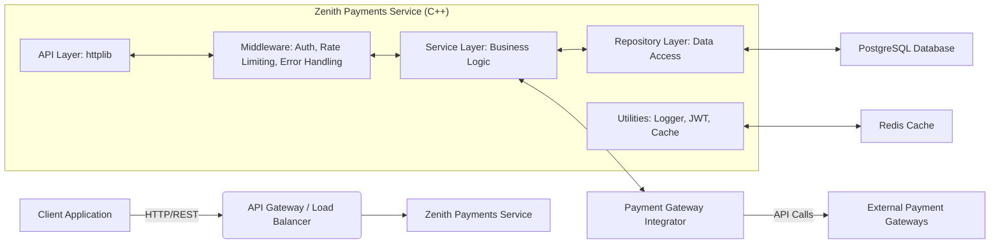

```markdown
# Zenith Payments - Architecture Documentation

This document provides a high-level overview of the architecture of the Zenith Payments system.

## 1. High-Level Design

Zenith Payments is designed as a modular, multi-layered microservice. It exposes a RESTful API to client applications and interacts with a PostgreSQL database for data persistence and Redis for caching. External payment gateways are integrated through a dedicated service layer.



## 2. Component Breakdown

### 2.1. API Layer (`src/api/`)
-   **Purpose**: Handles incoming HTTP requests, routes them to appropriate handlers, serializes/deserializes JSON data, and sends back responses.
-   **Technology**: `cpp-httplib`, `nlohmann/json`.
-   **Key Components**:
    -   `routes.cpp/hpp`: Defines all API endpoints (e.g., `/auth/login`, `/users/me`, `/transactions`).
    -   `auth_middleware.hpp`: Intercepts requests to validate JWT tokens and populate user context.
    -   `rate_limiter_middleware.hpp`: Prevents abuse by limiting the number of requests per client.
    -   `error_handler.hpp`: Centralized exception handling and consistent error responses.
-   **Interaction**: Communicates with the Service Layer to execute business logic.

### 2.2. Service Layer (`src/services/`)
-   **Purpose**: Contains the core business logic of the application. It orchestrates operations, performs validations, and manages the transaction lifecycle.
-   **Key Components**:
    -   `UserService`: Manages user registration, login, profile updates.
    -   `PaymentMethodService`: Handles creation, retrieval, and management of user payment methods.
    -   `TransactionService`: Orchestrates the payment processing flow, interacts with repositories and payment gateways.
    -   `PaymentGatewayIntegrator`: An abstraction layer for communicating with various external payment processing APIs.
-   **Interaction**: Depends on the Repository Layer for data persistence and the `PaymentGatewayIntegrator` for external interactions.

### 2.3. Repository Layer (`src/database/repositories/`)
-   **Purpose**: Provides an abstraction over the database, encapsulating data access logic. Each repository is responsible for CRUD (Create, Read, Update, Delete) operations on a specific data model.
-   **Technology**: `pqxx` (C++ client for PostgreSQL).
-   **Key Components**:
    -   `UserRepository`: Manages `User` data.
    -   `PaymentMethodRepository`: Manages `PaymentMethod` data.
    -   `TransactionRepository`: Manages `Transaction` data.
-   **Interaction**: Communicates with the `DBConnection` manager to get database connections.

### 2.4. Database Layer (`src/database/`)
-   **Purpose**: Persistent storage for application data.
-   **Technology**: PostgreSQL.
-   **Key Components**:
    -   `db_connection.hpp/cpp`: Manages a connection pool to the PostgreSQL database, ensuring efficient and thread-safe access.
    -   `schema.sql`: Defines the initial database schema.
    -   `migrations/`: Contains incremental SQL scripts for evolving the database schema.
    -   `seed_data.sql`: Populates the database with initial development/test data.
-   **Interaction**: Accessed by the Repository Layer.

### 2.5. Models (`src/models/`)
-   **Purpose**: Simple C++ structs that represent the entities in the domain model and correspond to database tables.
-   **Key Components**: `User`, `PaymentMethod`, `Transaction`.
-   **Interaction**: Used across all layers for data transfer and representation.

### 2.6. Utilities (`src/utils/`)
-   **Purpose**: Provides common, cross-cutting functionalities.
-   **Key Components**:
    -   `logger.hpp/cpp`: Configurable logging utility using `spdlog`.
    -   `jwt_manager.hpp/cpp`: Handles JWT token generation and verification using `jwt-cpp`.
    -   `cache_manager.hpp/cpp`: (Planned/Mocked) Interface for caching data, potentially backed by Redis.
    -   `common.hpp`: Contains common definitions, helper functions, or type aliases.
-   **Interaction**: Used by all other layers as needed.

### 2.7. Configuration (`src/config/`)
-   **Purpose**: Manages application settings loaded from environment variables.
-   **Key Components**: `config.hpp/cpp` (`AppConfig` singleton).
-   **Interaction**: Provides configuration parameters to all parts of the application.

## 3. External Services

-   **PostgreSQL**: Primary data store.
-   **Redis**: (Optional/Planned) Used for caching, session management, and rate limiting counters.
-   **External Payment Gateways**: Third-party services (e.g., Stripe, PayPal, Braintree) that handle actual financial transactions. The `PaymentGatewayIntegrator` acts as an adapter.

## 4. Cross-Cutting Concerns

-   **Authentication & Authorization**: Implemented via JWTs, managed by `JwtManager` and `auth_middleware`. Role-based access control (RBAC) is applied using `roleMiddleware`.
-   **Logging**: Centralized through `spdlog` for consistent application and error logging. Configurable log levels.
-   **Error Handling**: Consistent JSON error responses across the API.
-   **Caching**: A `CacheManager` provides an interface to an in-memory or Redis-backed cache.
-   **Rate Limiting**: Middleware to protect against API abuse.
-   **Security**: Use of parameterized queries to prevent SQL injection, secure password hashing (Argon2/BCrypt in production), JWT for API security, and environment variables for secrets.

## 5. Deployment Model

The application is containerized using Docker and orchestrated with Docker Compose for local development. For production, it's designed to be deployed as a microservice, potentially on Kubernetes or other container orchestration platforms. CI/CD pipelines automate building, testing, and deployment.

---
```