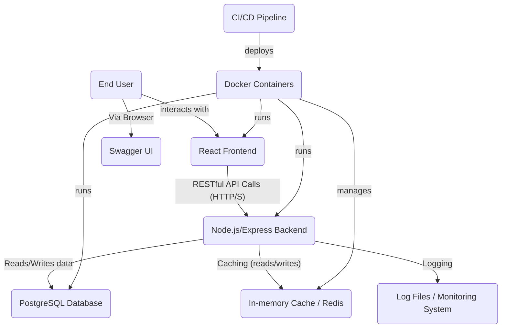

# Architecture Documentation

This document outlines the architecture of the Project Management System (PMS) API, covering its high-level design, technology choices, data flow, and key architectural considerations.

## 1. High-Level Architecture

The PMS API follows a **Monolithic Application Architecture** for simplicity of demonstration, while incorporating modularity within the backend to allow for easier transition to microservices if scaling demands it. It is a **full-stack web application** with a clear separation between the frontend (client-side) and backend (server-side) components, communicating via RESTful APIs.



## 2. Technology Stack

### Backend
*   **Runtime:** Node.js (TypeScript)
    *   Chosen for its non-blocking I/O model, large ecosystem, and excellent performance for API services. TypeScript adds static typing, improving code quality and maintainability.
*   **Web Framework:** Express.js
    *   A minimalist, unopinionated, and highly flexible web framework for Node.js, widely adopted for building REST APIs.
*   **Database:** PostgreSQL
    *   A powerful, open-source relational database known for its robustness, reliability, feature set, and strong support for ACID properties.
*   **ORM (Object-Relational Mapper):** TypeORM
    *   Provides a strong abstraction layer over the database, allowing interaction with database entities using TypeScript/JavaScript objects. It supports migrations, making schema evolution manageable.
*   **Authentication/Authorization:** JSON Web Tokens (JWT)
    *   Stateless authentication mechanism for securing API endpoints. `bcryptjs` is used for secure password hashing.
*   **Logging:** Winston
    *   A versatile logging library for Node.js, enabling structured logging to various transports (console, file, future external services).
*   **Caching:** `node-cache` (in-memory)
    *   For this demonstration, an in-memory cache is used. In a production environment, this would typically be replaced by a distributed cache like Redis for scalability and persistence across multiple backend instances.
*   **Rate Limiting:** `express-rate-limit`
    *   Middleware to protect against brute-force attacks and abuse by limiting the number of requests a user can make within a specified timeframe.
*   **API Documentation:** Swagger UI Express / OpenAPI Specification
    *   Provides interactive API documentation for easy understanding and testing of endpoints.

### Frontend
*   **Framework:** React (TypeScript)
    *   A popular JavaScript library for building user interfaces, offering a component-based approach for modular and reusable UI. TypeScript enhances development with type safety.
*   **Styling:** Tailwind CSS
    *   A utility-first CSS framework for rapidly building custom designs directly in HTML/JSX.
*   **HTTP Client:** Axios
    *   A promise-based HTTP client for the browser and Node.js, used for making API requests to the backend.

### DevOps
*   **Containerization:** Docker & Docker Compose
    *   Enables packaging the application and its dependencies into isolated containers, ensuring consistent environments across development, testing, and production. Docker Compose orchestrates multi-container applications.
*   **CI/CD:** GitHub Actions
    *   Automated workflows for continuous integration (testing) and continuous deployment (building Docker images, deploying to a target environment).
*   **Testing:** Jest, Supertest
    *   Jest is the primary testing framework for unit and integration tests. Supertest extends Jest to enable HTTP assertions for API endpoint testing.

## 3. Data Flow

1.  **Client Request:** A user interacts with the React frontend in their browser.
2.  **API Call:** The React frontend makes an HTTP request (e.g., GET, POST) to a backend API endpoint using Axios. If authenticated, the JWT is included in the `Authorization` header.
3.  **Backend (Express) Processing:**
    *   The request first hits Express middleware:
        *   **Rate Limiting:** Checks if the client has exceeded request limits.
        *   **Logging:** Logs incoming request details.
        *   **Authentication:** Validates the JWT. If invalid or missing, returns 401. Attaches user ID/role to `req.user`.
        *   **Authorization:** Checks if `req.user` has the necessary role for the route. If not, returns 403.
        *   **Caching:** For GET requests on specific routes, checks if a response is already cached. If so, returns cached data.
    *   The request reaches the appropriate **Controller**.
    *   The Controller handles request validation (basic or via DTOs) and delegates business logic to a **Service**.
    *   The **Service** encapsulates core business logic. It interacts with **Repositories** (TypeORM) to perform database operations.
    *   **Repositories** interact directly with TypeORM entities to perform CRUD operations on the PostgreSQL database.
    *   The Service might also interact with the caching layer (e.g., `node-cache`) to fetch data from or store data to the cache.
4.  **Database Interaction:** TypeORM translates object operations into SQL queries for PostgreSQL.
5.  **Response Generation:**
    *   Data retrieved from the database or cache is processed by the Service.
    *   The Service returns data to the Controller.
    *   The Controller formats the response and sends it back to the client.
    *   If a cacheable response was generated, the caching middleware intercepts `res.send` to store the response before sending it.
6.  **Error Handling:** If any error occurs at any stage, it is caught by the centralized `errorHandler` middleware, which logs the error and sends a consistent, user-friendly error response.

## 4. Architectural Decisions & Patterns

*   **Modular Monolith:** The backend is structured into feature-based modules (`auth`, `users`, `projects`, `tasks`), each containing its own controllers, services, repositories, and entities. This promotes separation of concerns, simplifies maintenance, and makes it easier to refactor into microservices in the future if needed.
*   **Layered Architecture:** The backend follows a traditional layered architecture (Controller -> Service -> Repository -> Database).
    *   **Controllers:** Handle HTTP requests and responses, parse input, and delegate to services. Keep them thin.
    *   **Services:** Contain the business logic, orchestrate operations, and interact with repositories. This is where the core application logic resides.
    *   **Repositories:** Abstract database access, providing methods for data manipulation for specific entities.
*   **Dependency Injection (Conceptual):** While explicit DI frameworks are not used for simplicity, the design allows for easy mocking of dependencies (e.g., `UserRepository` in `UserService`) for unit testing.
*   **DTOs (Data Transfer Objects):** Used for defining the shape of request bodies and response payloads, improving type safety and validation.
*   **Global Error Handling:** A dedicated middleware (`errorHandler`) catches all errors, standardizes error responses, and logs errors consistently. Custom `ApiError` classes are used for specific, expected error scenarios.
*   **Centralized Configuration:** All environment-dependent configurations are managed via `.env` files and accessed through a single `config` module, promoting consistency and maintainability.
*   **Read-Through Cache (Implicit):** The caching middleware attempts to serve responses from cache first. If a cache miss occurs, the request proceeds to the backend, and the successful response is then cached. Cache invalidation is explicit upon data modification.
*   **Stateless Services:** The backend services are stateless, making them easier to scale horizontally. User session information is stored in JWTs, not on the server.

## 5. Scalability Considerations

*   **Horizontal Scaling:** The stateless nature of the backend (JWT-based auth) and containerization with Docker makes it straightforward to run multiple instances of the backend service behind a load balancer.
*   **Database Scaling:** PostgreSQL can be scaled vertically (more powerful server) or horizontally (read replicas, sharding, though more complex). TypeORM's query building capabilities allow for optimized queries.
*   **Caching Layer:** While `node-cache` is in-memory for this demo, replacing it with a distributed cache like Redis would be a critical step for scaling, allowing multiple backend instances to share the same cache.
*   **Message Queues:** For long-running or asynchronous tasks (e.g., email notifications, complex report generation), integrating a message queue (like RabbitMQ or Kafka) would offload work from the main API thread.
*   **Monitoring & Logging:** Centralized logging (e.g., ELK stack, Datadog) and monitoring (Prometheus/Grafana) are essential for observing application health and performance in a scaled environment.

## 6. Security Considerations

*   **JWT Authentication:** Ensures only authenticated users can access protected resources.
*   **Role-Based Authorization:** Restricts access to resources based on user roles.
*   **Password Hashing:** `bcryptjs` is used to securely hash passwords, never storing them in plain text.
*   **HTTPS:** In production, all traffic between client and server (and within microservices) should be encrypted using HTTPS/TLS.
*   **CORS:** Properly configured CORS headers to prevent unauthorized cross-origin requests.
*   **Helmet:** Express middleware that sets various HTTP headers to improve security (e.g., XSS protection, MIME type sniffing prevention).
*   **Rate Limiting:** Protects against brute-force attacks and excessive requests.
*   **Input Validation:** Basic validation is implemented in controllers/services. For production, a more robust validation library (e.g., Joi, Zod) should be integrated to validate all incoming data against schemas.
*   **Environment Variables:** Sensitive information (database credentials, JWT secret) is stored in environment variables, not hardcoded.
*   **Docker Security:** Using lean base images (`alpine`), non-root users, and minimizing exposed ports.

This architecture provides a solid foundation for a production-ready application, balancing maintainability, scalability, and security.
```

#### `pms-api/docs/DEPLOYMENT_GUIDE.md`
```markdown