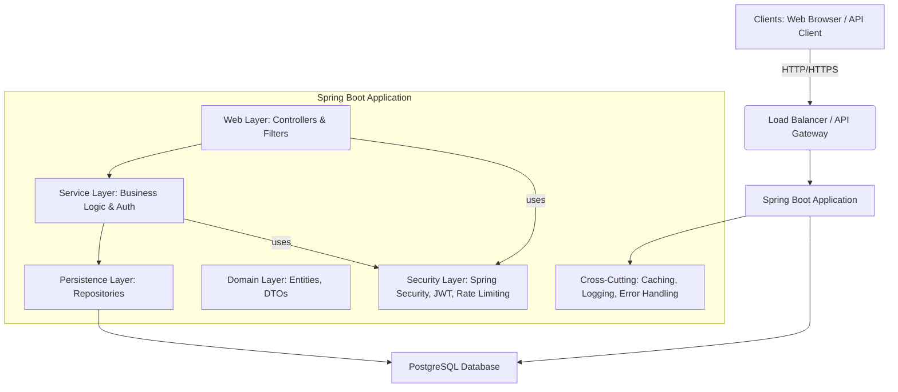

# Architecture Document: Secure Project Management System

This document outlines the architectural design of the Secure Project Management System.

## 1. Overview

The Secure Project Management System is a full-stack web application designed to manage projects, tasks, and comments with a strong emphasis on security, scalability, and maintainability. It utilizes a layered architecture pattern, which promotes separation of concerns and facilitates development and testing.

## 2. Architectural Style

The application primarily employs a **Layered Architecture (N-tier)** pattern on the backend, with a clear separation between presentation, business logic, and data access. For the frontend, it uses a server-side rendering approach with **Thymeleaf**, integrating seamlessly with the Spring MVC framework. The API endpoints follow a **RESTful** style for external clients (e.g., potential future SPAs or mobile apps).

## 3. High-Level Diagram

## 4. Layered Architecture Breakdown

### 4.1. Presentation Layer (Web Layer)

-   **Technologies:** Spring MVC, Thymeleaf, REST Controllers (`@RestController`, `@Controller`).
-   **Responsibilities:**
    -   Handling HTTP requests (routing, parsing input).
    -   Rendering HTML views (Thymeleaf templates) for UI interactions.
    -   Exposing RESTful API endpoints for external consumption (e.g., JSON responses).
    -   Input validation (using `@Valid` and JSR-303 annotations).
    -   Delegating business logic execution to the Service Layer.
-   **Key Components:**
    -   `HomeController`, `AuthController`, `ProjectController`, `TaskController`, `CommentController`: Handle specific resource interactions.
    -   `src/main/resources/templates/`: HTML files for UI.
    -   `src/main/resources/static/`: CSS and other static assets.

### 4.2. Service Layer (Business Logic Layer)

-   **Technologies:** Spring Beans (`@Service`), Spring Transaction Management (`@Transactional`).
-   **Responsibilities:**
    -   Encapsulating core business logic and rules.
    -   Orchestrating operations across multiple repositories.
    -   Applying `@PreAuthorize` for method-level authorization.
    -   Implementing caching strategies (`@Cacheable`, `@CachePut`, `@CacheEvict`).
    -   Handling complex data transformations or computations.
    -   Ensuring data integrity and consistency through transactions.
-   **Key Components:**
    -   `AuthService`: User registration logic.
    -   `CustomUserDetailsService`: Integrates user details with Spring Security.
    -   `ProjectService`, `TaskService`, `CommentService`: Manage CRUD and business rules for their respective domains.

### 4.3. Persistence Layer (Data Access Layer)

-   **Technologies:** Spring Data JPA, Hibernate.
-   **Responsibilities:**
    -   Providing an abstraction over the underlying database.
    -   Performing CRUD operations on domain entities.
    -   Mapping Java objects to database tables.
    -   Handling database-specific concerns (e.g., query optimization, though not explicitly shown in detail for this example).
-   **Key Components:**
    -   `UserRepository`, `RoleRepository`, `ProjectRepository`, `TaskRepository`, `CommentRepository`: JPA repositories for each entity.

### 4.4. Domain Layer (Model Layer)

-   **Technologies:** Plain Old Java Objects (POJOs), JPA annotations (`@Entity`, `@Table`).
-   **Responsibilities:**
    -   Representing the core business entities and their relationships.
    -   Defining data structures for DTOs (Data Transfer Objects).
    -   Implementing `UserDetails` for the `User` entity to integrate with Spring Security.
-   **Key Components:**
    -   `User`, `Role`, `Project`, `Task`, `Comment`: JPA Entities.
    -   `LoginRequest`, `RegisterRequest`, `JwtResponse`, `ProjectDTO`, `TaskDTO`, `CommentDTO`: DTOs for API requests/responses and form data.

## 5. Security Layer

-   **Technologies:** Spring Security, JWT (JJWT), BCrypt, Custom Filters (Bucket4j).
-   **Responsibilities:**
    -   **Authentication:** Verifying user identity (form-based for UI, JWT for API).
    -   **Authorization:** Granting or denying access to resources based on roles and resource ownership (`@PreAuthorize`).
    -   **Password Management:** Hashing passwords using `BCryptPasswordEncoder`.
    -   **Token Management:** Generating, validating, and parsing JWTs.
    -   **Rate Limiting:** Protecting endpoints from excessive requests.
    -   **Session Management:** Configured for both stateful (UI) and stateless (API) contexts.
-   **Key Components:**
    -   `SecurityConfig`: Main Spring Security configuration.
    -   `JwtTokenProvider`: Creates and validates JWTs.
    -   `JwtAuthenticationFilter`: Extracts and processes JWTs from requests.
    -   `RateLimitFilter`: Custom filter for applying rate limits.

## 6. Cross-Cutting Concerns

### 6.1. Configuration

-   **Technologies:** Spring Boot `application.yml`.
-   **Responsibilities:** Externalizing application settings, database credentials, security secrets, caching parameters, and logging levels.

### 6.2. Caching

-   **Technologies:** Spring Cache, Caffeine.
-   **Responsibilities:** Improving application performance by storing frequently accessed data in memory. Configured with `CacheConfig` and annotations like `@Cacheable`.

### 6.3. Logging & Monitoring

-   **Technologies:** SLF4J + Logback, Spring Boot Actuator.
-   **Responsibilities:** Providing insights into application behavior, debugging, and health monitoring.
    -   **Logging:** Structured logging to console and file.
    -   **Actuator:** Exposes endpoints like `/actuator/health`, `/actuator/info`, `/actuator/prometheus` for operational visibility.

### 6.4. Error Handling

-   **Technologies:** Spring `@ControllerAdvice`, Custom Exception Classes.
-   **Responsibilities:** Providing a consistent and user-friendly way to handle exceptions across the application, converting them into appropriate HTTP responses.
-   **Key Components:**
    -   `GlobalExceptionHandler`: Catches and processes exceptions globally.
    -   `ResourceNotFoundException`, `UnauthorizedException`: Custom exceptions for specific error scenarios.

## 7. Database Layer

-   **Technology:** PostgreSQL (via Docker), H2 (in-memory for local Maven run), Liquibase.
-   **Responsibilities:**
    -   Storing and retrieving application data.
    -   Ensuring data integrity through relational constraints.
    -   Managing schema changes and versioning with Liquibase.

## 8. Deployment Architecture

-   **Containerization:** The application is containerized using Docker.
-   **Orchestration:** `docker-compose.yml` defines how the application and its database are deployed together locally.
-   **CI/CD:** GitHub Actions workflow automates the build, test, and deployment process (pushing to Docker Hub, deploying to a remote server).

## 9. Testing Strategy

-   **Unit Tests:** Focus on isolated methods/classes using JUnit and Mockito.
-   **Integration Tests:** Verify interactions between components using Spring Boot Test and Testcontainers for a real database.
-   **API Tests:** Validate REST endpoint behavior, including security aspects, using MockMvc.
-   **Code Coverage:** Monitored with JaCoCo (aiming for 80%+).

This architecture provides a solid foundation for a scalable, secure, and maintainable project management system.