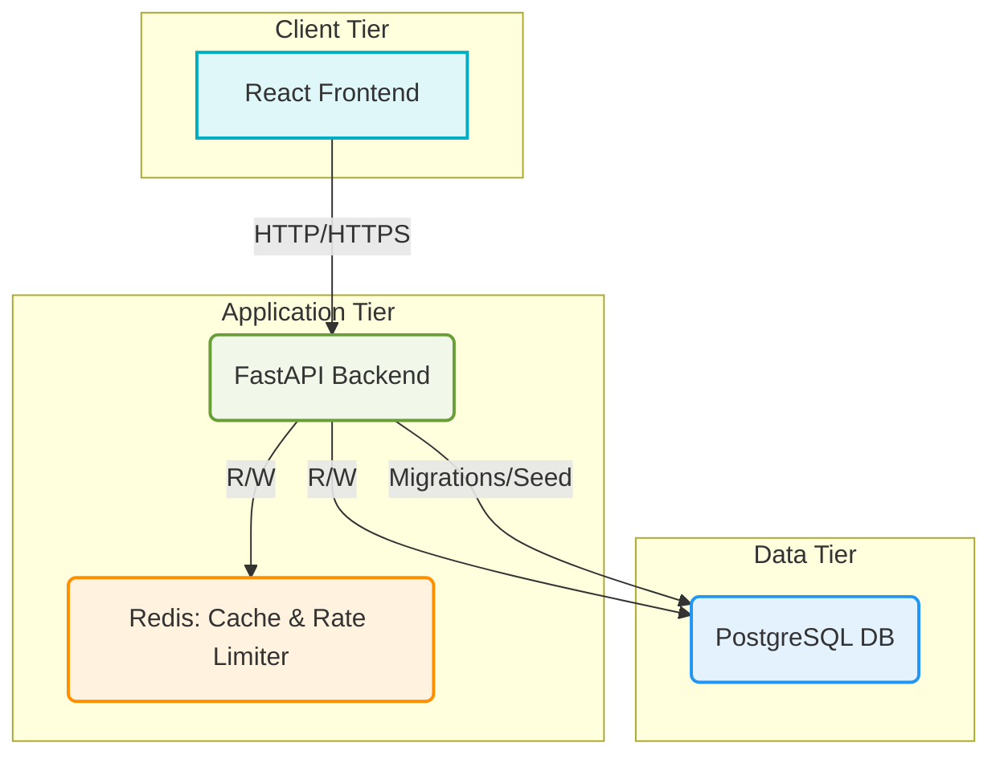

```markdown
# Architecture Documentation: Secure Task Management System

This document outlines the high-level architecture of the Secure Task Management System, focusing on its components, interactions, and security considerations.

## 1. High-Level Overview

The system is designed as a **monolithic API backend** served by FastAPI, coupled with a **Single Page Application (SPA) frontend** built with React. It leverages PostgreSQL for persistent data storage and Redis for caching and rate limiting. All components are containerized using Docker and orchestrated with Docker Compose for ease of development and deployment.



## 2. Component Breakdown

### 2.1. Frontend (React SPA)

*   **Technology:** React with Create React App (CRA).
*   **Purpose:** Provides the user interface for interacting with the task management system.
*   **Key Responsibilities:**
    *   User authentication (login, registration) and token management (storing/retrieving JWTs).
    *   Client-side routing.
    *   Displaying projects and tasks.
    *   Handling user input for CRUD operations.
    *   Consuming RESTful APIs from the backend.
*   **Security Considerations:**
    *   **Token Storage:** Access tokens typically stored in `localStorage` or `sessionStorage`. Refresh tokens are ideally stored in `HttpOnly` cookies to mitigate XSS risks, but for simplicity in this demo, both might be in `localStorage`.
    *   **CORS:** Respects backend's CORS policy.
    *   **XSS Protection:** React inherently provides some XSS protection by escaping content, but careful handling of user-generated content is always required.
    *   **Content Security Policy (CSP):** Can be implemented to whitelist allowed content sources.
    *   **Input Sanitization:** Frontend-side validation (e.g., minimum length, format) to provide immediate feedback, but backend validation is the authoritative source.

### 2.2. Backend (FastAPI API)

*   **Technology:** Python with FastAPI framework.
*   **Purpose:** The core business logic layer, exposing a RESTful API.
*   **Key Modules:**
    *   **`main.py`:** Application entry point, defines middlewares, exception handlers, and registers API routes.
    *   **`core/`:** Configuration (`config.py`), database connection (`db.py`), security utilities (`security.py` for JWT, password hashing).
    *   **`models/`:** SQLAlchemy ORM models (User, Project, Task) defining database schema.
    *   **`schemas/`:** Pydantic schemas for request validation, response serialization, and data type definitions. Crucial for input validation and output sanitization.
    *   **`crud/`:** CRUD operations (Create, Read, Update, Delete) for interacting with the database, abstracting SQLAlchemy details.
    *   **`api/v1/`:** RESTful API endpoints for different resources (auth, users, projects, tasks).
    *   **`dependencies/`:** FastAPI dependencies for authentication (JWT verification), authorization (role checks, ownership checks), and database session management.
    *   **`exceptions/`:** Custom exception classes and global handlers for consistent error responses.
    *   **`middleware/`:** Custom middleware (e.g., logging).
    *   **`services/`:** Utility services like caching.
*   **Security Implementations:**
    *   **Authentication:** JWT-based using `python-jose` for token generation/verification and `passlib[bcrypt]` for password hashing. Token blocklisting in Redis.
    *   **Authorization:**
        *   **Role-Based Access Control (RBAC):** Users assigned `user` or `admin` roles, enforced via `Depends` functions (`get_current_admin_user`, `role_required`).
        *   **Resource-Based Access Control:** Ownership checks (e.g., `verify_project_owner`, `verify_task_access`) ensuring users can only modify/delete resources they own or have explicit permission for.
    *   **Input Validation:** Pydantic schemas are strictly enforced on all incoming requests (path parameters, query parameters, request bodies), preventing malicious or malformed data.
    *   **Output Sanitization:** Pydantic schemas ensure that only allowed fields are returned in API responses, preventing accidental leakage of sensitive information (e.g., `hashed_password`).
    *   **SQL Injection Prevention:** SQLAlchemy ORM handles parameterized queries, mitigating SQL injection risks.
    *   **CORS:** Configured to whitelist trusted origins.
    *   **Rate Limiting:** `fastapi-limiter` integrated with Redis to protect endpoints from abuse (e.g., brute-force login attempts).
    *   **Logging:** `loguru` for structured logging of security events, errors, and access patterns.
    *   **Error Handling:** Custom exceptions and global handlers provide generic, non-informative messages for unexpected errors (500) and specific, clear messages for expected API errors (400, 401, 403, 404, 422).
    *   **Secret Management:** Configuration loaded from environment variables (`.env` file).

### 2.3. Database (PostgreSQL)

*   **Technology:** PostgreSQL relational database.
*   **Purpose:** Persistent storage for user accounts, project details, and tasks.
*   **Key Features:**
    *   Relational schema: `users`, `projects`, `tasks` tables with appropriate foreign keys and constraints.
    *   Data integrity: Enforced by SQLAlchemy models and database constraints.
    *   Scalability: PostgreSQL is a robust, production-ready database.
*   **Security Considerations:**
    *   **Least Privilege:** Database users should have only the necessary permissions (e.g., read/write to specific tables, not superuser access). (Conceptual in this project, but crucial for deployment).
    *   **Data Encryption at Rest:** Typically handled by cloud provider services or disk encryption.
    *   **Backups:** Regular, secure backups are essential.
    *   **Network Security:** Database should not be directly exposed to the internet. Access should be restricted to the application backend.

### 2.4. Caching & Rate Limiting (Redis)

*   **Technology:** Redis in-memory data store.
*   **Purpose:**
    *   **Caching:** Stores frequently accessed API responses (`fastapi-cache2`) to reduce database load and improve response times.
    *   **Rate Limiting:** Stores request counts and timestamps for `fastapi-limiter` to enforce rate limits on endpoints.
    *   **Token Blocklisting:** Used to store revoked/logged-out JWTs, preventing their continued use.
*   **Security Considerations:**
    *   **Network Security:** Like the database, Redis should not be directly exposed. Access limited to the backend.
    *   **Authentication:** While not implemented in this demo, Redis can be secured with a password (`requirepass`).
    *   **Persistence:** For blocklists, AOF (Append Only File) persistence can be enabled if Redis data needs to survive restarts.

## 3. Communication Flows

*   **Frontend ↔ Backend:** All communication is via HTTP/HTTPS (HTTPS in production). Requests include JWTs in the `Authorization` header for authentication and authorization.
*   **Backend ↔ Database:** Asynchronous connections managed by SQLAlchemy using `asyncpg`.
*   **Backend ↔ Redis:** Asynchronous connections managed by `redis.asyncio`.

## 4. Deployment Environment (Docker & Docker Compose)

*   **Containerization:** Each major component (backend, frontend, PostgreSQL, Redis) runs in its own Docker container. This ensures environment consistency and isolation.
*   **Orchestration:** Docker Compose is used for local development to define and run the multi-container application. For production, Kubernetes or similar orchestrators would be used.
*   **CI/CD (GitHub Actions):** Automates linting, testing, and building of Docker images on code pushes. This helps maintain code quality and provides faster feedback on changes.

## 5. Security Principles Applied

*   **Defense in Depth:** Multiple layers of security controls (frontend, backend, database, network).
*   **Least Privilege:** Users (and database users) are granted only the minimum permissions necessary.
*   **Secure by Default:** Default configurations aim for security (e.g., Pydantic validation, password hashing).
*   **Fail Securely:** Error handling prevents information leakage. Authentication/authorization failures result in denial of access.
*   **Separation of Concerns:** Security logic is encapsulated (e.g., `security.py`, `dependencies/auth.py`, `dependencies/permissions.py`).
*   **Auditing and Logging:** Comprehensive logging for security events helps detect and respond to incidents.

This architecture provides a solid foundation for a secure and scalable web application, demonstrating many critical security implementations.
```