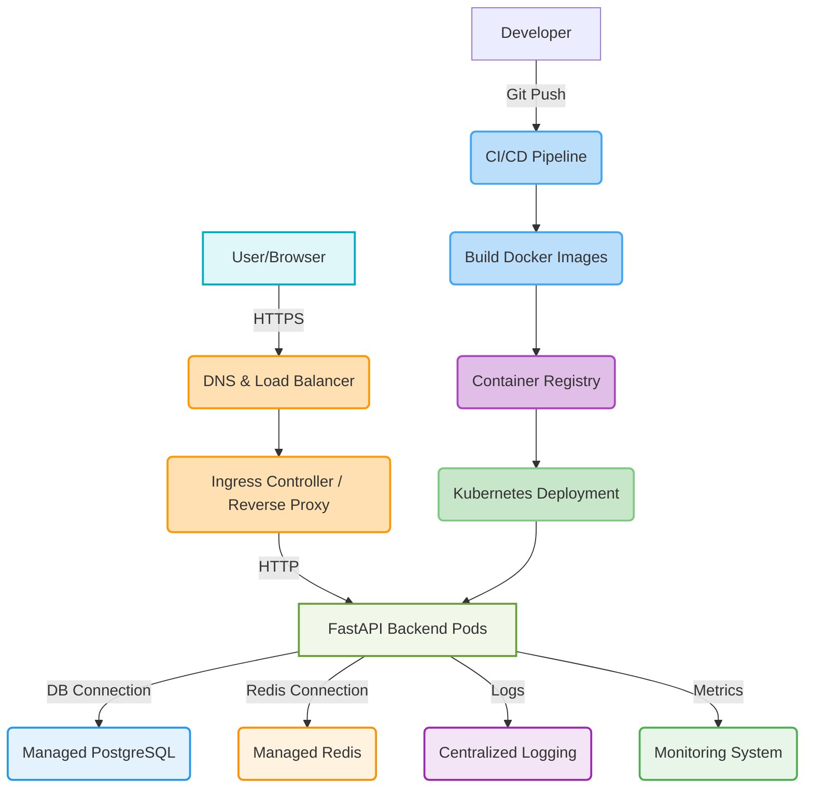

```markdown
# Deployment Guide: Secure Task Management System

This document outlines a conceptual guide for deploying the Secure Task Management System to a production environment. While Docker Compose is excellent for local development, production deployments typically require more robust solutions for scalability, reliability, and security.

## 1. Production Environment Considerations

Before deploying, consider the following:

*   **Cloud Provider:** AWS, GCP, Azure, DigitalOcean, etc.
*   **Orchestration:** Kubernetes (EKS, GKE, AKS), Docker Swarm, ECS, or a simpler VM-based approach.
*   **Managed Services:** Utilizing managed databases (RDS, Cloud SQL), managed Redis (ElastiCache, Memorystore), and container registries (ECR, GCR) simplifies operations.
*   **Network Security:** VPCs, security groups, firewalls, private subnets.
*   **Secrets Management:** Secure storage and injection of `SECRET_KEY`, database passwords, etc.
*   **Monitoring & Logging:** Centralized logging, metrics collection, and alerting.
*   **CI/CD:** Automated deployment pipelines.
*   **HTTPS:** Mandatory for all production traffic.
*   **Domain Name:** A registered domain name pointing to your application.

## 2. Recommended Production Stack (Conceptual)

A common and robust production stack might look like this:

*   **Container Orchestrator:** Kubernetes (or AWS ECS, etc.)
*   **Load Balancer:** Kubernetes Ingress (backed by cloud provider LB like AWS ALB), or a dedicated cloud LB.
*   **Reverse Proxy/SSL Termination:** Nginx, Traefik (often part of Ingress controller).
*   **Backend:** FastAPI Docker container(s) running multiple `uvicorn` workers (e.g., using `gunicorn` with `uvicorn` workers).
*   **Database:** Managed PostgreSQL service (e.g., AWS RDS, GCP Cloud SQL).
*   **Caching/Rate Limiting/Blocklist:** Managed Redis service (e.g., AWS ElastiCache, GCP Memorystore).
*   **Container Registry:** Docker Hub, AWS ECR, GCP GCR.
*   **CI/CD:** GitHub Actions, GitLab CI, Jenkins.
*   **Monitoring:** Prometheus, Grafana.
*   **Logging:** ELK Stack (Elasticsearch, Logstash, Kibana) or cloud-native solutions (CloudWatch, Stackdriver).



## 3. Deployment Steps (High-Level)

### 3.1. Infrastructure Setup

1.  **Cloud Account & Project Setup:** Create a cloud account (AWS, GCP, etc.) and set up a project.
2.  **Network Configuration:** Create a Virtual Private Cloud (VPC) with public and private subnets, routing tables, and internet gateways.
3.  **Managed Database:** Provision a managed PostgreSQL instance (e.g., AWS RDS).
    *   Place it in a private subnet.
    *   Configure security groups to allow traffic only from your backend application instances.
    *   Enable backups, point-in-time recovery, and encryption at rest.
4.  **Managed Redis:** Provision a managed Redis instance (e.g., AWS ElastiCache).
    *   Place it in a private subnet.
    *   Configure security groups to allow traffic only from your backend application instances.
    *   Consider enabling authentication (AUTH command) if supported by your provider.
5.  **Container Registry:** Set up a container registry (e.g., AWS ECR, GCP GCR, Docker Hub).
6.  **Kubernetes Cluster (Optional but Recommended):** Create a managed Kubernetes cluster (EKS, GKE, AKS).

### 3.2. Application & Image Building

1.  **Update `backend/app/core/config.py`:** Adjust `BACKEND_CORS_ORIGINS` for your production frontend domain.
2.  **Update `frontend/.env.production` (or similar):** Set `REACT_APP_API_BASE_URL` to your production backend API URL.
3.  **Secure `.env` values:** Do NOT deploy with `.env` files directly. Use cloud secrets managers (e.g., AWS Secrets Manager, GCP Secret Manager) or Kubernetes secrets.
4.  **Build Docker Images:**
    *   Ensure your `Dockerfile`s are optimized for production (multi-stage builds, smaller base images, remove development dependencies).
    *   Build backend and frontend Docker images.
    *   Tag images appropriately (e.g., `your-registry/backend:latest` and `your-registry/backend:git-sha`).
    *   Push images to your container registry.
    *   *(This is automated in the example CI/CD workflow).*

### 3.3. Deployment to Orchestrator (e.g., Kubernetes)

1.  **Kubernetes Manifests:** Create `Deployment`, `Service`, `Ingress`, `Secret`, and `ConfigMap` manifests for your application.
    *   **Backend Deployment:**
        *   Specify multiple replicas for high availability and scalability.
        *   Resource limits and requests (CPU, Memory).
        *   Liveness and readiness probes.
        *   Environment variables loaded from Kubernetes `Secrets` and `ConfigMaps`.
        *   Run `alembic upgrade head` as an `initContainer` or a pre-deployment hook to ensure migrations run before the app starts.
        *   Run `python app/initial_data.py` similarly for seeding.
    *   **Frontend Deployment:**
        *   Serve static files using Nginx or a similar web server.
        *   Multiple replicas.
    *   **Service:** Expose backend and frontend deployments within the cluster.
    *   **Ingress:** Configure an Ingress resource to route external traffic to your frontend and backend services.
        *   Configure SSL termination (using Cert-Manager for automatic Let's Encrypt certificates).
        *   Map `your-domain.com` to frontend and `api.your-domain.com` (or `your-domain.com/api`) to backend.
2.  **Apply Manifests:**
    ```bash
    kubectl apply -f your-kubernetes-manifests/
    ```

### 3.4. CI/CD Pipeline (GitHub Actions Example)

The provided `.github/workflows/main.yml` demonstrates:

1.  **Linting & Testing:** Run `flake8`, `black`, `ESLint`, `pytest`, `yarn test`.
2.  **Docker Build & Push:** Build and push Docker images to a container registry (e.g., Docker Hub, ECR).
3.  **Deployment Trigger (Conceptual):** After successful image pushes, the pipeline *could* trigger a deployment to Kubernetes. This typically involves:
    *   Updating image tags in Kubernetes manifests (e.g., using `kustomize` or `helm`).
    *   Applying the updated manifests: `kubectl apply -f .`
    *   Rolling out new versions with zero downtime.

### 3.5. Monitoring, Logging, and Alerting

*   **Centralized Logging:** Configure your containers to send logs to a centralized system (e.g., CloudWatch Logs, GCP Logging, ELK stack). `Loguru` already outputs structured logs.
*   **Metrics:** Collect application metrics (e.g., using Prometheus/Grafana) and infrastructure metrics (CPU, Memory, Network).
*   **Alerting:** Set up alerts for high error rates, slow response times, resource exhaustion, or security anomalies (e.g., too many failed login attempts).

## 4. Security Checklist for Production

*   **Secrets Management:** Never hardcode secrets. Use environment variables, Docker secrets, Kubernetes secrets, or dedicated secrets management services.
*   **HTTPS Everywhere:** Enforce HTTPS for all external and internal traffic where possible.
*   **Network Segmentation:** Use VPCs, subnets, and security groups to isolate components. Restrict database and Redis access to only the backend application.
*   **Least Privilege:**
    *   Cloud IAM roles for service accounts.
    *   Database users with minimal necessary permissions.
    *   Container user (avoid running as root).
*   **Image Security:**
    *   Use minimal base images (e.g., `python:3.11-slim-buster`, `node:18-alpine`).
    *   Regularly scan Docker images for vulnerabilities.
    *   Keep dependencies updated.
*   **API Security:**
    *   Ensure rate limiting is effective.
    *   Proper CORS configuration.
    *   Robust input validation.
    *   Monitor API access patterns for anomalies.
*   **Backup & Recovery:** Implement automated, regular backups for your database and test recovery procedures.
*   **DDoS Protection:** Consider services like Cloudflare or AWS Shield for protection against Distributed Denial of Service attacks.
*   **Web Application Firewall (WAF):** Place a WAF (e.g., AWS WAF, Cloudflare WAF) in front of your application to protect against common web vulnerabilities (OWASP Top 10).
*   **Security Audits:** Regularly conduct security audits and penetration tests.

This guide provides a roadmap. The specific implementation details will vary based on your chosen cloud provider and orchestration tools.
```