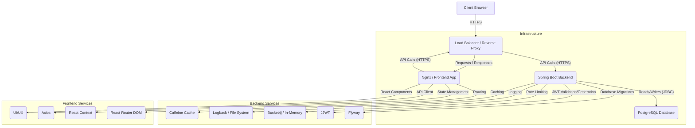

# Architecture Documentation

This document outlines the high-level architecture, design principles, and key components of the Authentication and Task Management System.

## 1. High-Level Architecture Diagram

## 2. Design Principles

The system is built upon the following design principles to ensure robustness, scalability, and maintainability:

*   **Layered Architecture:** Clear separation of concerns between presentation, business logic, and data access layers.
*   **Statelessness (Backend):** The backend API is largely stateless, relying on JWTs for authentication, which simplifies horizontal scaling.
*   **RESTful APIs:** Adherence to REST principles for clean, predictable, and discoverable API endpoints.
*   **Security First:** Emphasis on secure authentication (JWT, refresh tokens, BCrypt), authorization (RBAC), and robust error handling.
*   **Modularity:** Breaking down the application into smaller, manageable modules (e.g., Auth, User, Task).
*   **Testability:** Designed for easy unit and integration testing, enabling high test coverage.
*   **Containerization:** Use of Docker for consistent development, testing, and production environments.
*   **Observability:** Integrated logging and monitoring capabilities.
*   **Scalability:** Designed with practices that support horizontal scaling (stateless backend, external database).

## 3. Core Components

### 3.1. Frontend (React)

*   **React:** A JavaScript library for building user interfaces.
*   **React Router DOM:** For client-side routing and navigation.
*   **Axios:** A promise-based HTTP client for making API requests.
*   **Tailwind CSS:** A utility-first CSS framework for rapid and consistent styling.
*   **React Context API:** Used for global state management, particularly for authentication status and user information.
*   **`AuthContext` / `useAuth` Hook:** Provides authentication state (isAuthenticated, user, accessToken) and functions (login, logout, register, refresh) to all components.
*   **`ProtectedRoute` / `PublicRoute` Components:** Custom routing components to restrict access based on authentication status and roles.
*   **Component Structure:** Organized into `components/` (reusable UI elements), `pages/` (full-page views), `services/` (API interaction logic), `contexts/` (global state).

### 3.2. Backend (Spring Boot)

*   **Spring Boot:** The core framework, providing auto-configuration and an embedded server.
*   **Spring Web:** For building RESTful APIs (`@RestController`, `@RequestMapping`).
*   **Spring Data JPA / Hibernate:** For object-relational mapping and database interactions.
*   **Spring Security:** Comprehensive security framework.
    *   **JWT-based Authentication:** Utilizes `JwtAuthenticationFilter` to validate JWTs in incoming requests.
    *   **User Details Service:** `UserDetailsServiceImpl` loads user-specific data during authentication.
    *   **Role-Based Authorization:** `@PreAuthorize` annotations control access to endpoints based on user roles (`hasRole('ADMIN')`, `hasAnyRole('USER', 'ADMIN')`).
    *   **Password Hashing:** `BCryptPasswordEncoder` for securely storing passwords.
*   **JJWT (Java JWT):** Library for creating and validating JSON Web Tokens.
*   **PostgreSQL:** Relational database for persistent storage.
*   **Flyway:** Database migration tool to manage schema changes version-controlled scripts.
*   **MapStruct:** Code generator for mapping between DTOs and entities, reducing boilerplate.
*   **Caffeine:** High-performance, in-memory caching library integrated with Spring Cache for speeding up data retrieval.
*   **Bucket4j:** For IP-based rate limiting, protecting APIs from excessive requests.
*   **OpenAPI (Swagger UI):** Automated API documentation generation for easy consumption and testing of endpoints.
*   **Global Exception Handling (`GlobalExceptionHandler`):** Centralized error handling using `@ControllerAdvice` to provide consistent and informative error responses.
*   **Logging (SLF4J/Logback):** Configured for structured logging, supporting different log levels and output destinations (console, file).

### 3.3. Database (PostgreSQL)

*   **Relational Model:** Tables for `users`, `roles`, `user_roles`, `tasks`, and `refresh_tokens`.
*   **Schema Definitions (`db/migration/V1__initial_schema.sql`):** Defines tables, columns, constraints, and indexes.
*   **Seed Data (`db/migration/V2__seed_data.sql`):** Populates initial roles and example admin/user accounts.
*   **Query Optimization:** Use of appropriate indexes on foreign keys and frequently queried columns (`users.email`, `tasks.user_id`).

### 3.4. Docker & Docker Compose

*   **Dockerfiles:** Separate Dockerfiles for the backend and frontend, optimized for multi-stage builds to create lean production images.
*   **`docker-compose.yml`:** Orchestrates the multi-service application locally, linking the database, backend, and frontend containers. Simplifies setup and development environment consistency.

### 3.5. CI/CD (GitHub Actions)

*   **Automated Workflow:** Triggers on `push` and `pull_request` to `main`.
*   **Build & Test:** Separate jobs for backend (Java/Maven, Testcontainers, JaCoCo coverage) and frontend (Node/Yarn, Jest).
*   **Docker Image Building:** Builds Docker images for both services with unique tags (`github.sha`).
*   **Deployment (Example):** A placeholder `deploy` job demonstrates pushing images to a registry and an example of SSH-based deployment.

## 4. Data Flow

1.  **User Registration/Login:**
    *   Frontend sends `RegisterRequest` or `AuthRequest` to `backend/api/v1/auth`.
    *   Backend validates input, authenticates credentials (for login), hashes password (for register), interacts with `UserRepository`.
    *   For successful login/registration, backend generates an `accessToken` (JWT) and a `refreshToken` (stored in `refresh_tokens` table) and returns them in `AuthResponse`.
    *   Frontend stores tokens securely (accessToken in HTTP-only cookie or memory, refreshToken in secure HTTP-only cookie) and user details in `localStorage`.
2.  **Authenticated API Requests:**
    *   Frontend sends `accessToken` in the `Authorization: Bearer <token>` header for every protected request.
    *   `JwtAuthenticationFilter` on the backend intercepts the request, validates the JWT.
    *   If valid, Spring Security's `SecurityContextHolder` is populated with the authenticated user's details and authorities.
    *   Controller endpoints then execute, with `@PreAuthorize` potentially performing further role-based authorization checks.
    *   Business logic in `Service` layer interacts with `Repository` layer for data operations.
3.  **Token Refresh:**
    *   When the `accessToken` expires, the frontend detects this (e.g., 401 response from API).
    *   Frontend sends `RefreshTokenRequest` with the `refreshToken` to `backend/api/v1/auth/refresh-token`.
    *   Backend validates `refreshToken` against `refresh_tokens` table.
    *   If valid and not expired, a new `accessToken` and a new `refreshToken` are generated and returned.
    *   Frontend updates stored tokens.
4.  **Task Management:**
    *   Frontend sends CRUD requests (`POST`, `GET`, `PUT`, `DELETE`) to `backend/api/v1/tasks`.
    *   Backend `TaskController` processes requests, `TaskService` performs business logic (e.g., ownership checks, caching), and `TaskRepository` interacts with the `tasks` table.
    *   Caching layers (`Caffeine`) intercept read requests to serve data faster and evict stale data on writes.

## 5. Security Considerations

*   **JWT Security:** Short-lived access tokens, longer-lived refresh tokens, secure storage of tokens (HTTP-only cookies for refresh tokens is ideal to mitigate XSS).
*   **Password Storage:** BCrypt hashing with strong default iterations.
*   **Input Validation:** Comprehensive validation at the API boundary to prevent injection attacks and bad data.
*   **CORS:** Properly configured to allow trusted frontend origins.
*   **Rate Limiting:** Protects against brute-force attacks and denial of service.
*   **Error Hiding:** Generic error messages for production (avoid leaking sensitive internal details).
*   **Dependency Security:** Regular updates of dependencies to patch known vulnerabilities.
*   **Secrets Management:** Environment variables and GitHub Secrets for sensitive information (database credentials, JWT keys).

## 6. Future Enhancements

*   **Email Service Integration:** Implement actual email sending for user verification and password reset (e.g., SendGrid, Mailgun).
*   **Distributed Caching:** Replace Caffeine (in-memory) with a distributed cache like Redis for multi-instance deployments.
*   **Centralized Logging:** Integrate with external logging services (e.g., ELK Stack, Splunk, Datadog).
*   **Metrics & Monitoring:** More comprehensive metrics collection (Prometheus/Grafana) and alert configuration.
*   **Audit Logging:** Record security-sensitive actions for compliance and forensics.
*   **Two-Factor Authentication (2FA):** Add an extra layer of security.
*   **OAuth2/OpenID Connect:** Implement full OAuth2 flow for third-party integrations or single sign-on.
*   **Container Orchestration:** Deploy to Kubernetes (EKS, GKE, AKS) or cloud-specific services (ECS, Azure App Service) for production scaling and management.
*   **Frontend Testing:** Add End-to-End tests (Cypress, Playwright).
*   **Internationalization (i18n):** Support multiple languages.