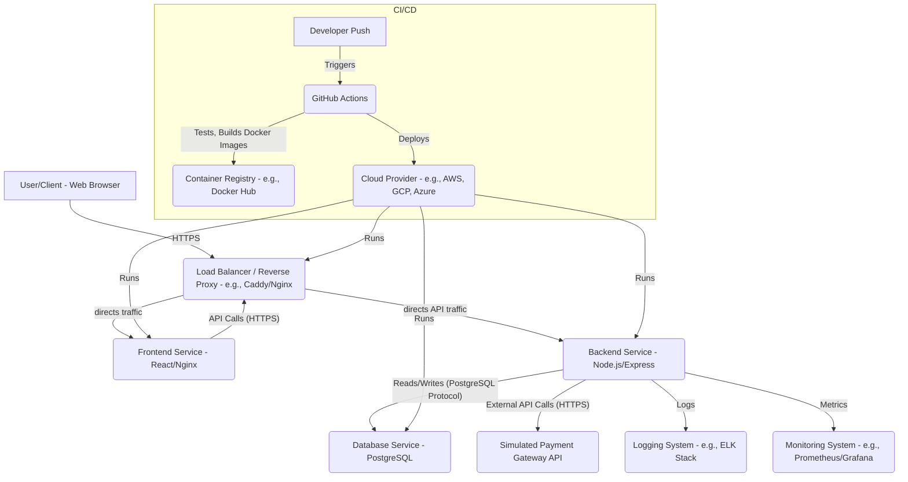

# Payment Processing System: Architecture Overview

This document outlines the high-level architecture of the Payment Processing System. The system follows a microservices-like approach (though implemented as a monolith for simplicity in this example) with a clear separation of concerns between frontend, backend, and database layers.

## 1. High-Level Diagram

## 2. Components

### 2.1. Frontend Service (React)
*   **Technology:** React, JavaScript, HTML, CSS.
*   **Purpose:** Provides the user interface for interacting with the payment system. This includes user registration, login, dashboard, account management, transaction viewing, and initiating payments.
*   **Key Aspects:**
    *   **Routing:** `react-router-dom` for navigation between pages.
    *   **State Management:** React Context API (or Redux in a larger app) for global state like authentication.
    *   **API Communication:** `axios` for making HTTP requests to the backend API.
    *   **UI/UX:** Basic, responsive design focusing on functionality.
    *   **Build:** Optimized for static file serving using Webpack (via `react-scripts`).
    *   **Deployment:** Served as static files by an Nginx web server.

### 2.2. Backend Service (Node.js/Express)
*   **Technology:** Node.js, Express.js, JavaScript.
*   **Purpose:** The core business logic layer. It handles API requests from the frontend, processes business logic, interacts with the database, and integrates with external services.
*   **Key Modules/Concerns:**
    *   **`auth`:** User registration, login, JWT token generation/validation.
    *   **`users`:** User profile management.
    *   **`accounts`:** Creation, retrieval, and balance updates for user accounts.
    *   **`transactions`:** Recording and managing deposits, withdrawals, and transfers between accounts.
    *   **`payments`:** Orchestration of external payment gateway interactions (simulated in this example). This module would typically handle credit card charges, refunds, webhooks from the gateway, etc.
    *   **`middleware`:** Authentication, authorization, error handling, rate limiting.
    *   **`config`:** Centralized configuration for database, JWT secrets, environment variables.
    *   **`utils`:** Helper functions, custom error classes, logging utilities.
*   **API:** RESTful API with JSON request/response formats.
*   **Security:** JWT for authentication, bcrypt for password hashing, Helmet for HTTP security headers, CORS configuration, `express-rate-limit`.

### 2.3. Database Service (PostgreSQL)
*   **Technology:** PostgreSQL relational database.
*   **Purpose:** Stores all persistent data for the application, including user details, account balances, transaction records, and payment gateway interaction logs.
*   **Key Aspects:**
    *   **Schema:** Defined for `users`, `accounts`, `transactions`, `payments`.
    *   **Migrations:** Managed using Knex.js for version-controlled schema evolution.
    *   **Transactions:** Extensive use of database transactions (ACID properties) for critical financial operations to ensure data consistency and integrity.
    *   **Indexing:** Applied to frequently queried columns (`user_id`, `account_id`, `email`, etc.) for performance optimization.

### 2.4. Payment Gateway (Simulated)
*   **Purpose:** Represents an external third-party service (e.g., Stripe, PayPal, Square) responsible for processing actual financial transactions (credit card charges, bank transfers).
*   **Simulation:** In this project, it's a simplified internal service that mimics success/failure and provides a `gateway_transaction_id`. In a real system, this would be a secure API integration.

## 3. Data Flow Example: Making a Payment

1.  **User Action:** A user fills out the "Make Payment" form on the **Frontend** with account details, amount, and (simulated) card information.
2.  **Frontend Request:** The **Frontend** sends a `POST /api/v1/payments` request to the **Backend** with payment details, including the user's JWT in the `Authorization` header.
3.  **Backend Validation & Processing:**
    *   The **Auth Middleware** validates the JWT.
    *   The `payment.controller` receives the request.
    *   The `payment.service` initiates the process:
        *   Creates a `payment` record in the **Database** with `status: 'pending'`.
        *   Calls the `processExternalPayment` function, which simulates an interaction with the **Payment Gateway**.
        *   If the simulated gateway returns success:
            *   Updates the `payment` record to `status: 'completed'`, storing the `gateway_transaction_id` and gateway response.
            *   Uses a **Database Transaction** to update the user's `account` balance (credit) and create a corresponding `transaction` record (type `payment_in`).
        *   If the simulated gateway returns failure:
            *   Updates the `payment` record to `status: 'failed'`.
            *   Throws an `ApiError` to the frontend.
4.  **Backend Response:** The **Backend** sends a success (201 Created) or error (e.g., 400 Bad Request) response back to the **Frontend**.
5.  **Frontend Update:** The **Frontend** displays the payment status to the user and updates the UI accordingly.

## 4. Operational Aspects

### 4.1. Containerization (Docker)
*   Each core service (frontend, backend, database) is containerized using Docker.
*   `docker-compose` orchestrates these containers for easy local development and deployment.

### 4.2. CI/CD (GitHub Actions)
*   Automated workflows trigger on push/pull requests.
*   **Build:** Lints code, installs dependencies, builds Docker images.
*   **Test:** Runs unit, integration, and API tests for both frontend and backend. Utilizes a separate, ephemeral PostgreSQL container for backend tests.
*   **Deploy:** (Conceptual) Pushes Docker images to a registry and deploys to a cloud environment upon merging to `main`.

### 4.3. Logging (Winston)
*   Centralized logging for backend events, errors, and critical business operations.
*   Outputs to console for development and to files (`error.log`, `combined.log`) for production. Can be extended to external log aggregators (e.g., ELK Stack).

### 4.4. Error Handling
*   Custom `ApiError` class to standardize error responses.
*   Global error handling middleware to catch and format errors, preventing sensitive information leakage in production.
*   `process.on('unhandledRejection')` and `process.on('uncaughtException')` for graceful shutdown.

### 4.5. Caching (Mentioned)
*   While not implemented in the provided code, a production-grade system would likely incorporate a caching layer (e.g., Redis) for:
    *   Session data (if not JWT-based entirely).
    *   Frequently accessed but slowly changing data (e.g., user profiles).
    *   Rate limiting storage (for distributed rate limiting).

### 4.6. Monitoring (Mentioned)
*   Integration with tools like Prometheus and Grafana for collecting and visualizing metrics (request latency, error rates, database query times, resource utilization).
*   Alerting based on predefined thresholds.

---
This architecture provides a solid foundation for a scalable and maintainable payment processing system. Further enhancements would involve introducing dedicated message queues (e.g., RabbitMQ, Kafka) for asynchronous processing of sensitive operations, robust webhook handling, multi-factor authentication, and advanced fraud detection.